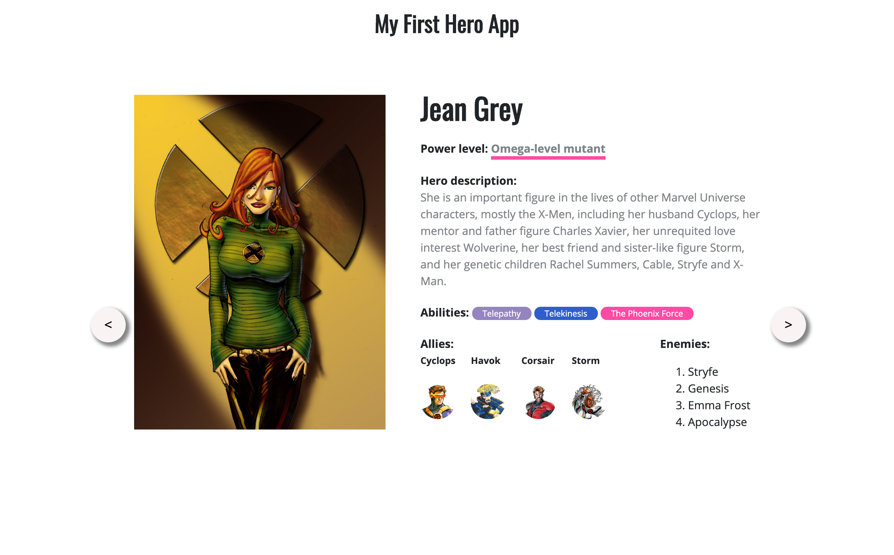

# Introducere

## Ce este această broșură?

Broșura _JavaScript Superheroes_ vine în sprijinul profesorilor de informatică din toată țara și propune predarea unui opțional la clasele de generală și liceu.

Broșura este creată și pusă la dispoziție publicului de către [Asociația Codette](https://codette.ro), în urma organizării a 5 workshop-uri de web development în 5 orașe din România. Voluntarii noștri \(menționați la finalul acestei pagini\) au lucrat la dezvoltarea, verificarea și îmbunătățirea acesteia. 

## Cunoștințe anterioare

Broșura se adresează elevilor care au cunoștințe de bază în programare \(recomandat clasele a VI-a până la a XII-a\). Nu este nevoie de cunoștințe de dezvoltare web în prealabil \(HTML, CSS, JS și Angular\), deoarece lecțiile conțin informații pentru începători.

## Mod de organizare

Lecțiile din cadrul acestei broșuri sunt concepute pentru a fi predate o oră pe săptămână \(50'\), timp de un an școlar \(ambele semestre\) și conțin și evaluări pentru a obține minim 2 note pe semestru.

#### Semestrul I

| Săptămână | Conținut | Evaluare |
| :--- | :--- | :--- |
| 1 \(HTML\) | introducere în web design, structura unei pagini web, etichete pereche | - |
| 2 \(HTML\) | etichete nepereche, atribute, formarea culorilor | recapitulare scurtă |
| 3 \(HTML\) | imagini, liste ordonate și neordonate | recapitulare scurtă |
| 4 \(HTML\) | tabele | recapitulare scurtă |
| 5 \(HTML\) | adăugare de legături externe \(link-uri\), butoane | QUIZ HTML |
| 6 \(HTML\) | meniu, formular, miniproiect | - |
| 7 \(HTML\) | elemente semantice, div, span | verificare miniproiect |
| 8 \(CSS\) | rolul CSS-ului, identificatori \(clase și id-uri\), exemple | - |
| 9 \(CSS\) | stilizarea textului, box model, poziționarea elementelor | recapitulare scurtă |
| 10 \(CSS\) | tranziții, transformări, animații | recapitulare scurtă |
| 11 \(CSS\) | flexbox, media queries | QUIZ CSS |
| 12 \(Proiect\) | tutorial proiect | - |
| 13 \(Proiect\) | tutorial proiect | - |
| 14 \(Proiect\) | tutorial proiect | - |
| 15 \(Proiect\) | tutorial proiect | - |
| 16, 17 | săptămâni de rezervă \(prezentarea proiectelor și închiderea mediilor\) | proiectul final lucrat în săptămânile 12 - 15 |

#### Semestrul II

| Săptămână | Conținut | Evaluare |
| :--- | :--- | :--- |
| 1 \(JS\) | introducere în JS, variabile, tipuri de date, operatori | - |
| 2 \(JS\) | structuri decizionale, structuri repetitive, array-uri și operații pe array-uri | - |
| 3 \(JS\) | dublu egal, triplu egal, funcții și DOM | - |
| 4 \(JS\) | - | Test JS |
| 5 \(proiect\) | tutorial proiect | - |
| 6 \(proiect\) | tutorial proiect | - |
| 7 | introducere in framework-uri | verificare proiect |
| 8 \(OOP\) | introducere în programare orientată pe obiecte | - |
| 9 \(Angular\) | set-ul, github | - |
| 10 \(Angular\) | componente, template, proprietăți, tipuri de binding | exercițiu |
| 11 \(Angular\) | clasă, obiecte | exercițiu |
| 12 \(Angular\) | liste, legături între componente | - |
| 13 \(Angular\) | servicii, filtrarea datelor | exercițiu |
| 14 \(Angular\) | editarea datelor | - |
| 15 \(Angular\) | editarea datelor | exercițiu |
| 16, 17 | prezentarea proiectelor și închiderea mediilor | proiectul final lucrat în săptămânile 9 - 15 |

Proiectele pot fi realizate în echipe de câte 2 și se pot efectua atât în cadrul orelor de curs dedicate lucrului la proiecte, cât și în timpul liber al elevilor, pentru finalizarea acestora.

## Competențe dobândite

În urma acest curs, elevul va dobândi următoarele competențe:

* [ ] crearea unei pagini web de bază
* [ ] adăugarea de conținut unei pagini web
* [ ] stilizarea elementelor unei pagini web
* [ ] adăugarea animațiilor și a interacțiilor
* [ ] folosirea unui limbaj de programare \(JavaScript\) pentru a adăuga diferite funcționalități paginii web
* [ ] folosirea unui framework open-source \(Angular\)
* [ ] dezvoltarea abilităților de a căuta informații în mediul online
* [ ] dezvoltarea abilităților de a lucra în echipă
* [ ] dezvoltarea abilităților de a susține prezentări

Ca rezultat al acestui curs, participanții vor construi o pagină web completă în care afișează informații despre 3 supereroi. Vor fi realizate două proiecte, unul folosind HTML, CSS si JS, iar celalalt folosind framework-ul Angular. Tematica celor două proiecte este aceeași.

## Mulțumiri

### Autorii lecțiilor

\*\*\*\*[**Popa Carmen-Gabriela**](https://www.linkedin.com/in/carmengpopa/), lead [Codette](https://codette.ro), studentă la Facultatea de Automatică și Calculatoare

\*\*\*\*[**Ioniță Valentin**](https://www.linkedin.com/in/valentin-ionita/), lead [Codette](https://codette.ro), student la Facultatea de Automatică și Calculatoare

### Contribuitori pentru materialele de la workshop

**Andrei Antal,** Senior Front-End Engineer, Co-founder JSLeague, a creat  materialele despre Angular

\*\*\*\*[**Diana Miron**](https://www.linkedin.com/in/diana-miron/)**,** Front-End Developer, CEO [JSLeague](https://www.jsleague.ro) & [JSKids](https://www.jskids.ro), a contribuit la proiectul de pe primul semestru, stilizând pagina web

### Revizuitori

**Bălan Silvia**, voluntar Codette și studentă la Facultatea de Automatică și Calculatoare

**Corneanu Nicoleta**, studentă la Facultatea de Automatică și Calculatoare

**Horga Daria**, elevă la Colegiul Național "Mihai Viteazu", București

**Prof. Pruș Paul**, Colegiul Național "Gh. Munteanu Murgoci", Brăila

**Prof. Păcurar Felicia**, Colegiul Național "DR. IOAN MEȘOTĂ", Brașov

**Prof. Căprăriu Alina**, Colegiul Național "Matei Basarab", București

**Prof. Voica Cornelia Nicoleta**, Colegiul Național "Ion C. Brătianu”, Pitești

**Prof. Voica Adrian**, Liceul Teoretic "Ion Barbu", Pitești

**Prof. Chirita Valentina**, Liceul Toretic "Alexandru Ioan Cuza", București

**Prof. Aldea Cristina**, Liceul Toretic "Alexandru Ioan Cuza", București

