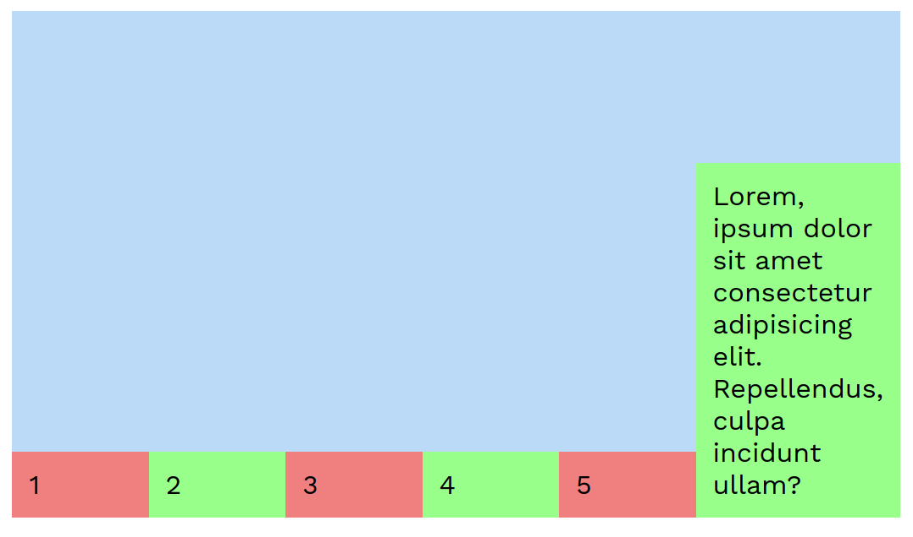

# Lecția 11

## Activitate 2 - Quiz

Durată: 20' \| Metodă: prelegere \| Materiale: videoproiector

## Activitate 2 - Flexbox

Durată: 30' \| Metodă: prelegere \| Materiale: videoproiector

`Flexbox Layout`, o specificație CSS modernă din 2017, are scopul de aranja, alinia și distribui spațiul elementelor dintr-un container, atunci când dimensiunile lor sunt necunoscute sau dinamice \(conținut adăugat folosind JavaScript, de exemplu\). Ideea care stă la baza flexbox este de a da abilitatea unui container de a altera înălțimea, lățimea și ordinea copiilor săi în mod flexibil \(de unde și numele\) pentru a ocupa spațiul de pe ecranul respectiv cât mai eficient. Vom încerca să descriem un set minimal de proprietăți, suficient pentru a crea diferite layouts, utile aplicațiilor voastre viitoare. Pentru un tutorial complex și complet despre flexbox, verificați [acest link](https://css-tricks.com/snippets/css/a-guide-to-flexbox/).

### Exemplu de bază

Vom porni de la următorul exemplu. Pentru fiecare test de mai jos, vom folosi o variație a HTML-ului și CSS-ului de mai jos. După cum vedeți, am definit un **div** părinte de culoare `#badaf7` cu 6 **div**-uri copii de culoare `#99ff8b`. Fiecare copil impar \(selectorul `:nth-child(odd)` va folosi fiecare copil impar în ordine\) va avea culoarea părintelui. Folosim culori pentru a face ușor diferența între **div**-uri.

```markup
<div class="parent">
    <div class="child one">1</div>
    <div class="child two">2</div>
    <div class="child three">3</div>
    <div class="child four">4</div>
    <div class="child five">5</div>
    <div class="child six">6</div>
</div>
```

```css
.parent {
    display: flex;
    background-color: #badaf7;
}

.child {
    flex: 1;
    padding: 10px;
    background-color: #99ff8b;
}

.child:nth-child(odd) {
    background-color: inherit;
}
```

Rezultatul va fi similar cu cel de mai jos.


Adăugând proprietatea `display: flex` asupra părintelui declarăm layoutul său ca flex. Proprietatea, `flex: 1` de pe copii distribuie spațiul rămas din părinte în mod egal pentru fiecare copil \(deoarece fiecare copil are valoarea 1\).

### Proprietatea flex

Folosind CSS-ul următor \(înlocuind CSS-ul de mai sus\), veți avea rezultatul din poza alăturată.

```css
.parent {
    display: flex;
    background-color: #badaf7;
}

.child {
    flex: 1;
    padding: 10px;
    background-color: #99ff8b;
}

.child:nth-child(odd) {
    background-color: inherit;
}

.child.one {
    flex: 2;
    background-color: #f08080;
}
```


Deoarece elementul cu clasa .one are proprietatea flex: 2, el va lua \(sau va încerca să ia\) de două ori mai mult spațiu decât ceilalți copii. Să explicăm numeric folosind dimensiunile de mai sus. Elementul **one** are `width=141px` iar toate celelalte au `width=80px`. Dar `141 / 80 = 1.76 != 2`, după cum ne așteptam, deci ce se întâmplă oare? Spațiul minimal necesar fiecărui element child este puțin mai mare decât lățimea unui caracter \(textul elmentului\) adunată cu paddingul de 20px \(stânga + dreapta\). Spațiul rămas este distribuit elementelor conform regulii flex, astfel `(141 - 21) / (80 - 21) = 2.03 ~ 2`.

### Proprietatea flex-direction

Proprietatea flex-direction stabilește **direcția** \(orizontal sau vertical\) și **ordinea** în care copii sunt aranjați în părinte. Poate avea ca valori **row**, **row-reverse**, **column**, **column-reverse**, iar valoarea de bază \(cea activă când nu este setată explicit este **row**\). Folosind `column-reverse` putem obține rezultatul de mai jos. Copii sunt aranjați în coloană și in ordine inversă.

```css
.parent {
    display: flex;
    flex-direction: column-reverse;
    background-color: #badaf7;
}

.child {
    flex: 1;
    padding: 10px;
    background-color: #99ff8b;
}

.child:nth-child(odd) {
    background-color: inherit;
}
```


### Proprietatea flex-wrap

Dacă mărim padding-ul lateral pe care îl are fiecare copil, astfel încât să nu aibă suficient loc în părinte, copiii vor depași dimensiunea părintelui \(overflow\), ca în poza de mai jos.


Pentru a rezolva acest lucru și a păstra toate elementele în ecran, folosim proprietatea `flex-wrap` cu valoarea non-default `wrap` - elementele se vor înfășura pe următoarea linie \(sau coloană dacă aceasta era direcția setată\). Pentru a testa acest lucru- folosiți CSS-ul de mai jos.

```css
.parent {
    display: flex;
    flex-wrap: wrap;
    background-color: #badaf7;
}

.child {
    flex: 1;
    padding: 10px 70px;
    background-color: #99ff8b;
}

.child:nth-child(odd) {
    background-color: inherit;
}
```


### Proprietatea justify-content

În cazul în care nu am folosit proprietatea flex pe copii pentru a distribui întreg spațiul rămas de pe un rând, va rămâne spațiu în părinte neasignat vreunui copil. Flexbox ne permite să setăm folosind proprietatea `justify-content` cum se va distribui conținutul de pe un rând și spațiul rămas. În continuare vom folosi CSS-ul următor, cu diferite valori pentru `justify-content`. 


Hint: Albastru reprezintă părintele


```css
.parent {
    display: flex;
    flex-wrap: wrap;
    justify-content: center;
    background-color: #badaf7;
}

.child {
    padding: 10px 70px;
    background-color: #99ff8b;
}

.child:nth-child(odd) {
    background-color: #f08080;
}
```


### Proprietatea align-items

Folosind următorul cod, vom putea avea rezultatul din poza alăturată.

```markup
<div class="parent">
    <div class="child one">1</div>
    <div class="child two">2</div>
    <div class="child three">3</div>
    <div class="child four">4</div>
    <div class="child five">5</div>
    <div class="child six">Lorem, ipsum dolor sit amet consectetur adipisicing elit. Repellendus, culpa incidunt
        ullam?</div>
</div>
```

```css
.parent {
    display: flex;
    height: 300px;
    /* align-items: flex-end; */
    background-color: #badaf7;
}

.child {
    flex: 1;
    padding: 10px;
    background-color: #99ff8b;
}

.child:nth-child(odd) {
    background-color: #f08080;
}
```


Când părintele este mai mare pe axa secundară \(direcția perpendiculară direcției pe care sunt ordonate elementele copil\) decât elementele copil, comportamentul default este ca și copii să se întindă \("stretch"\) până ocupă părintele. Folosind proprietatea align-items, putem seta explicit comportamentul pe care să îl aibă elementele copil. Două exemple sunt mai jos.




Activitatea 3 - Media queries

Media queries sunt o tehnică CSS care permite să definim CSS care va fi aplicat doar în cazul în care anumite proprietăți ale ecranului sunt aplicabile. Folosind media queries bazate pe lățimea ecranului stă la baza designului responsive prin care puteți crea un layout pentru desktop și unul pentru mobile \(sau oricâte layouturi intermediare\).

Pentru a exemplifica utilizarea lor, vom utiliza acelasi markup ca la activitatea trecută, alături de CSS-ul de mai jos.

```css
.parent {
    display: flex;
    flex-direction: column;
    background-color: #badaf7;
}

.child {
    flex: 1;
    padding: 10px;
    background-color: #99ff8b;
}

.child:nth-child(odd) {
    background-color: #f08080;
}

@media screen and (min-width: 420px) {
    .parent {
        flex-direction: row;
    }
}
```

Putem observa că sintaxa unui query este de forma `@media screen and (...) { }` în interiorul căreia putem scrie reguli css după cum ne-am obișnuit, dar care să fie valide doar în anumite situații, aici atunci când ecranul are lățimea cel puțin 420px. Rezultatul este că, pe un ecran mai mic de 420px, copii sunt aliniați în coloană, iar pe unul mai mare în linie, după cum putem vedea în imaginile următoare. Pentru a testa ambele dimensiuni, puteți trage de window-ul browserului.


### Concluzie

Pentru a vă crea o serie de layouts utile site-urilor voastre, vă recomandăm să folosiți o combinație de flexbox și media queries. Posibilitățile pe care le oferă împreună sunt diverse și ușor de implementat și vă vor ajuta enorm.


