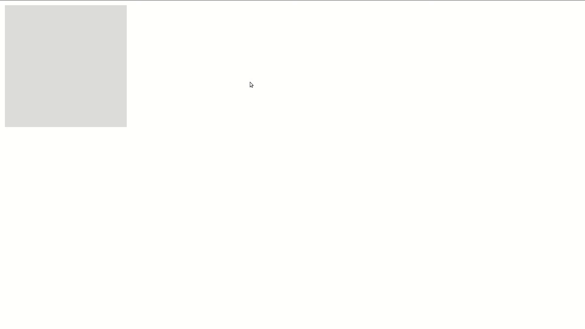
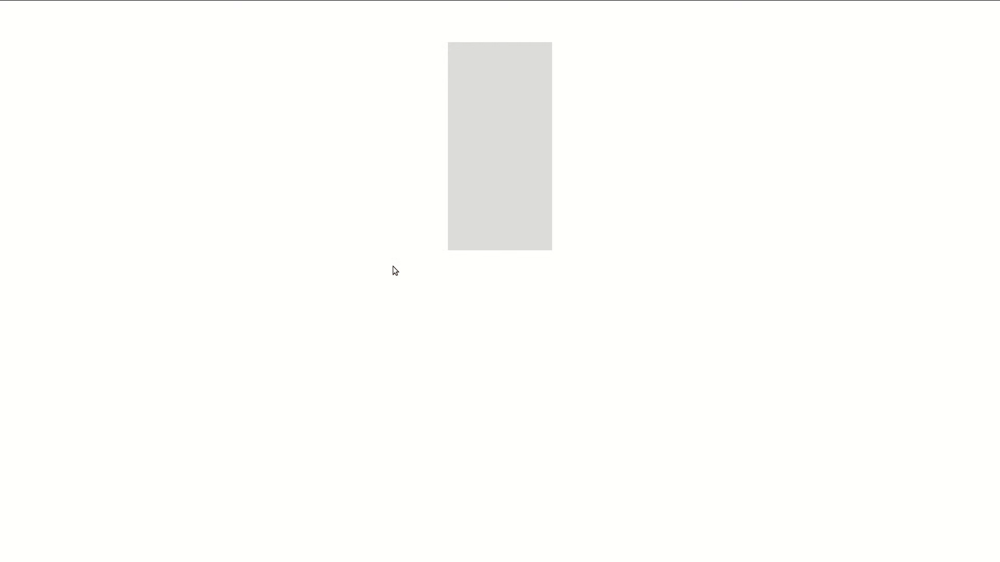
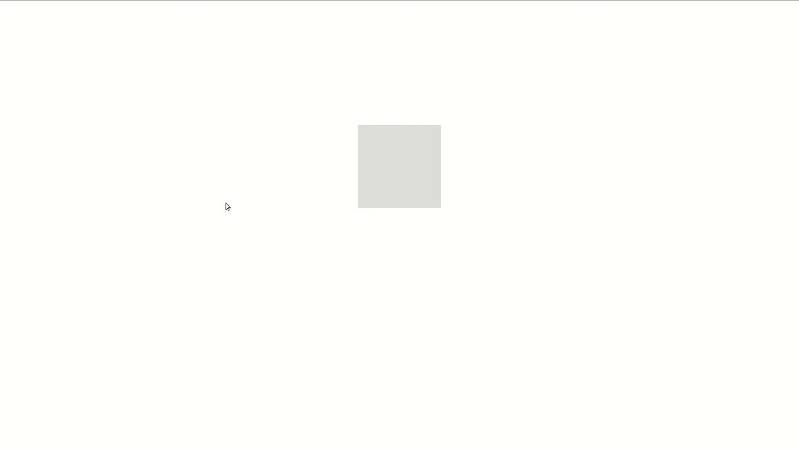

# Lecția 10

## Activitate 1 - Recapitulare

Durată: 5' \| Metodă: prelegere \| Materiale: videoproiector

1. Explicați diferența între conținut, padding, margin și border.
2. La ce se referă `3em`? Dar `65vh`? Dar `10vw`?
3. Ce stilizare puneți pe un paragraf dacă doriți ca textul să fie galben, îngroșat și subliniat. Dar ca textul să fie scris cu litere mari?
4. Ce efect are proprietatea float? Care sunt valorile pe care le poate lua?

## Activitate 2 - Tranziții

Durată: 15' \| Metodă: prelegere \| Materiale: videoproiector

Tranzițiile CSS permit să schimbați în mod gradual valorile unor proprietăți, într-un timp specificat. Asta înseamnă că, dacă schimbați valoarea unei proprietăți a unui element, fie folosind JavaScript, fie folosind selectorul :hover \(mai multe despre hover mai jos\), schimbarea va fi, în mod default, instantă. Tranzițiile vă permit să treceți prin toate stările intermediare pentru a avea o schimbare fluidă.

În exemplele următoare vom trece de la o valoare la alta folosind selectorul `:hover`. Acesta specifică o stare a elementului selectat, aceea când te afli cu mouse-ul deasupra elementului. Browserul detectează când treci cu mouse-ul de pe un element pe altul și pornește acest eveniment. Acest moment va fi și începutul tranziției noastre.

```markup
<div class="my-element"></div>
```

```css
.my-element {
    background: #dddddd; /* Default background color */
    width: 200px;
    height: 200px;
    display: block;
}

.my-element:hover { /* Nu există spațiu între selectorul elementului și ":hover" */
    background: #cc0000; /* Background when hovering */
}
```

Codul de mai sus ar executa schimbarea backgroundului în mod instant, iar pentru culori atât de depărtate, ar fi non-estetic.

### Proprietăți pentru tranziții

O tranziție CSS poate fi scrisă fie folosind cele 4 proprietăți specifice, fie proprietatea prescurtată `transition`, după cum vedem mai jos.

```css
/* Exemplul 1 */
.my-element {
    background: #dddddd;
    width: 200px;
    height: 200px;
    display: block;
    transition-delay: .5s;
    transition-duration: 1.5s;
    transition-timing-function: ease-out;
    transition-property: background;
}

/* Exemplul 2, echivalent cu exemplul 1 */
.my-element {
    background: #dddddd;
    width: 200px;
    height: 200px;
    display: block;
    transition: background 1.5s ease-out .5s;
}
```

* **transition-delay**: opțional, specifică după câte secunde să înceapă tranziția
* **transition-duration**: specifică câte secunde să dureze tranziția
* **transition-property**: opțional, specifică ce pe proprietate să fie aplicată, default fiind `all`
* **transition-timing-function**: opțional, specifică ce fel de interpolare să fie folosită între cele două valori între care se face tranziția, câteva valori pe care le poate lua fiind: **linear**, **ease-in**, **ease-out**, **steps\(\)**, **cubic-bezier\(\)**. Pentru a vedea mai bine cum funcționează aceste timing functions, puteți să folosiți consola pentru a edita funcția de interpolare.
* **transition**: cuprinde cele patru proprietăți de mai sus, în ordinea: `(property) duration (timing-function) (delay)`, unde \(\) înseamnă opțional



În exemplul de mai sus, putem vedea tranziția noastră \(care se întamplă când mouse-ul intră pe element dar și când iese de pe el\) și cum putem edita in Firefox **transition-timing-function** și cum schimbă cum este realizată tranziția.


Recomandăm călduros să experimentați cu tranziții direct în consolă.


Ca un ultim pas, putem specifica folosind proprietatea transition diferite tranziții pentru diferite proprietăți.

```css
.my-element {
    background: #dddddd;
    width: 200px;
    height: 200px;
    display: block;
    /* background-ul are o tranziție de 1s, iar lățimea de 2s */
    transition: background 1s, width 2s; 
}

.my-element:hover {
    background: #cc0000;
    width: 400px;
}
```

## Activitate 3 - Transformări

Durată: 10' \| Metodă: prelegere \| Materiale: videoproiector

Transformările CSS vă permit să mutați, rotiți, scalați și să puneți în perspectivă elemente. Există transformări CSS 2D și 3D, dar noi le vom aborda doar pe primele. Vom da exemplu de trei transformări asupra elementului următor.

```markup
<div class="my-element"></div>
```


Testați pe rând codurile de mai jos pentru a vedea cum funcționează transformările.


### Scale

```css
.my-element {
    background: #dddddd;
    width: 200px;
    height: 200px;
    margin: auto;
    display: block;
    transform: scaleX(3);
}
```

Deși elementul de mai sus are aceeași valoare pentru înălțime și lățime, aplicăm o transformare cu factorul 3 pe axa X care îl scalează de 3 ori. Există, desigur, și valoarea `scaleY()` pentru transformări pe axa Y.

### Rotate

```css
.my-element {
    background: #dddddd;
    width: 100px;
    height: 200px;
    margin: auto;
    display: block;
    transform: rotate(-30deg);
}
```

Transformarea `rotate()` primește un număr real pozitiv \(în sensul acelor de ceasornic\) sau negativ \(în sensul opus acelor de ceasornic\) pentru care unitatea de măsură poate fi `deg` \(**degrees** = grade, de exemplu 90**°**\) sau `rad` \(**radians** = radiani\).

### Translate

```css
.my-element {
    background: #dddddd;
    width: 100px;
    height: 200px;
    margin: auto;
    display: block;
    transform: translate(100px, 20px);
}
```

Transformarea de mai sus translatează \(mută\) elementul cu 100px pe axa X și 20px pe axa Y. Amintim că, într-o pagină web, axa X crește de la stânga la dreapta iar **axa Y crește de sus în jos**. Deci, punctul de coordonate \(0,0\) este în colțul din stânga-sus. Putem realiza translații și cu valori negative \(vor merge în direcția opusă creșterii axei\) sau pe o singură axă cu valorile: `translateX()` și `translateY()`.

### Originea transformării

Pentru toate transformările de mai sus ați putut observa că au originea transformării centrul geometric al elementului înainte de transformare. Pentru a schimba originea, folosim următoarea proprietate:

```css
.my-element {
    transform: rotate(30deg);
    transform-origin: 20% 40%;
}
```

### Transformări și tranziții

Combinând primele două activități puteți obține exemple foarte interesante, ca cel de mai jos.

```css
.my-element {
    background: #dddddd;
    width: 100px;
    height: 200px;
    margin: 40px auto;
    display: block;
    transform: rotate(0);
    transition: transform 1s, background 1.3s, width 2s;
}

.my-element:hover {
    background: #cc0000;
    width: 400px;
    transform: rotate(180deg);
}
```



## Activitate 4 - Animații

Durată: 20' \| Metodă: prelegere \| Materiale: videoproiector

Animațiile CSS permit animarea elementelor între mai multe stări \(_keyframes_ - cadre cheie\) fără folosirea JavaScript sau alte tehnologii web. Animațiile CSS sunt mai performante decât dacă sunt scrise folosind alte limbaje. Sintaxa pentru declararea unei animații pe un element este similară cu cea pentru tranziții, având proprietați precum `animation-duration` și `animation-delay`, dar și prescurtarea `animation` care primește mai multe argumente.

Pentru exemplele următoare, folosim HTMLul următor.

```markup
<div class="my-element"></div>
```

O animație simplă, între o stare inițială și una finală este cea de mai jos.

```css
.my-element {
    background: #dddddd;
    width: 100px;
    height: 200px;
    margin: 40px auto;
    display: block;
    animation-name: color-animation;
    animation-duration: 1.5s;
}

@keyframes color-animation {
    from {
        background: #dddddd;
    }

    to {
        background: #cc0000;
    }
}
```

Regula `@keyframes` specifică numele animației \(**color-animation** la noi\) și, între acolade, cele două stări. Numele este adăugat ca valoare pentru `animation-name` în elementul animat. Această sintaxă nu este foarte versatilă, având doar două stări. Vom introduce o animație cu mai multe stări mai jos.

```css
.my-element {
    background: #dddddd;
    width: 100px;
    height: 200px;
    margin: 40px auto;
    display: block;
    animation-name: size-animation;
    animation-duration: 1.5s;
}

@keyframes size-animation {
    0% {
        width: 100px;
    }

    25% {
        width: 200px;
    }

    50% {
        width: 500px;
    }

    100% {
        width: 100px;
    }
}
```

Pentru această sintaxă putem să menționăm oricâte momente în procente între **0%** și **100%** în interiorul cărora schimbăm valoarea proprietăților animate. Aceste momente sunt calculate procentual față de _durația animației_ specificată pe element. Fără să specificăm durata, animația nu va fi executată în nici unul din cazurile de mai sus.

Nu este necesar să avem aceeași proprietate pentru toate momentele, ci putem anima diferite proprietăți alternativ. Ce recomandăm este ca proprietățile să aibă aceleași valori la 0% și la 100%, pentru a fi fluide când animațiile se repetă.

### Exemplu complex

Testați următorul exemplu și veți obține următoarea animație.



```css
.my-element {
    background: #dddddd;
    width: 100px;
    height: 100px;
    margin: 150px auto;
    display: block;
    animation-name: cool-animation;
    animation-duration: 3s;
    animation-timing-function: linear;
    animation-delay: 1s;
    animation-iteration-count: infinite;
    animation-direction: alternate;
}

@keyframes cool-animation {
    0% {
        background: #dddddd;
        height: 100px;
        transform: rotate(0);
    }

    25% {
        width: 200px;
        background: #cc0000;
    }

    33% {
        transform: rotate(90deg);
    }

    50% {
        width: 500px;
        height: 200px;
    }

    66% {
        transform: rotate(-90deg);
    }

    75% {
        background: #ee25b2;
    }

    100% {
        width: 100px;
        height: 100px;
        background: #dddddd;
        transform: rotate(0);
    }
}
```

Pe lângă keyframes-urile specifice folosite, puteți observa că am folosit câteva proprietăți noi în regula `.my-element`. Acestea sunt:

* **animation-timing-function**: la fel ca la tranziții, o funcție care stabilește tipul interpolării între valori
* **animation-delay**: delay-ul de la încărcarea paginii până la începerea animației
* **animation-iteration-count**: numerul de repetări al animației sau **infinite**
* **animation-direction**: direcția în care este rulată animația \(**normal**, **reverse**, **alternate**\). Când este **reverse**, este rulată de la coadă la cap, iar **alternate** este alternativ **normal** și **reverse**.
* **animation**: cuprinde cele 6 proprități menționate mai sus, în ordinea: `name duration (timing-function) (delay) (iteration-count) (direction)`


Delay-ul poate lua și valori negative. Testați pe una dintre animațiile de mai sus pentru a vedea cum se comportă, folosind un delay negativ mai mic decât durata.



