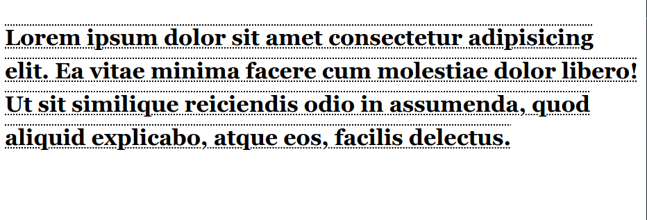
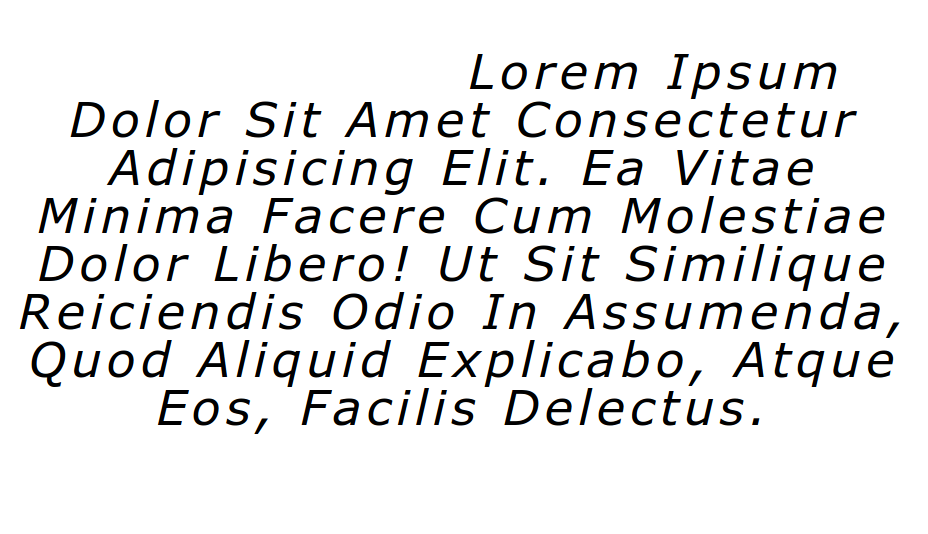

# Lecția 9

## Activitatea 1 - Stilizarea textului

Durată: 10' \| Metodă: prelegere \| Materiale: videoproiector

Una din capabilitățile cele mai utilizate în CSS este stilizarea textului în modalități similare editoarelor de documente text \(Google Docs, Microsoft Word, LibreOffice Writer etc\). În continuare vă vom introduce cele mai populare și utile proprietăți pentru a vă ajuta să customizați textul propriu.

### Exemplul 1

Începem prin a adăuga într-o pagină HTML paragraful de mai jos și a-l stiliza \(fie într-un fișier extern `.css` fie într-o etichetă `<style>`\) cu regula pentru `.classy-text`.

```markup
<p class="classy-style">
    Lorem ipsum dolor sit amet consectetur adipisicing elit. Ea vitae minima facere cum
    molestiae dolor libero! Ut sit similique reiciendis odio in assumenda, quod aliquid
    explicabo, atque eos, facilis delectus.
</p>
```

```css
.classy-text {
    font-family: Georgia, 'Times New Roman', Times, serif;
    font-size: 32px;
    line-height: 48px;
    font-weight: bold;
    text-decoration: underline overline dotted black;
}
```

Rezultatul va fi similar cu:



Proprietățile folosite sunt:

* **font-family**: alegerea fontului pe care să îl folosească paragraful. Puteți menționa mai multe fonturi sau familii de fonturi \(`serif` în acest caz\), separate cu virgulă, iar primul font găsit în sistemul utilizatorului va fi cel folosit.
* **font-size**: setează mărimea textului
* **line-height**: setează **înălțimea** unui singur rând de text. În combinație cu font-size, poate influența major vizibilitatea textului.
* **font-weight**: setează cât de îngroșat să fie textul. Poate avea ca valori numere \(**400** fiind grosimea normală, **300** subțire sau **700** bold, spre exemplu\) sau cuvinte \(**light**, **normal**, **bold**\). Acest parametru nu garantează că textul va fi de o anumită grosime \(decât pentru cele mai noi [variable fonts](https://developer.mozilla.org/en-US/docs/Web/CSS/CSS_Fonts/Variable_Fonts_Guide)\) ci caută printre versiunile disponibile ale fontului selectat.
* **text-decoration**: o proprietate care poate adăuga decorații variate \(**underline**, de exemplu\), cu sintaxa `linie stil culoare grosime`, dintre care noi am folosit de două tipuri și nu am selectat nici o grosime.

### Exemplu 2

Pentru al doilea exemplu, vom folosi același paragraf, dar cu stilizarea următoare \(nu uitați să înlocuiți clasa la `modern-style`\).

```css
.modern-style {
    font-family: 'Segoe UI', Tahoma, Geneva, Verdana, sans-serif;
    font-size: 48px;
    line-height: 1em;
    font-style: italic;
    letter-spacing: 5px;
    text-align: center;
    text-indent: 8em;
    text-transform: capitalize;
}
```

Rezultatul va fi:



Înainte de a descrie noua stilizare, putem remarca că unele valori sunt de forma `1em`, această unitate de măsură \(**em**\) este relativă la mărimea textului \(**font-size**, dacă este setată\). Spre exemplu, `2em` înseamnă de două ori mai mare decât marimea textului. Proprietățile folosite în exemplu sunt:

* **font-style**: **normal** sau **italic**
* **letter-spacing**: distanța dintre două litere consecutive
* **text-align**: alinierea textului, după cum puteți intui, poate fi **left**, **right**, **center** sau **justify**
* **text-ident**: identarea paragrafului \(spațiul de la începutul blocului până la începutul primel litere a primului rând\)
* **text-transform**: transformări ale textului, precum **capitalize** \(prima literă a fiecărui cuvânt e majusculă\), **uppercase**, **lowercase**

## Activitatea 2 - Box model

Durată: 10' \| Metodă: prelegere \| Materiale: videoproiector


## Activitatea 3 - Poziționarea elementelor în pagină

Durată: 10' \| Metodă: prelegere \| Materiale: videoproiector


```css

p {
    text-decoration: underline;
}

img {
    width: 200px;
    height: 120px;
    border: 10px;
}

body 

div {
    float: right;
    width: 200px;
    background: red;
    height: 200px;
    margin: auto;
    text-align: center;
}
```

