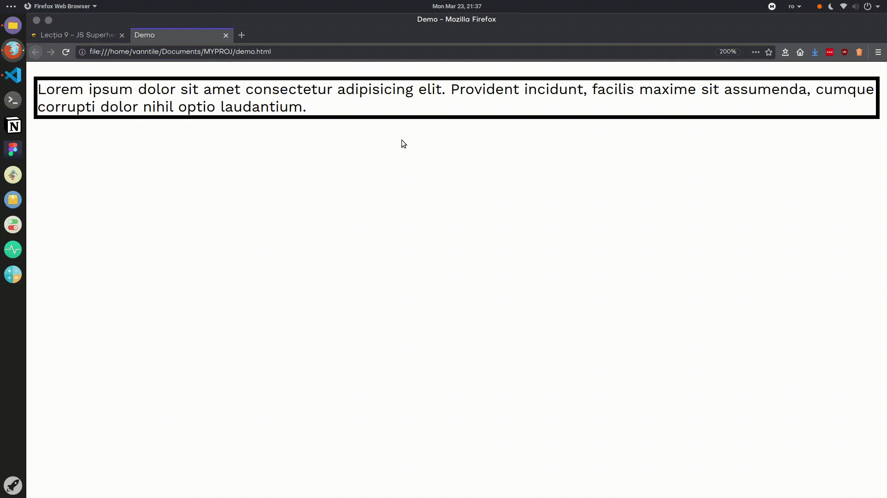
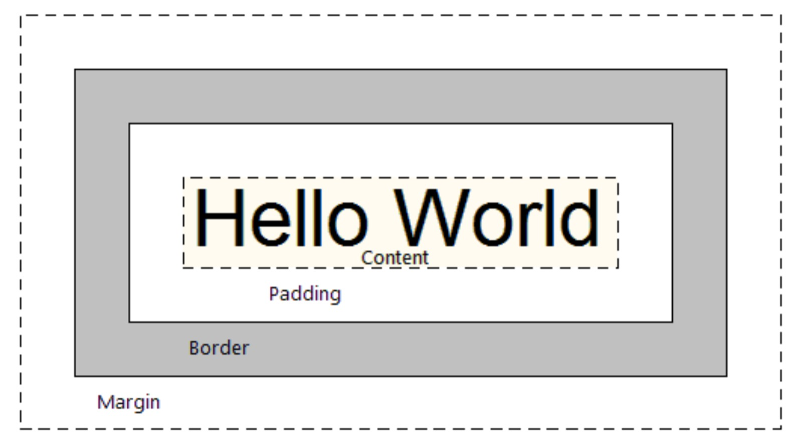
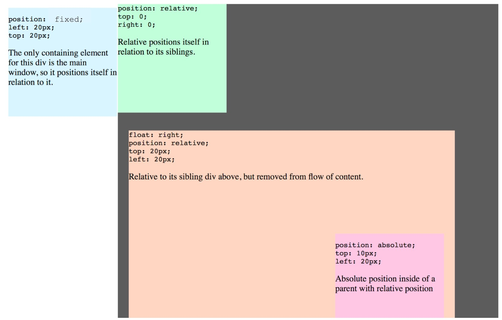
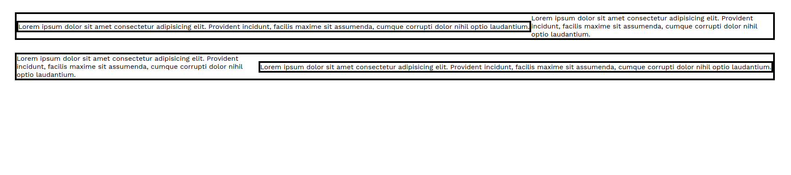

# Lecția 9

## Activitate 1 - Recapitulare

Durată: 5' \| Metodă: prelegere \| Materiale: videoproiector

## Activitatea 2 - Stilizarea textului

Durată: 15' \| Metodă: prelegere \| Materiale: videoproiector

Una din capabilitățile cele mai utilizate în CSS este stilizarea textului în modalități similare editoarelor de documente text \(Google Docs, Microsoft Word, LibreOffice Writer etc\). În continuare vă vom introduce cele mai populare și utile proprietăți pentru a vă ajuta să customizați textul propriu.

### Exemplul 1

Începem prin a adăuga într-o pagină HTML paragraful de mai jos și a-l stiliza \(fie într-un fișier extern `.css` fie într-o etichetă `<style>`\) cu regula pentru `.classy-text`.

```markup
<p class="classy-style">
    Lorem ipsum dolor sit amet consectetur adipisicing elit. Ea vitae minima facere cum
    molestiae dolor libero! Ut sit similique reiciendis odio in assumenda, quod aliquid
    explicabo, atque eos, facilis delectus.
</p>
```

```css
.classy-text {
    font-family: Georgia, 'Times New Roman', Times, serif;
    font-size: 32px;
    line-height: 48px;
    font-weight: bold;
    text-decoration: underline overline dotted black;
}
```

Rezultatul va fi similar cu:


Proprietățile folosite sunt:

* **font-family**: alegerea fontului pe care să îl folosească paragraful. Puteți menționa mai multe fonturi sau familii de fonturi \(`serif` în acest caz\), separate cu virgulă, iar primul font găsit în sistemul utilizatorului va fi cel folosit.
* **font-size**: setează mărimea textului
* **line-height**: setează **înălțimea** unui singur rând de text. În combinație cu font-size, poate influența major vizibilitatea textului.
* **font-weight**: setează cât de îngroșat să fie textul. Poate avea ca valori numere \(**400** fiind grosimea normală, **300** subțire sau **700** bold, spre exemplu\) sau cuvinte \(**light**, **normal**, **bold**\). Acest parametru nu garantează că textul va fi de o anumită grosime \(decât pentru cele mai noi [variable fonts](https://developer.mozilla.org/en-US/docs/Web/CSS/CSS_Fonts/Variable_Fonts_Guide)\) ci caută printre versiunile disponibile ale fontului selectat.
* **text-decoration**: o proprietate care poate adăuga decorații variate \(**underline**, de exemplu\), cu sintaxa `tip stil culoare grosime`, dintre care noi am folosit două tipuri și nu am selectat nici o grosime. Stilul folosit aici este **dotted** \(punctat\).

### Exemplu 2

Pentru al doilea exemplu, vom folosi același paragraf, dar cu stilizarea următoare \(nu uitați să înlocuiți clasa la `modern-style`\).

```css
.modern-style {
    font-family: 'Segoe UI', Tahoma, Geneva, Verdana, sans-serif;
    font-size: 48px;
    line-height: 1em;
    font-style: italic;
    letter-spacing: 5px;
    text-align: center;
    text-indent: 50vw;
    text-transform: capitalize;
}
```

Rezultatul va fi:


Înainte de a descrie noua stilizare, putem remarca că unele valori sunt de forma `1em`, această unitate de măsură \(**em**\) este relativă la mărimea textului \(**font-size**, dacă este setată\). Spre exemplu, `2em` înseamnă de două ori mai mare decât mărimea textului. De asemenea, există o valoarea `vw`\(viewport width\), care, împreună cu `vh`\(ciewport height\), sunt `viewport units` \(unități de măsură relative la mărimea ecranului\).  Spre exemplu, **10vw** este egal cu 10% din lățimea ecranului, iar **20vh** este egal cu 20% din înălțimea ecranului.

Proprietățile folosite în exemplu sunt:

* **font-style**: **normal** sau **italic**
* **letter-spacing**: distanța dintre două litere consecutive
* **text-align**: alinierea textului, după cum puteți intui, poate fi **left**, **right**, **center** sau **justify**
* **text-ident**: identarea paragrafului \(spațiul de la începutul blocului până la începutul primel litere a primului rând\)
* **text-transform**: transformări ale textului, precum **capitalize** \(prima literă a fiecărui cuvânt e majusculă\), **uppercase**, **lowercase**


Puteți explora mai multe proprietăți CSS prin a edita exemplele date direct în broswer, prin consolă. Pentru a deschide consola, dați click dreapta &gt; Inspect element. Puteți vedea în exemplul de mai jos.




## Activitatea 3 - Box model

Durată: 15' \| Metodă: prelegere \| Materiale: videoproiector

Fiecare element are o serie de proprietăți asociate unui model conceptual numit **box model** \(vizibil în poza de mai jos\). Toate proprietățile de care vom discuta în această activitate influențează _mărimea_, _spațierea_ și _layout_-ul \(schema\) elementelor în pagină.

Presupunem că asignăm fiecărui element o "cutie" formată din mai multe straturi, de la interior la exterior: **conținut** \(**content**\), **padding**, **border** și **margin**. Zona conținutului încapsulează elementul propriu-zis, fie el text, o imagine sau un video. Între conținut și border este o zonă de spațiere numită **padding**. La exteriorul border-ului putem adăuga o zonă de spațiere între elementul curent și alte elemente numită **margin**. 



Există o proprietatea `box-sizing` care stabilește care din aceste zone sunt determinate de proprietățile de mărime `width` și `height`. Valorile sunt explicate mai jos.

```css
/* lățimea content-ului este de 100px */
.div1 {
    box-sizing: content-box; /* valoarea default */
    width: 100px;
}

/* lățimea border + padding + content este de 100px */
.div2 {
    box-sizing: border-box;
    width: 100px;
}
```

### Sintaxa proprietăților margin, padding

Pentru proprietățile margin și padding, există patru sintaxe echivalente de a da valori pentru cele 4 direcții \(sus, dreapta, jos și stânga\). Vom prezenta mai jos exemple pentru fiecare sintaxă doar pentru **margin**, pentru **padding** fiind asemenea.

```css
/* Exemplul 1 */
margin-top: 1px;
margin-right: 2px;
margin-bottom: 3px;
margin-left: 4px;

/* Exemplul 2, echivalent cu exemplul 1 */
margin: 1px 2px 3px 4px; /* sus, dreapta, jos, stânga */

/* Exemplul 3 */
margin: 1px 2px; /* vertical, orizontal */

/* Exemplul 3 e echivalent cu */
margin-top: 1px;
margin-right: 2px;
margin-bottom: 1px;
margin-left: 2px;

/* Exemplul 4 */
margin: 1px 2px 3px; /* sus, orizontal, jos */

/* Exemplul 4 e echivalent cu */
margin-top: 1px;
margin-right: 2px;
margin-bottom: 3px;
margin-left: 2px;
```

## Activitatea 4 - Poziționarea elementelor în pagină

Durată: 15' \| Metodă: prelegere \| Materiale: videoproiector

### Position

Poziționarea elementelor folosind CSS se poate face folosind mai multe proprietăți. Vom începe cu `position`.  Valoarea default a proprietății position este `static`. Pentru toate celelalte valori, proprietățile de poziționare pentru cele patru direcții \(`top`, `left`, `bottom` și `right`\) setează așezarea elementului.



* `position: relative` aliniază relativ la poziția lui normală, statică
* `position: absolute` aliniază relativ la primul părinte poziționat \(cu o valoare diferită de **static**\)
* `position: fixed` aliniază relativ la ecran

Mai multe despre **position** puteți găsi [aici](https://developer.mozilla.org/en-US/docs/Web/CSS/position).

### Float

Proprietatea float poate pozitiona elementele la stânga sau la dreapta, în interiorul părintelui. Exemplul de mai jos vă va ajuta să experimentați. Mai multe despre **float** puteți găsi [aici](https://developer.mozilla.org/en-US/docs/Web/CSS/float).

```markup
<div class="parent">
    <p class="left">
        Lorem ipsum dolor sit amet consectetur adipisicing elit. Provident incidunt, facilis maxime sit assumenda,
        cumque corrupti dolor nihil optio laudantium.
    </p>
    Lorem ipsum dolor sit amet consectetur adipisicing elit. Provident incidunt, facilis maxime sit assumenda,
    cumque corrupti dolor nihil optio laudantium.
</div>
<div class="parent">
    <p class="right">
        Lorem ipsum dolor sit amet consectetur adipisicing elit. Provident incidunt, facilis maxime sit assumenda,
        cumque corrupti dolor nihil optio laudantium.
    </p>
    Lorem ipsum dolor sit amet consectetur adipisicing elit. Provident incidunt, facilis maxime sit assumenda,
    cumque corrupti dolor nihil optio laudantium.
</div>
```

```css
.parent, .left, .right {
    border: 4px solid black;
}

.parent {
    margin: 30px;
}

.left {
    float: left;
}

.right {
    float: right;
}
```

Rezultatul va fi similar cu:



