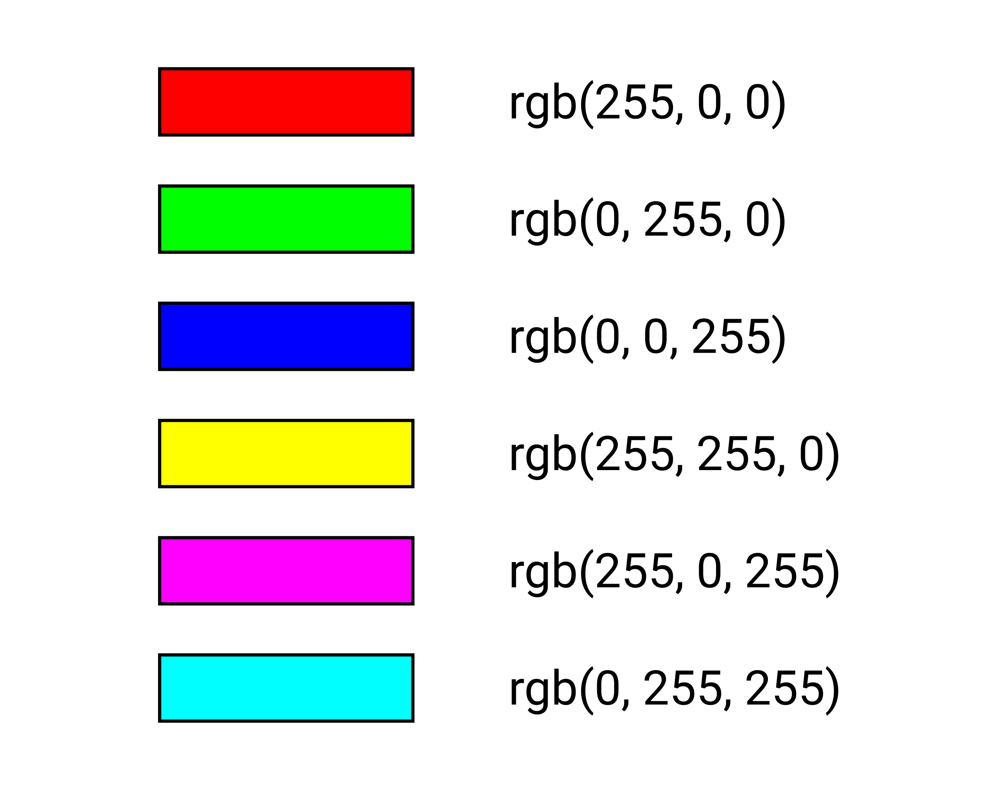

# Lecția 2

## Activitate 1 - Recapitulare

Durată: 10' \| Metodă: dezbatere, conversație \| Materiale: -

1. Ce este web designul?
2. Ce este HTML? Enumerați caracteristicile acestuia.
3. Care este structura de baza a unei pagini HTML?
4. Dați exemple de etichete pereche învățate.
5. Care e diferența dintre etichete pereche și nepereche?
6. Ce se adaugă în head și ce se adaugă în body?

## **Activitate 2 - Etichete nepereche**

Durată: 10' \| Metode: demonstrație, conversație, exercițiu \| Materiale: videoproiector

### **Line break**

Am observat că închiderea etichetelor de paragraf `</p>` sau de heading `</h3>` introduc automat un rând nou. Putem introduce oricând un rând nou în conținutul paginii web cu ajutorul etichetei `<br>`. Aceasta nu are sens să se închidă, deoarece știm deja că ocupă un rând întreg, deci nu există eticheta `</br>`.

#### **Exercițiu**

În fișierul în care ați lucrat data trecută, adăugați eticheta `<br>` între două cuvinte oarecare dintr-un paragraf din body. Ce se întâmplă atunci când dați refresh? Dar dacă adăugați de mai multe ori eticheta `<br>` una după alta? Apar mai multe linii libere.

```markup
<body>
<h3> Prima mea pagina web </h3>
<p> 
<h1> Titlul paragrafului </h1> 
Lorem <br> <br> <br> ipsum… </p>
<p> Duis <br> aute… </p>
</body>
```

### Horizontal rule

Putem folosi eticheta `<hr>` pentru a adăuga o linie orizontală care să delimiteze zonele paginii web. Numele vine de la horizontal rule și, întocmai ca `<br>`, nu are sens ca această etichetă să se închidă, deci nu există `</hr>`.

#### Exercițiu

Adăugați eticheta `<hr>` între cele două paragrafe din body. Ce se întâmplă atunci când dați refresh?

## Acti**vitate 3 - Atribute**

Durată: 10' \| Metodă: demonstrație, conversație, exercițiu \| Materiale: videoproiector

Am discutat în prima lecție despre etichete, structura standard a acestora fiind: ****`<tag> content </tag>`

Pe lângă numele etichetei și conținutul acesteia, etichetele pot să mai aibă și atribute. Acestea ajută la formatarea conținutului într-un anumit fel sau la indicarea sursei conținutului. Pentru a adăuga atribute, acestea sunt menționate în interiorul etichetei, și anume:

```markup
<tag atribut_1="valoare" atribut_2="valoare"> continut </tag>
```

După numele etichetei, adăugăm spațiu, numele atributului, urmat de semnul `=` și, între ghilimele, valoarea atributului. Este important să vă asigurați că etichetele arată ca `""` și nu `“”`. Mai multe atribute pot fi adăugate în aceeași etichetă, fiind separate de spații. Ordinea lor nu contează și nu există un număr maxim de atribute ce poate fi adăugat.

### Exemplu

Eticheta `<hr>` adaugă o linie despărțitoare, neagră. Cu ajutorul atributelor putem sa îi modificăm culoarea, astfel:

`<hr color="blue">` sau `<hr color="red">`.

### Exercițiu

Testează mai multe culori în body, unde ai adăugat eticheta &lt;hr&gt; între cele două paragrafe. Valorile atributelor pot fi culorile în limba engleză: yellow, orange, green etc.

## **Activitate 4 - Formarea culorilor**

Durată: 20' \| Metodă: demonstrație, conversație, exercițiu \| Materiale: videoproiector

### Culori

Deși HTML înțelege specificarea culorilor în limba engleză, acestea au un format standard de reprezentare numit RGB \(red, green, blue\). Prin intermediul acestui format putem obține orice culoare, combinând în toate modurile posibile cele trei culori de bază.

Formatul are trei parametri, câte unul pentru fiecare culoare. Dacă ne gândim la nuanțe ca la niște amestecuri de trei culori de bază - **roșu**, **verde** și **albastru**, atunci acești parametrii reprezintă cantitatea din fiecare culoare de bază pe care o adăugăm în amestec, cu scopul obținerii unei noi culori. Fiecare parametru poate să ia o valoare între 0 \(nul\) și 255 \(maximul din culoarea respectivă\).

#### Exemplu

Dacă scriem culoarea `rgb(0, 0, 0)`, specificăm lipsa totală a culorii roșu, verde și albastru, reprezentând astfel **negru**. Similar, `rgb(255, 255, 255)` reprezintă cantitatea maximă din toate culorile de bază, reprezentând astfel **alb**.

* `rgb(255, 0, 0)` = maxim din roșu, nimic din verde și albastru
* `rgb(0, 255, 0)` = maxim din verde, nimic din roșu și albastru
* `rgb(0, 0, 255)` = maxim din albastru, nimic din roșu și verde
* `rgb(255, 255, 0)` = maxim din roșu și verde, nimic din albastru
* `rgb(255, 0, 255)` = maxim din roșu și albastru, nimic din verde
* `rgb(0, 255, 255)` = maxim din verde și albastru, nimic din roșu



Se pot forma astfel orice combinații de culori, dacă dăm valori de la 0 la 255 pentru cei trei parametrii - roșu, verde și albastru.

Nu putem ști pe dinafară toate combinațiile și ce culori o să iasă. Astfel, există site-uri care ne ajută să testăm parametrii aleși și să vedem ce culoare se obține. Unul dintre acestea este [Colors RGB](https://www.w3schools.com/colors/colors_rgb.asp) sau orice color picker găsit pe internet.

### Format hexazecimal

Culorile pot fi reprezentate și în format **hexazecimal**, adică alcătuite din restul împărțirii la 16 \(cifrele 0-9 și literele a-f\). Restul 10 este reprezentat de litera `a`, restul 11 de `b`, …, restul 15 de `f`. Culorile în hexazecimal încep cu semnul `#` urmat de 6 caractere, primele două pentru roșu, următoarele două pentru verde și ultimele două pentru albastru. 

Am menționat anterior că aceste trei culori sunt folosite pentru a forma orice alte culori și sunt combinate, folosind valori de la 0 la 255. Transformat în format hexazecimal, 0 este 00, iar 255 este ff. Numerele pot fi transformate în format hexazecimal prin împărțirea la 16 și salvarea restului, întocmai ca la conversia binară.

#### Exemplu: **rgb\(90, 111, 7\) devine \#5a6f07 după următorul algoritm:**

* roșu are parametrul 90, verde 111 și albastru 7
* Transformăm 90 din decimal în hexazecimal, prin împărțiri la 16:
* 90 : 16 = 5 rest 10, luăm restul 10, care este ‘a’
* 5 : 16 = 0 rest 5, luăm restul 5
* Astfel, se formează 5a, deci 90 în baza 10 este echivalent cu 5a în baza 16
* Transformăm 111 din decimal în hexazecimal, prin împărțiri la 16:
* 111 : 16 = 6 rest 15, luăm restul 15, care este ‘f’
* 6 :  16 = 0 rest 6, luăm restul 6
* Astfel, se formează 6f, deci 111 în baza 10 este echivalent cu 6f în baza 16
* Transformăm 7 din decimal în hexazecimal, prin împărțiri la 16:
* 7 : 16 = 0 rest 7, luăm restul 7 Astfel, se formează 07, deci 7 în baza 10 este echivalent cu 7 în baza 16 \(se adaugă 0 în față pentru că fiecare parametru transformat are exact 2 caractere\)


Nu trebuie să faceți aceste calcule de fiecare dată când formați o culoare, pentru că există o multitudine de site-uri care vă ajută la formarea culorilor și calculează automat codul pentru culoarea respectivă \([Colors picker](https://www.w3schools.com/colors/colors_picker.asp)\).

De asemenea, pentru a găsi o paletă de culori potrivită, puteți încerca folosirea aplicațiilor precum [coolors.co](https://coolors.co/) sau altele asemenea pe care le găsiți pe Google căutând _color scheme generator_.


#### Exerciții

1. Caută într-un color picker ce culori sunt reprezentate mai jos:

   a. \#cccc00

   b. rgb\(210, 32, 233\)

   c. \#32aaf1

2. Alege cu ajutorul unui color picker codul reprezentant al fiecărei culori a curcubeului \(ROGVAIV\)
3. Adaugă în pagina ta web 7 linii despărțitoare `hr`, fiecare colorată într-o culoare a curcubeului.


