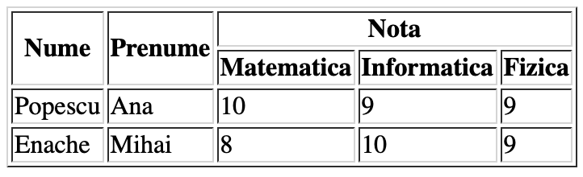
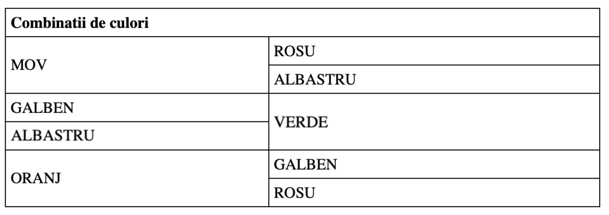

# Lecția 4

## Activitate 1 - Recapitulare

Durată: 5' \| Metodă: dezbatere, conversație \| Materiale: -

1. Menționați eticheta pentru adăugarea unei imagini și dați exemplu de 3 atribute.
2. Care este calea pozei `"superhero.jpg"` dacă dorim să o punem în cadrul unei etichete `img` din index.html?

   ```markup
   project/
   	index.html 
   	resurse/
   		img/
   			cat.png
   			dog.jpg
   			eroi/
   				superhero.jpg
   		video/
   ```

3. Care este codul necesar pentru a forma urmatoarele liste:

   Lista 1:

   1. Română
   2. Matematică
   3. Informatică


   Lista 2:

   A. sus

   B. jos

   3. stânga

   4. dreapta


Este posibil să îmbinați mai multe tipuri de marcatori pentru liste în cadrul aceleiași liste.


## Activitate 2 - Tabele

Durată: 25' \| Metodă: demonstrație, conversație, exercițiu, dezbatere \| Materiale: videoproiector

În afară de paragraf, o altă metodă prin care putem expune datele într-o pagină web este prin intermediul tabelelor.

Acestea sunt definite de eticheta `<table>` care este pereche `</table>`.

Pentru a crea un rând intr-un tabel, folosim etichetele pereche &lt;tr&gt; &lt;/tr&gt; \(table row\), iar pentru o celulă `<td> <td>` \(table data\). Celulele pot fi create în cadrul rândurilor.

În plus, există și etichetele `<th> </th>` \(table head\) care denumesc capul de tabel. Folosind aceaste etichete, primul rând al tabelului va avea textul îngroșat și centrat în celule, denuntând numele coloanelor.

Eticheta `<caption> </caption>` scrisă în interiorul tabelului va adăuga un titlu centrat deasupra acestuia.

#### Exemplu

```markup
<!-- Hey, un tabel -->

<table>
  <caption>Lista de supereroi</caption>
  <tr>
    <th>Prenume</th>
    <th>Nume</th> 
    <th>Varsta</th>
  </tr>
  <tr>
    <td>Peter</td>
    <td>Park</td> 
    <td>28</td>
  </tr>
  <tr>
    <td>Bruce</td>
    <td>Wayn</td> 
    <td>44</td>
  </tr>
</table>
```


În exemplul de cod de mai sus, prima linie conține un element despre care nu s-a mai discutat până acum: un comentariu. Folosirea simbolurilor &lt;!-- --&gt; ne permite să adăugăm comentarii în cod, adică bucăți de text scrise pentru noi și care vor fi ignorate de interpretor și neafișate în pagina web.


Care este rezultatul codului de mai sus? Testați-l într-o pagina HTML cu o structură completă \(head si body\). Puteți elimina capul de tabel, adăuga linii și/sau coloane.


Să ne amintim ce sunt atributele: sunt cuvinte-cheie ce pot fi specificate în cadrul etichetelor pentru a oferi anumite caracteristici/stilizări. 

Forma standard pentru a adăuga un atribut este astfel:

&lt;eticheta atribut="valoare"&gt; &lt;/eticheta&gt;

```markup
<!-- o eticheta fara atribute -->
<p> Un paragraf </p>

<!-- o eticheta cu doua atribute -->

```


### Celule care se întind pe mai multe coloane

Dacă dorim ca o celulă sa ocupe spațiul mai multor coloane consecutive, atunci folosim atributul `colspan`. Acesta este utilizat în cadrul etichetelor &lt;td&gt; și primește ca valoare un număr între ghilimele, arătând lungimea noii celule în raport cu celelalte \(numărul de coloane pe care se întinde celula\).

```markup
<table>
  <tr>
    <th>Nume</th>
    <th>Olimpic la fizica</th>
    <th>Olimpic la matematica</th>
  </tr>
  <tr>
    <td>Ana</td>
    <td>Da</td>
    <td>Nu</td>
  </tr>
  <tr>
    <td>Diana</td>
    <td colspan="2">ambele</td>
  </tr>
  <tr>
    <td>Victor</td>
    <td>Nu</td>
    <td>Da</td>
  </tr>
</table>
```

Care este rezultatul codului de mai sus? 

Ce credeți că se întâmplă dacă mai adăugăm o celulă pe rândul cu numele Diana? O să apară eroare, o sa ignore atributul colspan?

```markup
<tr>
    <td>Diana</td>
    <td colspan="2">ambele</td>
    <td>Da</td>
  </tr>
```

### Celule care se întind pe mai multe rânduri

Dacă dorim ca o celulă sa ocupe spațiul mai multor rânduri consecutive, atunci folosim atributul `rowspan`. Acesta este utilizat în cadrul etichetelor &lt;td&gt; sau &lt;th&gt; și primește ca valoare un număr între ghilimele, arătând numărul de rânduri pe care se întinde celula.

```markup
<table>
  <tr>
    <th>Nume</th>
    <th>Olimpiade</th>
  </tr>
  <tr>
  	<td>Ana</td>
    <td>Fizica</td>
  </tr>
  <tr>
    <td rowspan="2">Diana</td>
    <td>Fizica</td>
  </tr>
  <tr>
    <td>Matematica</td>
  </tr>
  <tr>
  	<td>Victor</td>
    <td>Matematica</td>
  </tr>
</table>
```

#### Exemple

Putem combina celulele pe mai multe rânduri cu cele pe mai multe coloane, ca în imaginea de mai jos. Încercați să scrieți codul corespunzător tabelului următor, iar la final vă puteți verifica.



Codul corespunzător este:

```markup
<table border="1">
<tr>
  <th rowspan="2"> Nume </th>
  <th rowspan="2"> Prenume </th>
  <th colspan="3"> Nota </th>
</tr>
<tr>
  <th> Matematica </th>
  <th> Informatica </th>
  <th> Fizica </th>
</tr>
<tr>
  <td> Popescu </td>
  <td> Ana </td>
  <td> 10 </td>
  <td> 9 </td>
  <td> 9 </td>
</tr>
<tr>
  <td> Enache </td>
  <td> Mihai </td>
  <td> 8 </td>
  <td> 10 </td>
  <td> 9 </td>
</tr>
</table>
```

Care este rezultatul codului de mai sus?


Capul de tabel poate fi adăugat și vertical, nu doar orizontal. Eticheta th poate fi folosită în locul oricărei etichete td, făcând textul centrat și îngrosat.

Testați codul de mai jos:

```markup
<table>
  <tr>
    <th>Prenume</th>
    <td>Peter</td>
    <td>Bruce</td>
  </tr>
  <tr>
    <th>Nume</th>
    <td>Park</td>
    <td>Wayn</td>
  </tr>
</table>
```


## Activitate 3 - Exerciții

Durată: 20' \| Metodă: exercițiu \| Materiale: calculator

Scrieți codul pentru a replica următoarele două tabele.





