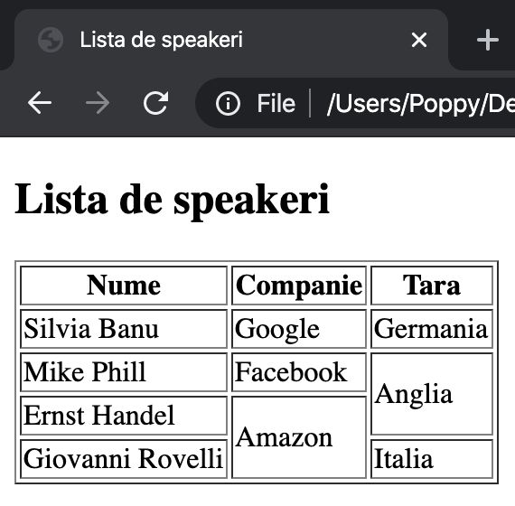
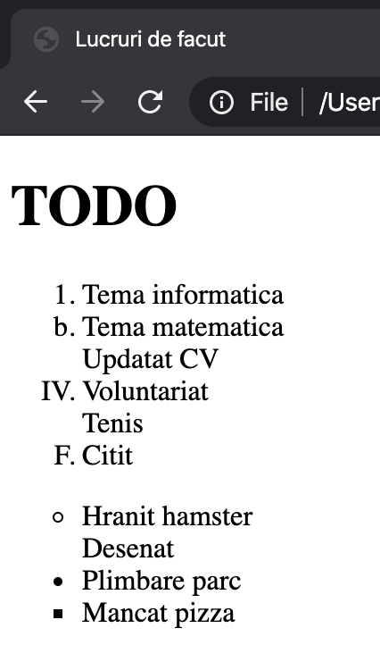

# Lecția 5

## Test de evaluare a cunoștințelor - 2 pct oficiu

Durată: 25' \| Metodă: evaluare formativă, observarea sistematică a activității și a comportamentului elevilor \| Materiale: videoproiector

Total: 10 pct \(2 pct din oficiu\)

#### Partea 1 \(4 puncte\) - 8 întrebări grilă a câte 0.5 fiecare

1. Ce nu se adaugă în cadrul etichetei `head`?

   a. &lt;title&gt;

   b. paragrafe

   c. metadate

   d. favicon

   e. legături externe

2. Care este eticheta pentru a adăuga o listă numerotată?

   a. &lt;ul&gt;

   b. &lt;dl&gt;

   c. &lt;ol&gt;

   e. &lt;nl&gt;

   f. &lt;li&gt;

3. Ce caracter e folosit pentru a indica închiderea unei etichete?

   a. ?

   b. /

   c. \

   d. &gt;

   e. end

4. Care este valoarea culorii alb în hexazecimal?

   a. \#000000

   b. \#f1f1f1

   c. \#ffffff

   d. rgb\(255, 255, 255\)

   e. \#1f1f1f

5. Care dintre următoarele este metoda corectă de adăugare a unei imagini numită cat.png?

   a. &lt;img value="cat.png"&gt;

   b. &lt;img src="cat.png"&gt; &lt;/img&gt;

   c. &lt;img href="cat.png"&gt;

   d. &lt;img source="cat.png"&gt;

   e. &lt;img src="cat.png"&gt;

6. Care dintre următoarele conține doar atribute pentru imagine?

   a. src, width, height, type

   b. src, width, height, alt, title

   c. src, height, title, value, href

   d. src, width, height, color, font

   e. source, width, height

7. Care dintre următoarele este verde pur în RGB?

   a. rgb\(0, 255, 0\)

   b. rgb\(0, 255, 255\)

   c. \#00ff00

   d. \#rgb\(0, 255, 0\)

   e. rgb\(0, 0, 255\)

8. Care este eticheta pentru cel mai mare heading?

   a. &lt;heading&gt; &lt;/heading&gt;

   b. &lt;h4&gt; &lt;/h4&gt;

   c. &lt;h1&gt; &lt;/h1&gt;

   d. &lt;h6&gt; &lt;/h6&gt;

   e. &lt;h7&gt; &lt;/h7&gt;

#### Partea a 2-a \(4 puncte\)  

1. **\(1 pct\)** Scrieți eticheta și atributele necesare pentru a adăuga imaginea "cat.png" în fișierul `index.html`. Specificațiile imaginii sunt: lățime de 300 pixeli, înălțime de 550 pixeli, titlu "Just a cat", descriere dacă imaginea nu e disponibilă "Imaginea nu a putut fi găsită". Structura folderului este următoarea:

Hint: folosiți calea absolută de la folderul rădăcină până la poza dorită

```text
project/
    README/
    index.html
    img/
        cat/
            cat.png
            cat.jpg
```

2. **\(1.5 pct\)** Scrieți o pagină html, cu toate etichetele necesare, pentru a dispune pe ecran următoarele elemente, ca în imaginea de mai jos:



3. **\(1.5 pct\)** Scrieți o pagină html, cu toate etichetele necesare, pentru a dispune pe ecran următoarele elemente, ca în imaginea de mai jos:




## Activitate 2 - legături externe

Durată: 15' \| Metodă: demonstrație, conversație, exercițiu \| Materiale: videoproiector

Întreg web-ul este construit pe baza legăturilor dintre documente, numite hyperlinks. Ați observat cum putem naviga dintr-o pagină în alta prin intermediul unui simplu click.

Eticheta pentru a adăuga o legătura externă \(link\) este:

```markup
<a href="https://www.wikipedia.org" target="_blank"> Click here! </a>
```

Eticheta este pereche, `<a> </a>`

Haideți să înțelegem cum funcționează eticheta:

* _a_ vine de la **anchor** si este numele etichetei
* _href_ vine de la **hyperlink** **reference** și este atributul care arată către ce este făcută legătura; vom vedea puțin mai târziu ce fel de valori poate lua href
* _target_ este atributul care arată unde să se deschidă noua pagina; având valoarea "**\_blank**", se va deschide într-un tab nou, similar cu a da click dreapta -&gt; open in a new tab. În schimb, dacă nu  îi specificăm să se deschidă într-un tab nou, adică dacă lipsește atributul target, atunci link-ul va fi deschis în pagina curentă și vom fi nevoiți să dăm back pentru a revedea conținutul anterior.
* textul dintre cele două etichete `<a>` și `</a>` este textul care apare pe ecran și care activează link-ul; nu este necesar să fie doar text, ci putem adăuga și o imagine sau orice alt element.

### Exerciții

Copiați și salvați codul de mai jos într-un fișier pagina1.html. Pe baza lui, aduceți următoarele modificări:

```markup
<!DOCTYPE html>
<html>
<head>
<title> Link </title>
</head>
<body>

<a href="https://www.wikipedia.org" target="_black"> Click here! </a>

</body>
</html>
```

1. Schimbați link-ul către o altă pagină \(de exemplu, spre site-ul liceului vostru\) și testați.
2. Schimbați textul "Click here!" într-un paragraf cu mai mult scris și testați.
3. Eliminați atributul target. Ce se întâmplă atunci când dați click pe scris?
4. Adăugați, între etichetele &lt;a&gt; și &lt;/a&gt;, o poză folosind eticheta img, în locul paragrafului sau textului anterior. Testați funcționalitatea dând click pe poză.
5. Creați o nouă pagină HTML simplă, cu câteva elemente vizuale: un header și un paragraf. Salvați această pagină în același folder cu pagina1.html. Adăugați o legătura între pagina1.html și pagina2.html ca în exemplul de mai jos.

```markup
<a href="pagina2.html" target="_blank"> Click here! </a>
```


Se observă ca pentru elementele care suportă acțiunea click, cursorul mouse-ului devine mânuță atunci când e poziționat deasupra acelui element. Acest lucru se întâmplă cu orice element inclus între `<a>` și `</a>`și înseamnă că utilizatorul poate interacționa cu acel element.



Prin intermediul etichetei `<a href>` putem adăuga legături externe către pagini web existente \(link-uri\) sau către fișiere locale \(o altă pagină html\). Elementele din cadrul etichetei `<a href>` pot fi text simplu, paragrafe, imagini - orice am studiat până acum poate fi integrat în cadrul etichetei `<a href>`.


## Activitate 3 - Butoane

Durată: 5' \| Metodă: demonstrație, conversație, exercițiu \| Materiale: videoproiector

Putem adăuga și butoane în cadrul unei pagini web. Eticheta folosită este una pereche, `<button> </button>`. Similar cu &lt;a href&gt;, textul din interiorul etichetelor este mesajul care apare pe buton.

```markup
<button type="button">Click Me!</button>
```

Butoanele și link-urile par că funcționează la fel, însă există câteva diferențe. Pe butoane nu se pot adăuga link-uri externe, adică eticheta button nu suporta atributul href. În schimb, butoanele permit adăugarea de acțiuni definite de utilizator, scrise ca funcții în JavaScript - despre care vom discuta în alte lecții. Un exemplu de acțiune care se poate atașa butonului este următorul:

```markup
<button type="button" onclick="alert('Hello world!')">Say hello</button>
```

Testați codul de mai sus în pagina HTML în care ați lucrat. Ce observați? Atributul onclick i-a comunicat butonului ce să se întâmple la apăsare, și anume să arate o alertă pe ecran, cu mesajul "Hello world!". Puteți schimba mesajul din interiorul alertei și să vedeți ce se întâmplă.


alert\(\) este o funcție din JavaScript care afișează pe ecran un pop-up cu un anumit mesaj, pentru a informa utilizatorul



