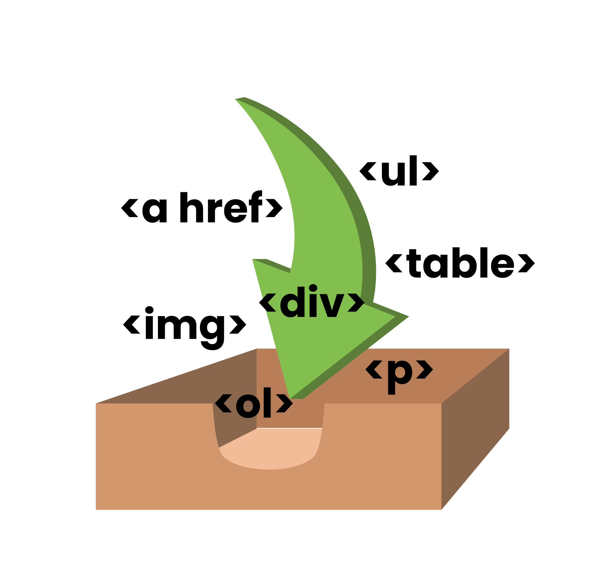

# Lecția 7

## Activitate 1 - Recapitulare

Durată: 10' \| Metodă: prelegere \| Materiale: videoproiector

1. Care este eticheta necesară pentru formular? Este pereche sau nepereche?
2. Menționați proprietățile următoarelor tipuri de input:

   a. password

   b. radio

   c. checkbox

   d. submit

   e. reset

   f. file

3. Cum putem adăuga o listă din care să selectăm un răspuns? Și ce trebuie să scriem pentru a avea un anumit răspuns deja selectat?

## Activitate 2 - Prezentarea miniproiectelor

Durată: 20' \| Metodă: - \| Materiale: -

Se prezintă proiectele începute lecția trecută.

## Activitate 2 - Elemente semantice și nesemantice

Durată: 20' \| Metodă: prelegere \| Materiale: videoproiector

### Elemente semantice

În HTML, există elemente semantice, al căror nume "are sens". Prin definirea acestor elemente, oricine poate înțelege cu ușurință despre ce este vorba în conținut. De exemplu: `<form>, <table>, `. 

Sigur cunoașteți elementele semantice menționate anterior. În continuare vom discuta despre elemente noi.

#### header

Definește header-ul unei secțiuni sau a întregului document. Zona de header se referă la titluri sau elemente care marchează un început de secțiune.

```markup
<header>
    <h1>Superheroes</h1>
    <p>You are what you choose to become</p>
</header>
```

#### footer

Definește zona de subsol a paginii web. De regulă, acolo se scriu informații despre copyright, date de contact, established in.

```markup
<footer>
  <p>Site created by JSSuperheroes.</p>
  <p>Follow us on <a href="https://twitter.com/">Twitter</a>.</p>
  <p>Contact information: <a href="mailto:someone@example.com">
  someone@example.com</a>.</p>
</footer>
```

#### figure, figcaption

`figcaption` definește descrierea unei imagini. Eticheta `figure` este golosită pentru a grupa o imagine alături de descrierea ei.

```markup
<figure>
  
  <figcaption>Supererou, 1955, color</figcaption>
</figure>
```

#### picture

Este o etichetă folosită pentru a adăuga imagini cu rezoluții diferite pentru ecrane de dimensiuni diferite. Mai multe detalii [aici](https://www.w3schools.com/html/html_images_picture.asp).

#### nav

Definește un set de link-uri utile pentru navigarea paginii.

```markup
<nav>
    <a href="https://google.com" target="_blank"><button>Go to Google</button></a>
    <a href="https://reddit.com" target="_blank"><button>Go to Reddit</button></a>
    <a href="https://twitter.com" target="_blank"><button>Go to Twitter</button></a>
<nav>
```

#### De ce avem nevoie de elemente semantice?

Elementele semantice nu schimbă conținutul propriu-zis, ci doar îi oferă un context cu sens. Fiecare exemplu de mai sus arată la fel și dacă eliminăm elementele semantice \(header, footer, figure, figcaption, nav\). În schimb, acestea sunt folosite ca bune practici, pentru a face codul ușor de citit și de parsat de boți ale motoarelor de căutare. Motoarele de căutare nu înțeleg conținutul efectiv al paginii, dar pot să identifice tipurile de conținut prin secțiunile definite de elementele semantice.

Puteți citi mai multe despre elemente semantice [aici](https://www.w3schools.com/html/html5_semantic_elements.asp).

### Elemente nesemantice

Similar, elementele nesemantice nu au un sens în limbajul natural și nu definesc exact ce se află în conținutul lor. De exemplu, `<div>, <span>`.

#### div

**HTML Content Division element** \(**&lt;div&gt;**\) este un element generic care joacă rolul unui container pentru orice număr de elemente copil. Acesta nu modifică aranjarea în pagină, spațierea sau stilizarea. CSS-ul default din browsere setează modul de afișare al elementului **div** ca `block`, adică două div-uri vor fi afișate unul după altul la fel ca paragrafele în limba documentului \(în Engleză, de exemplu, ele vor fi unul sub altul de sus în jos\). Această proprietate \(ca oricare alta\) poate fi suprascrisă, oferindu-vă posibilitatea de a folosi elementul **div** pentru orice utilizare. O metaforă bună pentru **div** este cea a unei cutii: nefolositoare singură, folositoare pentru că încapsulează alte obiecte.



#### span

Elementul `<span>` este un alt tip de container generic, cu scopul de a încapsula elemente din categoria text \(text simplu, linkuri, paragrafe\). Diferența dintre **div** și **span** este că primul este `block` și cel de-al doilea `inline`, adică primul se aliniază asemenea blocurilor suprapuse sus-jos, iar cel de-al doilea "în linie", asemenea cuvintelor în propoziție. Folosim **span** atunci când vrem să evidențiem o bucată de text, adaugându-i stilizare sugestivă.

De exemplu, să considerăm paragraful de mai jos cu textul "Wonderwoman is a superhero". Dorim să colorăm doar cuvântul superhero în roșu, iar celelalte să rămână negre. Pentru această separare, includem cuvântul superhero într-un span, pe care îl vom modifica pentru a îi atribui o culoare textului \(în lecțiile următoare\).

```markup
<p> Wonderwoman is a <span>superhero</span>.</p>
```


