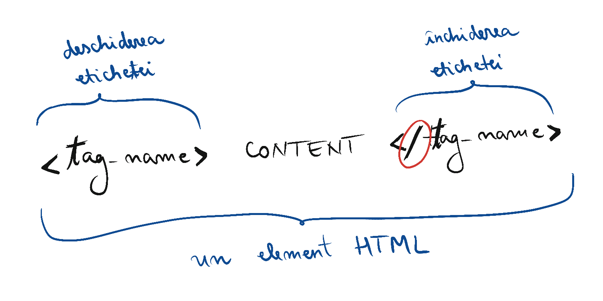
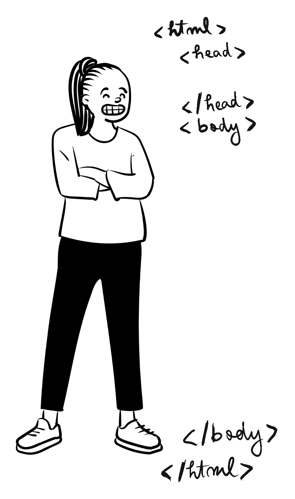
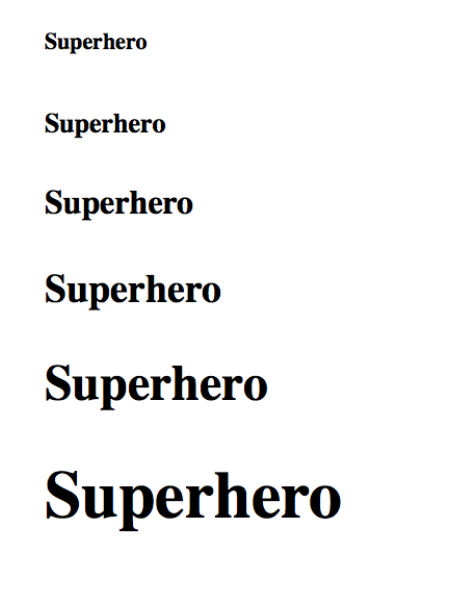

# Lecția 1

## Activitate 1 - Ce este Web Designul?

Durată: 10' \| Metode: explicație \| Materiale: -

### Definiții

> **Designul web** este domeniul care integrează o multitudine de tehnici și platforme cu scopul final de a realiza un site web. Prin web design înțelegem toți pașii pe care îi parcurgem, de la momentul conceperii structurii, a interfeței grafice până la finalizarea programării și introducerea propriu-zisă a conținutului site-ului.

> **HTML \(Hyper Text Markup Language\)** este limbajul care stă la baza paginilor web și cu ajutorul căruia este adăugat conținutul paginii web. Putem recunoaște un fișier ce conține cod HTML după extensia ****`.html`

### Caracteristicile limbajului HTML

* **Asigură legătura către alte pagini HTML,** prin intermediul hyperlink-urilor
* **Este un limbaj markup:** spre deosebire de C/C++, HTML nu este un limbaj compilat. Cu alte cuvinte, dacă într-un fișier HTML scriem operații cum ar fi 2 + 3, acesta nu va evalua rezultatul la 5, ci va lua ca atare textul “2 + 3”. HTML recunoaște doar etichetele \(tag-uri\) despre care vom vorbi în lecțiile următoare. Acesta nu are atribuiri, structuri decizionale \(if, else\) sau repetitive \(for, while\) precum alte limbaje studiate.
* **Nu este un limbaj case-sensitive:** nu face diferența între litere mici sau mari
* **Nu are proprietar:** HTML nu este deținut de nimeni, este o sursă liberă, putând fi folosit de oricine fără a plăti
* **Poate fi procesat de o mare varietate de instrumente** \(telefon, tableta, laptop etc\) și poate fi creat cu ajutorul editoarelor de text \(Sublime, Atom, Visual Studio Code, Notepad++ etc\)

## Activitate 2 - Structura paginii web

Durată: 10' \| Metode: explicație \| Materiale: videoproiector

### Etichete

Am menționat anterior că o pagină HTML este alcătuită din etichete \(sau tag-uri\). Acestea sunt recunoscute de browser și interpretate ca atare, formatând conținutul într-un anumit fel. Structura standard a etichetelor este următoarea:



Etichetele sunt marcate de semnele `<` și `>`. De exemplu, `<title>` este o etichetă care marchează titlul unei pagini web. Eticheta de titlu are un început `<title>` și un sfârșit `</title>`, iar între acestea două se află conținutul etichetei, și anume titlul propriu-zis al paginii web.

Etichetele pot fi **pereche** sau **nepereche**. Cele pereche se deschid \(de exemplu, `<title>`\) și la un moment dat sunt închise folosind **slash** \(`/`\) \(cum este cazul lui `</title>`\). Există însă și etichete care nu se închid. Vom reveni mai târziu asupra acestui aspect.

#### Eticheta &lt;html&gt;

`<html>` este prima etichetă dintr-un document **HTML**. Aceasta îi comunică _browser_-ului că în fișierul citit este scris cod HTML. Este o etichetă pereche și se închide la final cu `</html>`. Tot ce reprezintă pagina web este inclus în interiorul etichetei `<html> </html>`.

#### Eticheta &lt;head&gt;

`<head>` este o etichetă ce trebuie să existe în orice pagină web. Aceasta este o etichetă pereche și se închide cu `</head>`. În interiorul acestora se includ metadatele paginii web. În cadrul acestei etichete nu se adaugă conținutul ce va fi afișat pe pagina web, ci se adaugă elemente precum:

* titlul paginii web \(`<title> </title>`\), care reprezintă titlul afișat în tab
* metadate: cuvinte cheie, descrierea paginii, informații despre autori și, cel mai important, informații pentru browsere pentru a ajuta la afișarea corectă a paginii
* legături externe: către documente **CSS** și **JS**, care conțin cod util pentru pagina web, însă despre care vom vorbi în alte lecții
* favicon: iconița asociată cu site-ul vizibilă în tab-ul browserului pe desktop

#### Eticheta body

Am menționat că nu adăugam conținutul pe care dorim să îl afișăm pe ecran utilizatorilor în cadrul etichetei `<head>`. Acesta se adaugă în eticheta `<body>`, care este pereche și se închide cu `</body>`. Aceasta etichetă este obligatorie în orice document HTML și cuprinde tot conținutul afișat al paginii web.


Browserele moderne permit, din motive de compatibilitate, scrierea paginilor web neconforme cu standardul, însă noi vom prezenta explicații cât mai apropiate de standardul la momentul publicării.


Ca și conținut putem avea: text și media \(organizat în paragrafe, imagini, video-uri, tabele, liste, link-uri\). Despre toate acestea vom vorbi imediat.

Ca un rezumat, structura de bază a unei pagini HTML este evidențiată în imaginea următoare:



## Activitatea 3 - Exercițiu

Durată: 15' \| Metode: demonstrație, conversație, exercițiu \| Materiale: videoproiector

Am dat deja exemplu de 4 etichete pereche:

```markup
<title> </title>
<html> </html>
<head> </head>
<body> </body>
```

Cu ajutorul unui editor de text \(VS Code, Sublime, Atom, Notepad++ etc\), scrieți scheletul paginii HTML, după cum urmează:

```markup
<!DOCTYPE html>
<html>
<head>
    <title>Prima mea pagină HTML</title>
</head>
<body>
</body>
</html>
```


Alinierea sau spațierea în codul de mai sus nu influențează corectitudinea acestuia, însă este de preferat sa fie aranjat în pagină pentru lizibilitate. Astfel, zonele diferite de cod sunt separate printr-un rând nou și folosim indentarea pentru a marca ca o etichetă este cuprinsă în alta \(de exemplu, title aparține de head\).



`<!DOCTYPE html>` este o etichetă pentru compatibilitate cu versiuni mai vechi de html \(**XHTML**\) și includerea ei este considerată **best-practice**.


Momentan body-ul este gol. Salvați fișierul cu orice nume doriți, dar asigurați-vă că are extensia `.html`. Dacă nu apar aceste extensii în listă, puteți salva ca “**All files**” și să adăugați manual extensia `.html` sau `.htm`.

Acum deschideți fișierul într-un browser, făcând _click dreapta &gt; Open with &gt; Chrome / Firefox_. Veți vedea o pagină web albă \(pentru că am lăsat body-ul gol\). În partea de sus, în tab, va apărea titlul adăugat.

1. Modificați conținutul titlului și observați cum se schimbă acesta. După fiecare modificare trebuie dat refresh asupra paginii web \(`Ctrl + R` în browser\).
2. Adăugați în body niște linii de text. Nu este nevoie de nicio etichetă, puteți lua de pe o altă pagina web cu copy-paste textul. Adăugați minim 2 propoziții.

```markup
<body>
Lorem ipsum dolor sit amet, consectetur adipiscing elit, sed do eiusmod tempor incididunt ut labore et dolore magna aliqua. Ut enim ad minim veniam, quis nostrud exercitation ullamco laboris nisi ut aliquip ex ea commodo consequat. Duis aute irure dolor in reprehenderit in voluptate velit esse cillum dolore eu fugiat nulla pariatur. Excepteur sint occaecat cupidatat non proident, sunt in culpa qui officia deserunt mollit anim id est laborum.
</body>
```

## Activitate 4 - Etichete pereche

Durată: 15' \| Metode: demonstrație, conversație, exercițiu, dezbatere \| Materiale: videoproiector

### Eticheta de paragraf

Cea mai utilizată etichetă este cea de paragraf. Aceasta e marcată prin `<p>` și se închide cu `</p>`. În cadrul acestei etichete se poate introduce textul \(conținutul paginii web\). 


Proprietatea acestei etichete este că adaugă un rând nou după ce a fost închisă, astfel, două paragrafe alăturate sunt despărțite.


#### Exerciții

1. Adăugați textul scris în body în cadrul unui paragraf. Se modifică ceva atunci când dați refresh?

```markup
<body>
<p>
Lorem ipsum dolor sit amet, consectetur adipiscing 
elit, sed do eiusmod tempor incididunt ut labore et 
dolore magna aliqua. Ut enim ad minim veniam, quis 
nostrud exercitation ullamco laboris nisi ut aliquip 
ex ea commodo consequat.
</p>
</body>

```


Formatarea nu trebuie făcută neapărat ca mai sus. Etichetele pot fi scrise în continuare sau pe rândul următor, contează doar ordinea lor și să fie scrise corect. De exemplu, puteam scrie și astfel:

```markup
<body> <p> Lorem ipsum ... </p> </body>
```


2. Despărțiți textul din body în două paragrafe diferite și dați refresh. Ce observați?

```markup
<body>
<p> Lorem ipsum dolor sit amet, consectetur adipiscing
 elit, sed do eiusmod tempor incididunt ut labore et 
 dolore magna aliqua. 
</p>
<p>
Ut enim ad minim veniam, quis nostrud exercitation 
ullamco laboris nisi ut aliquip ex ea commodo consequat. 
</p>
</body>
```


Acum a apărut un rând nou între acestea, textul nu mai este scris împreună.


### Etichete de heading

Etichetele de heading sunt folosite pentru a adăuga titluri de secțiuni în conținutul paginii web. Sunt 6 astfel de etichete, `<h1> </h1>`, `<h2> </h2>` până la `<h6> </h6>`

După închiderea unei etichete de heading se adaugă automat un rând nou, întocmai ca la `</p>`.

În imaginile următoare puteți observa cum se utilizează și ce efecte au cele 6 etichete de heading. Aceasta îngroașă și măresc textul, h6 având dimensiunea cea mai mică, iar h1 cea mai mare.

```markup
<h6> Superhero </h6>
<h5> Superhero </h5>
<h4> Superhero </h4>
<h3> Superhero </h3>
<h2> Superhero </h2>
<h1> Superhero </h1>
```



#### Exerciții

1. Adăugați un titlu paginii web, în body, înainte de cele 2 paragrafe. Testați mai multe heading-uri si conținuturi de titlul și verificați cum se modifică acestea.
2. Adăugați un heading în cadrul paragrafului. Eticheta de heading se va afla în cadrul etichetei de paragraf. Acest concept se numește **nested tags**.


**Exemplu:**

```markup
<p> Inainte de heading <h2> in heading </h2> 
dupa heading </p>
```


Eticheta de heading a fost deschisă după eticheta de paragraf și este închisă înaintea etichetei de paragraf. Conceptul de nested tags se referă la etichetă în etichetă și, întocmai ca un sandwich, acestea se închid în ordinea inversă deschiderii. De fapt, ați lucrat și înainte cu nested tags: `<title>` din `<head>` este tot nested, la fel și `<p>` din `<body>`.

3. Încercați să închideți eticheta de heading după cea de paragraf, ca în exemplul de mai jos. Ce se întâmplă?

```markup
<body>
<h3> Prima mea pagina web </h3>
<p> <h1> Titlul paragrafului Lorem ipsum… </p> </h1>
<p> Duis aute… </p>
</body>
```


Tot conținutul paragrafului, și anume textul acestuia, este acum scris sub forma de heading \(îngroșat și mărit\). Eticheta de heading nu a fost închisă așa că browser-ul consideră că tot conținutul paragrafului este, de fapt, parte a etichetei **h1** și îl formatează ca atare.



