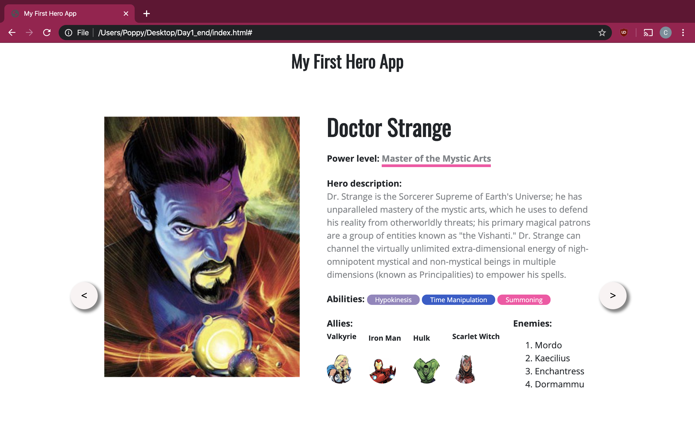
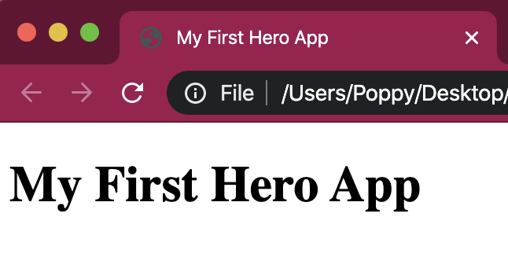
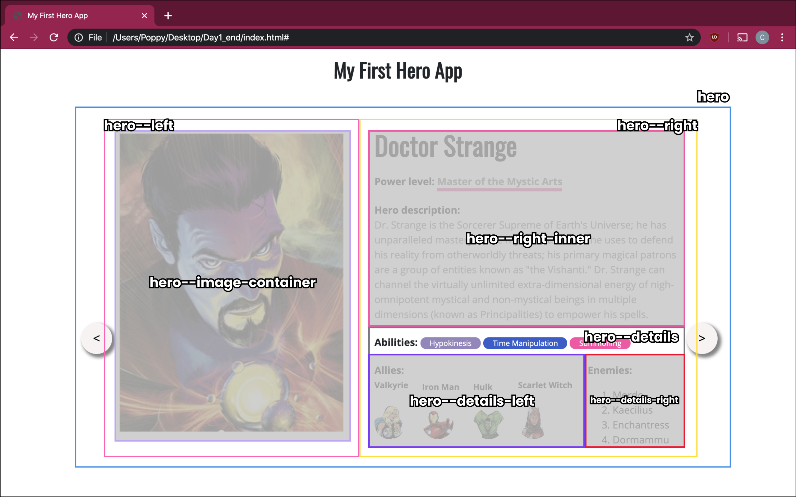

# Lecția 12

## Pasul 0 - setup

În lecțiile următoare vom construi o pagină web despre supereroi. Vom folosi HTML și CSS pentru a afișa informații despre eroi într-un mod cat mai captivant pentru un utilizator. Orientativ, așa ar trebui să arate o pagina la finalul acestor lecții.



Creați un folder care să conțină 2 fișiere \(.html, și .css\) și un folder numit img în care vom salva imaginile folosite pentru proiect. Structura folderului este următoarea:

```text
myProject/
    img/
    index.html
    stylesheet.css
```


În cadrul acestor lecții, nu este musai să folosiți în tocmai structura sau stilizările oferite în tutorial. Puteți experimenta și alege ce vă place cel mai mult. Vă recomandăm să modificați valorile proprităților și să vedeți cum afectează rezultatul, și chiar să eliminați linii din CSS pentru a vedea scopul și importanța lor, atunci când nu este clar.


## Pasul 1 - scheletul HTML

Deschideți fișierul HTML și scrieți scheletul de bază al unei pagini web. Tematica aleasă este despre supereroi, așa că alegeți un titlu sugestiv. Adăugați și în conținutul paginii un header h1.

În head, adăugați următoarele linii de cod. Eticheta `meta` definește metadate pentru pagina web, iar `link` face legătura către fișiere externe, de care vom avea nevoie mai târziu \(când adăugam CSS și JS\).

```javascript
<meta charset="utf-8">
<meta name="viewport" content="width=device-width, initial-scale=1, shrink-to-fit=no, minimum-scale=1">

<link rel="stylesheet" href="https://fonts.googleapis.com/css?family=Open+Sans:300,400,600,700&lang=en">
<link href="https://fonts.googleapis.com/css?family=Oswald" rel="stylesheet">

<link rel="stylesheet" href="stylesheet.css">
<script type="text/javascript" src="script.js"></script>
```

Până acum, pagina web arată astfel, doar titlul din browser și un header în conținut. Puteți personaliza acest text cum doriți.



În acest tutorial vom adăuga doar 3 supereroi, dar se pot adăuga cu ușurință oricâți doriți, de îndată ce scheletul este terminat. Pozele folosite în acest tutorial au dimensiunea de 480x640px. Pozele folosite în cadrul acestui tutorial pot fi găsite [aici](https://drive.google.com/drive/folders/13HaFjMi-kIylGltjB2j5AMx_NFPgoP2R?usp=sharing). Descărcați-le și salvațile în folderul `img`. Puteți folosi alte poze, de preferat în mod portrait \(înălțimea mai mare decât lățimea\).

## Pasul 2 - schițarea paginii

Înainte de a adăuga conținutul propriu-zis, vom stabili o structură a paginii web, și anume un șablon pentru fiecare supererou. Această structură, realizată prin div-uri cu clase diferite, poate fi observată în figura de mai jos.



Fiecare supererou este adăugat într-un div numit **hero**. Acesta e împărțit în două div-uri, **hero--left** și **hero--right**. Hero--left conține **hero--image-container,** unde se află imaginea de profil a supereroului. Hero--right conține **hero--right-inner,** unde sunt incluse informații despre supererou \(nume, descriere etc\) și **hero-details**, unde sunt incluse detalii cum ar fi abilitățile, aliații și inamicii. Hero--details conține alte două div-uri, **hero--details-left** și **hero--details-right**, pentru a poziționa informațiile pe două coloane, ca în imagine.

Această structură este propusă și va fi folosită în cadrul lecțiilor, însă voi puteți sa alegeți alta sau să încludeți alte elemente.

Cu alte cuvinte, șablonul pentru un supererou este următorul. Chiar dacă vom adăuga 3 super-eroi, momentan lucrați doar cu un singur șablon, pe care îl vom îmbunatați. Codul următor este necesar în body:

```javascript
<div class="hero" id="jean">

  <div class="hero--left">
    <div class="hero--image-container">
      <!-- aici vor fi incluse imaginile mari cu supereroul -->
    </div>
  </div>

  <div class="hero--right">
    <div class="hero--right-inner">
      <!-- aici e inclus un header cu numele eroului, power level si hero description -->
      <div class="hero--details">
        <!-- aici vor fi incluse abilitatile supereroului -->
        <div class="hero--details-left">
          <!-- aici va fi inclusa lista cu aliati -->
        </div>
        <div class="hero--details-right">
          <!-- aici va fi inclusa lista cu inamici -->
        </div>
        <div class="clearfix"></div>
      </div>
    </div>
  </div>
  <div class="clearfix"></div>
</div>
```


Observați că am adăugat un div gol, cu clasa `clearfix`. Acesta este adăugat dupa div-uri care au proprietatea float \(adică pentru a împărți în două coloane conținutul\) și ajută la păstrarea layout-ului.


CSS-ul de la care puteți porni este:

```css
body {
  margin: 0;
  font-size: 1rem;
  font-weight: 400;
  line-height: 1.5rem;
  height: 100%
  color: #212529;
  font-family: "Open Sans", sans-serif;
  overflow-x: hidden;
  position: relative;
}

.clearfix {
  overflow: auto;
}
```

## Pasul 3 - adăugarea conținutului

Până acum, pagina conține niște div-uri goale. În continuare, vom adăuga conținut.

În div-ul **hero--image-container,** adăugați cele două imagini portret salvate pentru supererou.

În div-ul **hero--right-inner**, adăugați un header h2 cu clasa **hero--name**, care să conțină numele supereroului, și un header h4 **hero--power** cu clasa, care să conțină nivelul de putere al supereroului. Tot aici adăugați și un header h4 fără clasă care să conțină titlul paragrafului ce îl urmează, și un paragraf cu clasa **hero--description**, care va conține un text cu o scurtă descriere despre supererou.

În div-ul **hero--details**, adăugați un header h4 care să conțină titlul secțiunii \(de exemplu, Abilities\), urmat de 3 abilități, fiecare scrisă într-un span separat. Fiecare abilitate va fi stilizată în CSS în lecția următoare.

În div-ul **hero--details-left** adăugați un header h4 fără clasă care să conțină  titlul secțiunii \(de exemplu, Allies\).  Header-ul este urmat de o listă neordonată cu clasa **hero--allies**, care conține 4 elemente. Fiecare element al listei conține un header h5 cu numele unui supererou și o imagine asociată acestuia cu clasa **img-round**.

În div-ul **hero--details-right** adăugați un header h4 fără clasă care că conțină titlul secțiunii \(de exemplu, Enemies\). Header-ul este urmat de o listă ordonată cu clasa **hero--enemies**, care conține 4 elemente, fiecare element reprezentând numele unui supererou.

După adăugarea acestor elemente, pagina web arată astfel:



Div-urile adăugate încă nu conțin CSS-ul necesar pentru a fi aranjate ca în prima imagine prezentată în lecție, deci tot conținutul va fi afișat pe o singură coloană, fără niciun fel de stilizare.



Dacă imaginile nu merg, verificați ca numele, extensia și calea către acestea să fie scrise corect.



