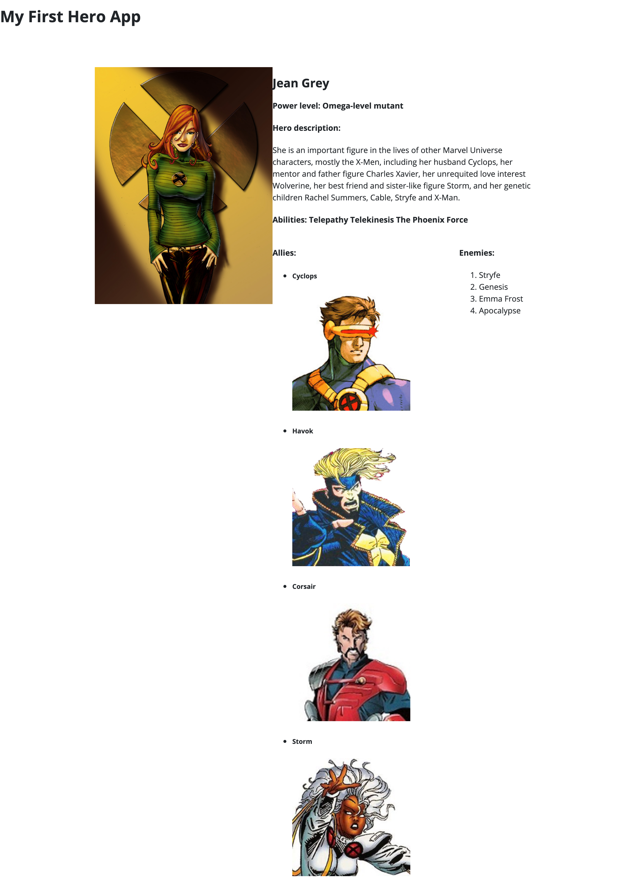
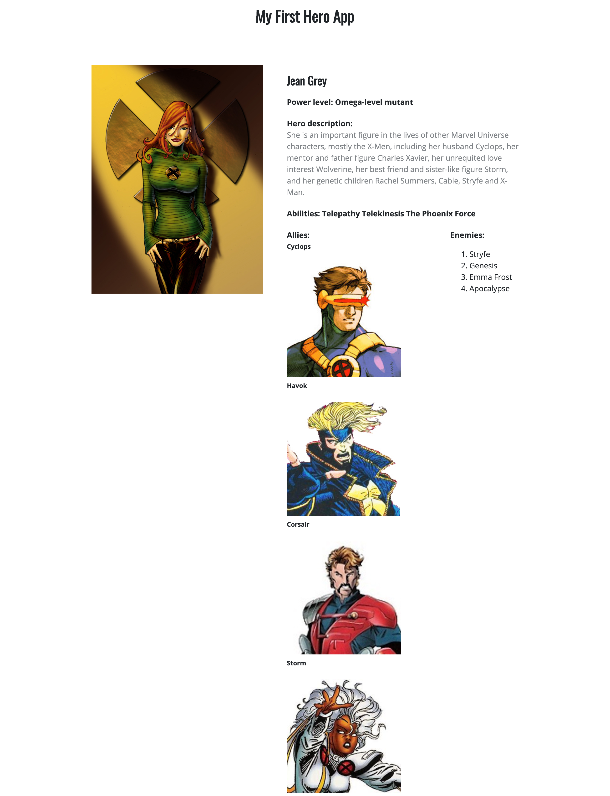
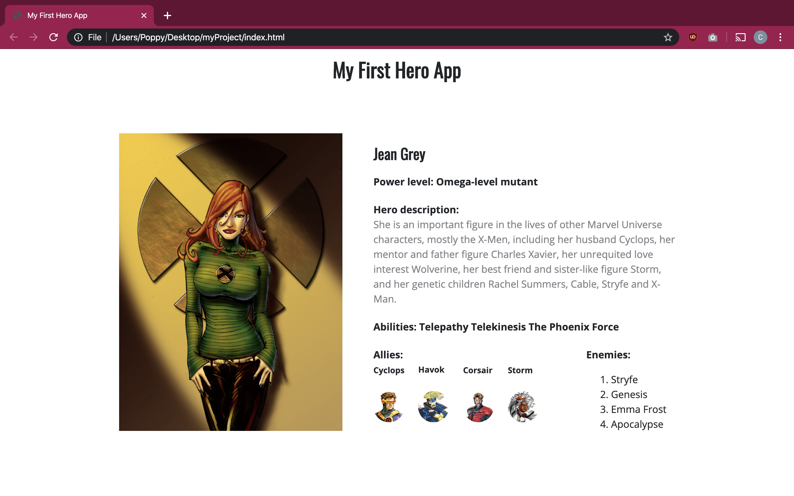

# Lecția 13

## Pasul 4 - stilizarea imaginii de profil

În această lecție vom adăuga CSS paginii web, pentru a o face să arate mult mai frumos. Începem cu cele două imagini de profil ale unui supererou. În momentul actual, sunt vizibile amândouă, însă vrem să apară doar una dintre ele în mod default, și atunci când merge cu mouse-ul peste ea \(hover\) să se schimbe în cealaltă imagine.

Clasele celor două imagini sunt **hero--image** \(cea vizibilă mereu\) și **hero--image-back** \(cea vizibilă la hover\). Vom lucra cu aceste clase asociate imaginilor, dar și cu div-urile **hero--left** și **hero--image-container**.

Adăugați codul următor în fișierul CSS și testati ce se întâmplă. La hover, imaginea trebuie să se schimbe.

```css
.hero--left {
  width: 40%;
  position: relative;
}

.hero--image {
  width: 100%;
  height: auto;
  position: absolute;
  backface-visibility: hidden;
}

.hero--image-back {
  width: 100%;
  height: auto;
  position: absolute;
  transform: rotateY(180deg);
  -webkit-transform: rotateY(180deg);
  backface-visibility: hidden;
}

.hero--image-container {
  min-height: 660px;
  position: relative;
  transform-style: preserve-3d;
  transition: transform .6s cubic-bezier(.55,.09,.68,.53) .05s;
  -webkit-transform-style: preserve-3d;
  -webkit-transition: -webkit-transform .6s cubic-bezier(.55,.09,.68,.53) .05s;
}

.hero--left:hover .hero--image-container {
  transform: rotateY(180deg);
  -webkit-transform: rotateY(180deg);
}
```

## Pasul 5 - stilizarea div-urilor

În continuare, să așezăm div-urile pe mai multe coloane, după cum am stabilit structura inițial.

```css
/* div-ul cu un supererou, conține și hero--left și hero--right */
.hero {
  width: 70%; /* ocupă 70% din lățimea paginii */
  min-width: 900px;
  position: absolute;
  left: 15% /* spațiere stânga */
  top: 115px; /* spațiere sus */
}


.hero--right {
  width: 60%; /* ocupă 60% din părinte, adică din div-ul hero */
  position: absolute;
  top: 0;
  right: 0;
  bottom: 0;
  left: 40%; /* loc pentru hero--left */
}

/* de completat */
.hero--details-left {
  width:%;
  float:;
}

/* de completta */
.hero--details-right {
  width:%;
  float:;
}
```

Copiați codul de mai sus și completați liniile `11, 12, 16 și 17`. Cele două div-uri, **hero--details-left** și **hero--details-right** identifică secțiunea de Allies și Enemies și trebuie să fie dispuse ca două coloane. Astel, folosiți proprietatea `float` pentru a poziționa unul dintre ele în partea stângă, iar pe celălalt în partea dreaptă. În plus, cele două nu au dimensiuni egale, de aceea folosiți width exprimat în procente. Cel din stânga este mai mare \(70%\), iar cel din dreapta mai mic și ocupă restul spațiului rămas. Puteți să modificați aceste numere să vedeți cum se schimbă.

De asemenea, div-urile **hero--right** și **hero-left** se comportă similar, pe două coloane. **hero--left** a fost deja adăugat la pasul anterior, cu o lățime de 40% din dimensiunea paginii. Astfel, menționând `left:40%;` pentru **hero--right**, va fi poziționat să aibă în partea stângă 40% din pagina web, adică suficient loc pentru div-ul **hero--left**. S-a obținut efectul de `float:left; și float:right;` într-un alt mod.

Div-ul **hero** se referă la uîntreagă zona în care afisăm conținut despre supererou. Acesta conține înauntrul său toate celelalte div-uri \(image, details left, details right etc\). Folosind `width:70%; și left:15%;`, acest div va fi mereu centrat în pagină, deoarece are la stânga o spațiere de 15% din lățimea paginii, are o dimensiune de 70% din lățimea paginii și implicit o spațiere de 15% în partea dreaptă, deci este centrat.

După ce ați completat cele 4 linii cu valorile corecte și ați salvat modificările, pagina ar trebui să arate astfel:



Încă nu este gata, dar suntem pe drumul cel bun. Imaginile eroilor de la Allies trebuie micșorate, mai avem de adăugat culori și diferite efecte, dar mai ales spațiere \(margins, padding\) pentru că div-urile au conținutul prea apropiat și ajung să se unească. În plus, mai avem de centrat titlul \(My First Hero App\) și de scris elementele listei Allies pe o singură linie, nu coloană.

## Pasul 6 - spațiere

După cum am adăugat anterior, conținutul div-urilor este prea apropiat. Din acest motiv, pentru a arăta cât mai bine, vom adăuga niște margini și padding.

```css
.hero--allies {
  padding: 0;
  margin: 0;
}

.hero--allies li {
  display: inline-block; /* elementele sunt pe o singură linie */
  margin-right: 18px;
}

.hero--allies li h5 {
  margin-top: 0;
}

.hero--right-inner {
  padding-left: 50px; /* spațiere în stânga */
}

.hero--right-inner h4 {
  margin-bottom: 0;
}

.hero--right-inner p {
  margin-top: 0;
  color: #808488; /* gri */
}
```

Copiați codul de mai sus, care va alinia div-urile. În continuare, com stiliza heading-urile.

```css
h1 {
  text-align: center; /* centrare în pagină */
  margin-bottom: 70px;
  font-family: 'Oswald', sans-serif;
}

/* adăugați font-ul Oswald ca mai sus și pentru h2 */
h2 {
}
```

După modificările făcute, pagina va arăta astel. Se observă că au dispărut bulinele de elementele listei neordonate; acest lucru se întâmplă pentru că au `display: inline-block;`



## Pasul 7 - rotunjirea imaginilor

Imaginile de la Allies sunt prea mari. Le vom seta la o lățime de 50 de pixeli și o rotunjire de 50%. Aceste imagini au clasa `img-round`

```css
.img-round {
    width:;
    border-radius:;
}
```

Completați codul de mai sus și adăugați-l în fișierul CSS. Rezultatul obținut este:




Dacă nu ați obținut acelasi aspect, verificați CSS-ul și denumirea claselor. În plus, verificați ca fiecare element din lista neordonată să conțină atât text, cât și imaginea, de forma:


```markup
<li>
<h5>Cyclops</h5>

</li>
```

