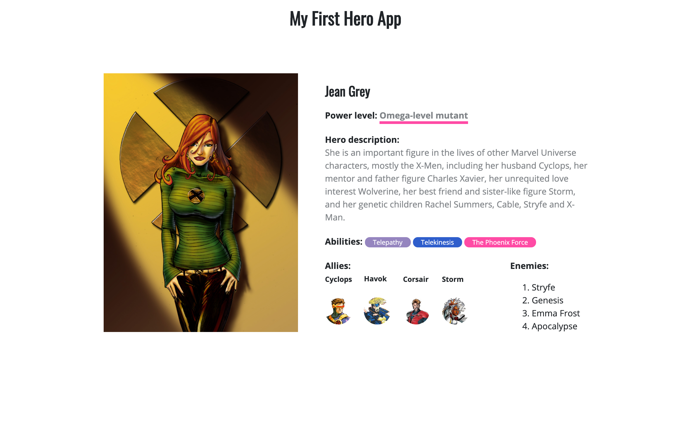

# Lecția 14

## Pasul 8 - culori

Este timpul să adăugăm culori paginii web. În div-ul **hero--right-inner**, ați adăugat un header h4 în care ați menționat nivelul de putere al supereroului. Dorim să îl stilizăm și scrisul să fie gri, subliniat cu roz. Putem stiliza astfel întreg conținutul lui h4, sau doar o parte a textului. De exemplu, în cadrul tutorialul stilizăm doar textul "Omega-level mutant", nu și "Power Level:". Pentru această separare folosim `span-uri`. Astfel, includeți într-un span textul care doriți să fie stilizat.

În fișierul CSS avem nevoie de următoarele proprietăți adăugate asupra `span-ului` din elementele cu clasa **hero--power** \(Adică header-ul h4 despre care am vorbit anterior\):

```css
.hero--power span{
  border-bottom: 5px solid #ff4ca5; /* sublinierea cu roz */
  color: #808488; /* textul cu gri */
}
```


Testați rezultatul. Puteți modifica tipul de bordură, grosimea, culoarea, dar și culoarea textului pentru a vă personifica proiectul.


În plus, vom colora diferit fiecare abilitate menționată în secțiunea Abilities, din div-ul **hero--details**. Astfel, adăugăm fiecare element \(abilitate\) într-un span cu două clase: una numită **badge** pentru construirea unui dreptunghi in jurul textului, și una **badge-color\_name** pentru a da fiecărui element câte o culoare diferită. Codul HTML arată astfel:

```css
<h4>Abilities:
<span class="badge badge-purple">Telepathy</span>
<span class="badge badge-blue">Telekinesis</span>
<span class="badge badge-pink">The Phoenix Force</span>
</h4>
```

Codul CSS necesar este următorul. Completați-l unde este nevoie, specificând pentru clasa badge dimensiunea fontului de 12px, înălțimea de 15px, rotunjirea de 20px și culoarea alb.

```css
/* completați valorile proprietăților de mai jos */
.badge {
  text-shadow: none;
  font-size:;
  padding: 1px 15px; /* 1px sus și jos, 15px dreapta și stânga */
  font-weight: normal;
  line-height:;
  border-radius:;
  color:;
}

/* adăugați culori pentru cele 3 badge-uri de mai jos */
.badge-purple {
  background-color:;
}

.badge-blue {
}

.badge-pink {
}
```

În final, șablonul complet pentru un supererou arată astfel:



## Pasul 9 - animații


