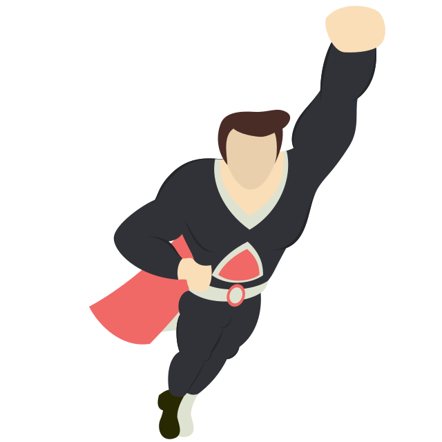

# Lecția 14

## Pasul 8 - culori

Este timpul să adăugăm culori paginii web. În div-ul **hero--right-inner**, ați adăugat un header h4 în care ați menționat nivelul de putere al supereroului. Dorim să îl stilizăm și scrisul să fie gri, subliniat cu roz. Putem stiliza astfel întreg conținutul lui h4, sau doar o parte a textului. De exemplu, în cadrul tutorialul stilizăm doar textul "Omega-level mutant", nu și "Power Level:". Pentru această separare folosim `span-uri`. Astfel, includeți într-un span textul care doriți să fie stilizat.

În fișierul CSS avem nevoie de următoarele proprietăți adăugate asupra `span-ului` din elementele cu clasa **hero--power** \(Adică header-ul h4 despre care am vorbit anterior\):

```css
.hero--power span{
  border-bottom: 5px solid #ff4ca5; /* sublinierea cu roz */
  color: #808488; /* textul cu gri */
}
```


Testați rezultatul. Puteți modifica tipul de bordură, grosimea, culoarea, dar și culoarea textului pentru a vă personifica proiectul.


În plus, vom colora diferit fiecare abilitate menționată în secțiunea Abilities, din div-ul **hero--details**. Astfel, adăugăm fiecare element \(abilitate\) într-un span cu două clase: una numită **badge** pentru construirea unui dreptunghi in jurul textului, și una **badge-color\_name** pentru a da fiecărui element câte o culoare diferită. Codul HTML arată astfel:

```css
<h4>Abilities:
<span class="badge badge-purple">Telepathy</span>
<span class="badge badge-blue">Telekinesis</span>
<span class="badge badge-pink">The Phoenix Force</span>
</h4>
```

Codul CSS necesar este următorul. Completați-l unde este nevoie, specificând pentru clasa badge dimensiunea fontului de 12px, înălțimea de 15px, rotunjirea de 20px și culoarea alb.

```css
/* completați valorile proprietăților de mai jos */
.badge {
  text-shadow: none;
  font-size:;
  padding: 1px 15px; /* 1px sus și jos, 15px dreapta și stânga */
  font-weight: normal;
  line-height:;
  border-radius:;
  color:;
}

/* adăugați culori pentru cele 3 badge-uri de mai jos */
.badge-purple {
  background-color:;
}

.badge-blue {
}

.badge-pink {
}
```

În final, șablonul complet pentru un supererou arată astfel:


## Pasul 9 - animații

În continuare, vom adăuga o animație cu un supererou care zboară pe ecran și face două repetiții pe același traseu, după care dispare.

Pentru început, vom adăuga acest supererou: poza este în folderul `img`, numită `myHero.svg`. Adăugați un nou div, în body, cu clasa `flyingHero`, nelegat de div-ul existent. Pentru ușurință, îl puteți plasa chiar când începe `body`. În acest div, singurul element de care avem nevoie este imaginea supereroului, având grijă la calea către imagine și extensia folosită.



Următorul pas este să adăugăm CSS-ul. Setați înălțimea imaginii la 400px. Linia 5, cu proprietatea animation, va fi completată mai târziu.

```css
.flyingHero {
  position: fixed;
  left: -500px; /* pozitia initiala este in afara ecranului */
  top: 50%; /* centrat pe verticala in body */
  animation:;
}

.flyingHero img {
  position: relative;
  transform: rotate(45deg); /* rotirea imaginii cu 45 de grade */
}
```

Pentru a implementa o animație folosim cuvântul cheie @keyframes, urmat de numele animației. Animațiile se scriu tot în fișierul CSS.

```css
@keyframes fly {
  0% {
    left: -560px;
    top: calc(50vh - 280px);
  }
  30% {
    left:;
    top:;
  }
  60% {
    left:;
    top:;
  }
  100% {
    left: -560px;
    top: calc(50vh - 280px);
  }
}
```

Completați punctele intermediare cu ce poziții doriți pe ecran.

Acum că am definit animația întorceți-vă la stilizarea div-ului flyingHero, pentru a specifica ce animație să fie apelată. Sintaxa necesară este următoarea:

```css
animation: name duration repetition;
```

Adăugați animația definită, cu o durată și un număr de repetiții alese de voi, iar apoi testați. Supereroul formează un triunghi pe ecran de mai multe ori, în punctele specificate.


Animația se pornește la fiecare refresh, ceea ce ar putea să încurce. Odată implementată, comentați div-ul `flyingHero` pentru a elimina animația cât timp lucrați.


