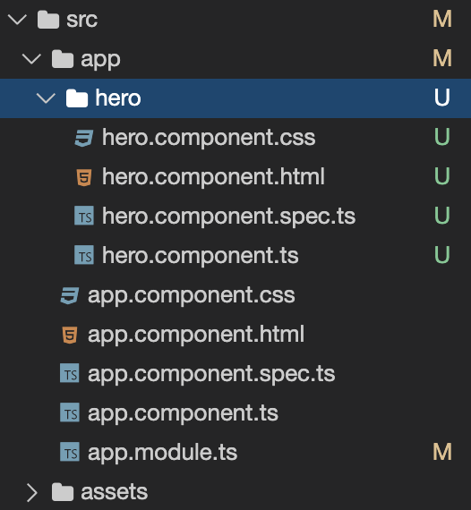
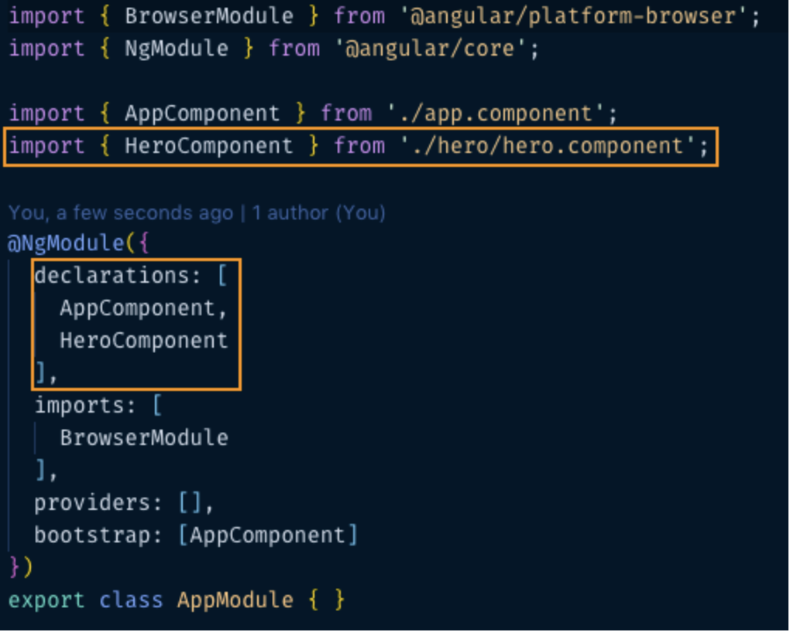
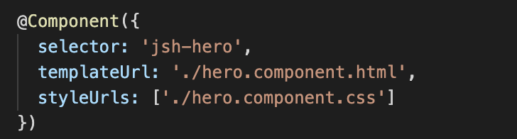
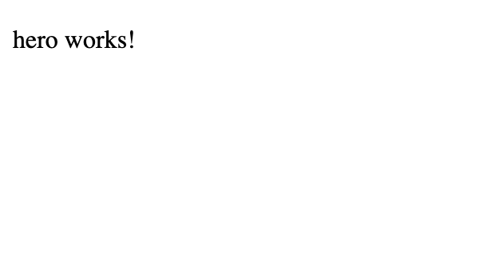
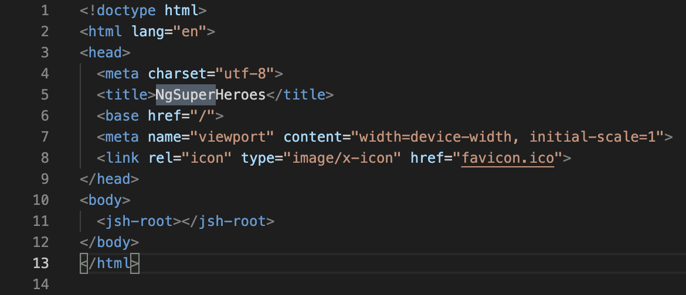
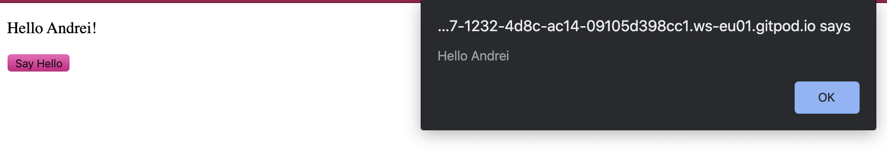
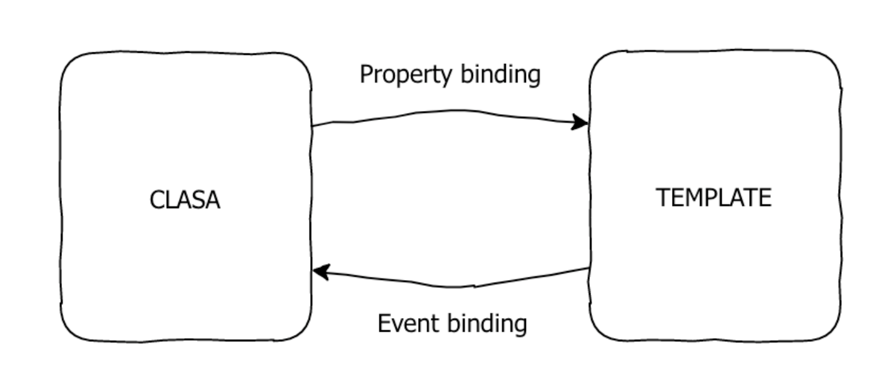
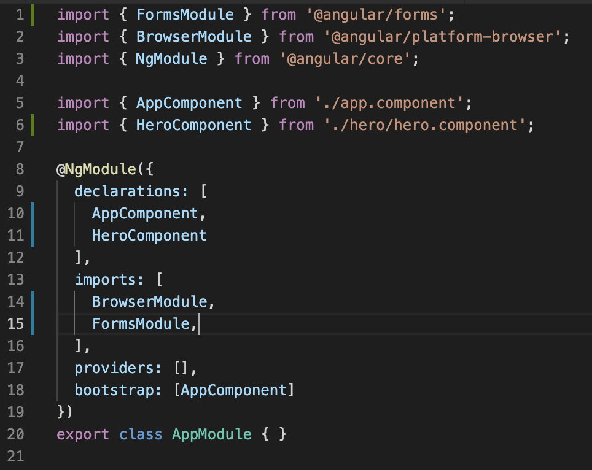
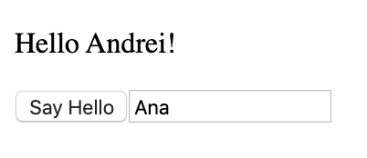

# Lecția 10

## Starter

Deschideți în Gitpod proiectul la care lucrați și în terminal rulați comanda: `npm install -g @angular/cli`

## Activitate 1 - Crearea unei componente

Durată: 15' \| Metodă: prelegere \| Materiale: -

O **componentă** în Angular este echivalentul unei clase. Printr-o componentă putem defini cum arată și cum se comportă un anumit element pe care îl vom adăuga în pagina web. Puteți vedea componentele ca și cum noi am scrie propriile etichete. Mai pot fi asemănate cu niște piese de LEGO pe care le asamblăm pentru a crea un proiect mai mare.

Componenta principală într-o aplicație Angular este **app component**, care deja este prezentă în proiectul vostru. În cadrul ei vom grupa alte componente și elemente pentru a crea conținutul, aspectul și funcționalitatea dorită. Ne vom referi la fișierul HTML al unei componente ca fiind **template-ul** acesteia.

Pentru a genera automat o componentă \(adică să nu creem noi de mână toate fișierele și să nu scriem codul de la 0\) vom folosi Angular CLI. Rulează următoarea comandă în terminal:

```text
ng generate component Hero
```

Rularea acestei comenzi are 2 efecte:

1. a creat pentru noi folderul hero \(după numele componentei\) care are înauntru 4 fișiere



Folderul **hero** conține:

* `hero.component.ts` -  fișier în care definim logica componentei \(cum se comportă\); ts este prescurtare de la Typescript, părintele JavaScript-ului, deci putem scrie cod JS cum am învățat
* `hero.component.html` - fișier ce conține ce elementele vizuale ale componentei \(structura vizuală și conținutul\)
* `hero.component.css` - fișier ce conține detalii despre cum arata elementele vizuale din componenta \(stilurile componentei\)
* `hero.component.spec.ts` - fișier pentru testare cu care nu vom lucra

2. a înregistrat componenta în modulul aplicației \(fisierul `src/app/app.module.ts`\), dupa ce a importat-o pentru a putea fi folosită



Pentru a putea folosi componenta tocmai creată, trebuie să o includem în template-ul unei alte componente. În cazul de față trebuie să adăugăm un tag `<jsh-hero>` în template-ul componentei `AppComponent`. **Prefixul `jsh` este adaugat automat numelui componentei pentru a evita coliziunea de nume cu elemente standard de html.**

Numele tagului vine din proprietatea `selector` aflata in decoratorul componentei:



**Î**nlocuiți codul existent în fișierului `src/app/app.component.html` cu urmatoarea linie de cod:

```markup
<jsh-hero> </jsh-hero>
```

Salvați codul \(`ctrl + S`\), dacă nu se salvează automat \(autosave\) și scrieți `ng serve` , sau `ng s` pe scurt, în terminal pentru a vedea modificările:



De unde apare acest text? Deschideți hero.component.html și veți vedea paragraful inclus. Modificați textul și dați refresh.


Ați observat că în hero.component.html am scris direct eticheta `<p></p>`, fără să scriem structura cu care eram obișnuiți, cu head și body. În interiorul componentelor \(app component și cele create de noi - momentan doar hero component\) vom scrie conținutul componentei direct, deci nu avem nevoie să introducem head și body.


Dacă vă uitați în meniul din partea stângă, veți vedea mai jos fișierul `index.html`, care conține o structură obișnuită de pagină html, cu etichetele `html, head și body`.



Observați că eticheta body conține doar o altă etichetă, numită `<jsh-root></jsh-root>`. Acesta este selectorul pentru componenta principală a aplicației noastre \(app component\) și îl puteți găsi declarat în app.component.ts. Orice includem în app component este astfel adăugat în aplicația noastră.

Cu alte cuvinte: `index.html` conține selectorul lui **app component** care conține în HTML selectorul lui **hero component** care conține un paragraf, deci atâta are momentan aplicația noastră.


De asemenea, proiectul are, pe lângă `index.html`, și un fișier `stylesheet.css`, unde deja sunt incluse niște stilizări pentru elementele pe care le vom folosi. Stilizarea de aici se aplică asupra tuturor componentelor \(este globală\). Pentru stilizări particulare, vom scrie în `nume-componentă.component.css` codul CSS necesar.


## Activitate 2 - Binding de proprietăți

Durată: 5' \| Metodă: prelegere \| Materiale: -

De cele mai multe ori în aplicațiile noastre vom dori ca textul dintr-o componentă să fie dinamic \(să se schimbe în funcție de îndeplinirea unor condiții\). Pentru asta ne vom folosi de mecanismul de `data-binding`. Avem nevoie de o variabilă \(care va conține textul dinamic\) pe care să o folosim în template.

În componenta `HeroComponent` \(fișierul `hero.component.ts`\) adăugați o proprietate numită `name` pe care o inițializați cu numele vostru:

```javascript
export class HeroComponent implements OnInit {
    public name = 'Andrei'; // adăugați linia aceasta de cod

    // restul rămâne neschimbat
    ... 
}
```

Pentru a afișa valoarea variabilei, în template-ul componentei `HeroComponent` \(fișierul `component.html`\) adăugați numele variabilei între două perechi de acolade \(`{{name}}`\).

```javascript
<p>
  Hello {{name}}!
</p>
```

Porniți serverul cu `ng serve` \(dacă era închis\). Dați refresh paginii pentru a vedea modificările.

## Activitate 3 - Event binding

Durată: 10' \| Metodă: prelegere \| Materiale: -

Ne dorim ca în momentul în care apare un eveniment generat de utilizator \(click, input, scroll etc.\) să rulăm o anumită bucată de cod. Aceasta se realizează prin legarea evenimentului în template de o metodă a clasei componentei.

De exemplu, vrem ca în momentul în care apăsăm pe un buton, să apară un alert cu numele nostru \(de ex. `Hello Andrei`\).

În componenta `HeroComponent` \(fișierul `hero.component.ts`\) adăugați o metodă numită `sayHello` care va afișa un mesaj ce conține numele aflat în proprietatea `name`:

```javascript
sayHello() {
    alert('Hello ' + this.name);
}
```

În template-ul componentei `HeroComponent` \(fișierul`hero.component.html`\) adaugati un buton care sa aibe ca text `Say Hello`.

```markup
<button>Say Hello</button>
```

Dacă rulați acum aplicația și apăsați pe butonul nou creat, veți vedea că nu se întâmplă încă nimic. Pentru a lega actiunea de `click` la funcția din clasa mai este necesar un pas. Trebuie să îi spunem ce eveniment atașat elementului respectiv este asociat cărei acțiuni din clasa. Modificati butonul recent adaugat cu urmatorul cod:

```markup
<button (click)="sayHello()">Say Hello</button>
```

Ce conține codul de mai sus?

* **`(click)`** - parantezele rotunde semnalează un binding de eveniment, iar în interiorul parantezelor este numele evenimentului ce declansează acțiunea \(în cazul de față, acțiunea este `click` pe buton\)
* **`="sayHello()"`** - in partea dreaptă a egalului, intre ghilimele se află numele funcției ce urmează sa fie chemată în momentul în care este declanșat evenimentul. **Numele trebuie neapărat să fie o funcție declarată în clasa componentei, altfel se va ivi o eroare.**

Dacă rulați din nou aplicația veți vedea că în momentul în care veți da click, va fi afișat numele stocat în variabila name într-o alertă:




## Activitate 4 - Exercițiu

Durată: 10' \| Metodă: prelegere \| Materiale: -

Folosind property și event binding explicate anterior, adăugați în componenta hero o variabilă contor care ține evidența de câte ori a fost apăsat un buton. La apăsarea butonului, se va afișa numărul curent de apăsări.

## Activitate 5 - Two-way binding

Durată: 10' \| Metodă: prelegere \| Materiale: -

Am descoperit că există 2 modalități de comunicare între template-ul unei componente \(.html\) și clasa sa \(.ts\), și anume property binding și event binding. 

Property binding: afișarea în template a proprietăților din clasa \(deci de la clasă la tempalte\)

Event binding: semnalarea evenimentelor din template către clasă \(deci de la template la clasă\). 

Diagrama de mai jos ilustreaza aceste 2 moduri de comunicare clasa/template:



Dar mai există și o a treia modalitate ce implică o comunicare bidirecțională între clasă și template.

Adăugați în template-ul componentei un element &lt;input&gt;.

```markup
<input [ngModel]="name">
```

Pentru a-l inițializa cu valoarea variabilei `name` adăugam un property binding. Binding-ul îl vom realiza cu ajutorul cuvântului cheie `ngModel`. Fara a intra prea mult în detalii, `ngModel` este o directivă care îi spune elementului `<input>` de la ce proprietate a clasei să își ia valoarea, în cazul de față, de la proprietatea `name` pe care am declarat-o și utilizat-o anterior.

Dacă ați întâmpinat o eroare, aceasta se datorează faptului că nu am inclus în aplicație modulul ce se ocupă cu prelucrarea formularelor:`ngModel` este o directivă ce este inclusă în modulul `FormsModule` și nu poate fi folosită fără acesta.

Pentru a adăuga modulul, trebuie mai întâi importat în `AppModule` \(in fișierul `app.module.ts`\). Adăugati urmatoarea linie de cod pe primul rând al fișierului:

```javascript
import { FormsModule } from '@angular/forms';
```

Apoi adăugați modulul în array-ul `imports`:

```javascript
@NgModule({
    declarations: [ ... ],
    imports: [
        BrowserModule,
        FormsModule // adăugat acum
    ],
    ...
})
```

Fișierul `app.module.ts` arată acum astfel:



Dacă rulați acum codul, aplicația ar trebui să meargă fără erori, odată ce am inclus import-urile necesare. Însă dacă schimbăm textul din input, nimic nu se întâmplă. Am fi vrut să creem o legătură între input și proprietatea name, astfel încât dacă schimbăm textul din input, acesta să se modifice și în paragraful cu `Hello {{name}}!`



Pentru a semnaliza că vrem ca proprietatea la care facem bind să se schimbe odată cu evenimentul de input, trebuie să creem un nou tip de binding: **two-way binding**. Pentru aceasta folosim urmatoarea notație: `[(ngModel)]="name"`

* **`(ngModel)`** - schimbă textul în direcția template -&gt; clasă \(cand se introduce un caracter de la tastatură\)
* **`[ngModel]`** - schimbă proprietatea de la clasă la template \(setează valoarea inițială sau dacă o schimbăm programatic, din codul clasei\)
* **`="name"`** - în partea dreapta avem între ghilimele numele proprietății din clasa la care vrem să facem binding. Nu uitați că aceasta trebuie să fie un nume valid de proprietate, altfel veți avea o eroare.

Astfel, elementul de input adăugat devine:

```javascript
<input [(ngModel)]="name">
```

Iar acum dacă încercați să modificați numele din input veți vedea că această modificare este reflectată în timp real, atât în template, cât și dacă apăsați pe buton \(numele va fi actualizat cu valoarea schimbată\):


## Final

Nu uitați ca la finalul lecției să faceți commit și push pentru a updata proiectul cu noile modificări.

Dacă serverul este pornit, apăsați `ctrl + C` pentru a îl opri.

Puteți folosi comanda `git status` în terminal pentru a vedea un rezumat al modificărilor aduse de voi.

Pentru a salva codul scris astăzi, folosiți următoarele comenzi:

```javascript
git add .
git commit -m "mesajul"
git push
```


