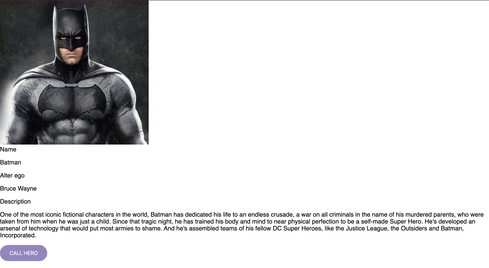
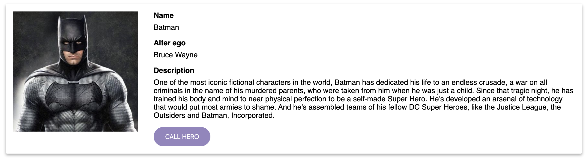

# Lecția 11

## Starter

Deschideți în Gitpod proiectul la care lucrați și în terminal rulați comanda: `npm install -g @angular/cli`

## Activitatea 1 - Detaliile unui supereroi

Durată: 10' \| Metodă: prelegere \| Materiale: -

Acum că ne-am familiarizat cu felul în care funcționează o componentă, să începem să adăugăm detaliile corespunzătoare unui erou în componenta `HeroComponent`. Pentru aceasta trebuie mai întâi să ne gândim ce fel de informații am vrea să afișăm pentru un erou:

1. **Nume** - numele de scena al eroului \(de ex. Batman\)
2. **Alter ego** - adevarata identitate \(secretă\) a eroului \(de ex. Bruce Wayne\)
3. **Scurtă descriere** - o scurtă descriere a eroului și a superputerilor acestuia
4. **Imaginea eroului** - calea către o poză cu eroul
5. **Buton pentru chemarea eroului** - când apăsam acest buton, un mesaj va fi trimis să cheme eroul, și va afișa o alertă care să confirme acest lucru \(de ex. `'Batman a fost chemat'`\)

Pentru început, să concepem html-ul \(structura vizuală\) pentru componentă. Înlocuiți conținutul template-ului \(`hero.component.html`\) cu urmatorul mark-up:

```markup
<div class="hero">
  <!-- IMAGE -->
  <div class="photo">
    
  </div>
  <div class="details">
    <!-- NAME -->
    <span class="detail-title">Name</span>
    <p class="detail-text">Batman</p>
    <!-- ALTER EGO -->
    <span class="detail-title">Alter ego</span>
    <p class="detail-text">Bruce Wayne</p>
    <!-- DESCRIPTION -->
    <span class="detail-title">Description</span>
    <p class="detail-text">One of the most iconic fictional characters in the world,
    Batman has dedicated his life to an endless crusade, a war on all criminals in the
    name of his murdered parents, who were taken from him when he was just a child.
    Since that tragic night, he has trained his body and mind to near physical perfection
    to be a self-made Super Hero. He's developed an arsenal of technology that would put
    most armies to shame. And he's assembled teams of his fellow DC Super Heroes, like the
    Justice League, the Outsiders and Batman, Incorporated.</p>
    <!-- BUTTON -->
    <button class="btn btn-xl btn-purple">CALL HERO</button>
  </div>
</div>
```

Rezultatul când pornim serverul:



Deși avem toate informațiile necesare pe ecran, componenta nu arată foarte atrăgător din punct de vedere vizual. Observați faptul că fiecare element are aplicat pe el o clasă, pentru a le putea stiliza. Amintiți-vă că acestui proiect deja i se aplică niște stilizări globale definite în `stylesheet.css`. 

Adăugați următorul cod CSS iî fișierul de stilizare al componentei \(`hero.component.css`\):

```css
.hero {
  min-width: 50vw;
  display: flex;
  padding: 16px;
  margin: 16px 16px 64px 16px;
  border-radius: 2px;
  box-shadow: 0 3px 6px rgba(0, 0, 0, 0.16), 0 3px 6px rgba(0, 0, 0, 0.23);
}

.photo {
  margin: 0 24px 8px 0;
}

.detail-title {
  font-weight: bold;
  font-family: 'Oswald', sans-serif;
}

img {
  width: 270px;
  margin-right: 10px;
}

p {
  margin-top: 8px;
}
```

Rezultatul:




În aceste lecții, veți primi direct codul HTML și CSS necesar. Scopul este să vă familiarizați cu Angular, nu să vă testăm cunoștințele din semestrul trecut. Dacă aveți neclarități legate de HTML și CSS, căutați pe net sau comentați codul pentru a vedea de ce era necesar.


## Activitatea 2  - Modelul de date pentru un erou

Durată: 20' \| Metodă: prelegere \| Materiale: -

Am reușit să definim ce date ar trebui să se afișeze și cum ar trebui să fie prezentate \(stilul vizual\). Însă, felul în care am implementat componenta nu este unul deosebit de flexibil întrucat dacă am dori să modificăm informațiile eroului, ar trebui să modificăm direct textul static din template. Iar scopul nostru final nu este să definim câte o componentă pentru fiecare erou, ci mai degrabă să creem o componentă pe care să o refolosim. 

Primul pas pentru a îmbunătăți componenta este să mutăm datele \(numele, alter-ego, descrierea și sursa pozei\) în clasa componentei și să folosim binding-ul pentru a le afișa. Deși prima intuiție ar fi să creem câte o proprietate pentru fiecare, există o modalitate mai bună.

Trebuie să creem o clasă care să definească modelul de date pentru erou. Pentru a crea un fișer care să conțină o clasă în proiect, folosiți următoarea comandă în terminal:

```css
ng generate class Hero
```

Aceasta comandă va crea un fișier numit `hero.ts` în folderul `src/app/`. Dacă inspectăm conținutul fișierului, vom vedea că avem deja definiția clasei `Hero`

```javascript
export class Hero {
}
```

În continuare trebuie să adăugam proprietățile ce definesc un erou, așa cum le-am expus mai sus. Proprietățile definite pe clase se pot defini ca parametrii publici ai constructorului și astfel acestea vor fi create automat. Definiția completă a clasei este:

```javascript
export class Hero {
  constructor(
    public name: string,
    public alterEgo: string,
    public description: string,
    public photo: string,
  ) {}
  // constructorul are doar parametrii, momentan corpul este gol
}
```

În acest moment putem defini obiecte de tip `Hero` folosind operatorul `new` în acest fel:

```javascript
const hero = new Hero(
    'Batman',
    'Bruce Wayine',
    "One of the most iconic fictional characters in the world, Batman has dedicated his life to an endless crusade, a war on all criminals in the name of his murdered parents, who were taken from him when he was just a child. Since that tragic night, he has trained his body and mind to near physical perfection to be a self-made Super Hero. He's developed an arsenal of technology that would put most armies to shame. And he's assembled teams of his fellow DC Super Heroes, like the Justice League, the Outsiders and Batman, Incorporated.",
    'assets/batman.jpg'
)
```

De asemenea mai putem crea obiecte de tip `Hero` și folosind declarația directă de obiect:

```javascript
const hero: Hero = {
    name: 'Batman',
    alterEgo: 'Bruce Wayine',
    description: "One of the most iconic fictional characters in the world, Batman has dedicated his life to an endless crusade, a war on all criminals in the name of his murdered parents, who were taken from him when he was just a child. Since that tragic night, he has trained his body and mind to near physical perfection to be a self-made Super Hero. He's developed an arsenal of technology that would put most armies to shame. And he's assembled teams of his fellow DC Super Heroes, like the Justice League, the Outsiders and Batman, Incorporated.",
    photo: 'assets/batman.jpg'
}
```

Rezultatul celor două este același, în ambele cazuri creându-se un obiect ce respectă semnătura tipului `Hero`.

În acest moment avem un model pentru tipul `Hero`, mai ramane doar să adăugăm un obiect de acest tip în componenta noastră pentru a-l afișa. Înainte de a începe, să facem puțină curățenie în componentă \(in fișierul `src/app/hero/hero.component.ts`\):

* stergeti proprietatea `name`
* stergeti functia `sayHello()`

Componenta voastra ar trebui să arate așa:

```javascript
import { Component, OnInit } from '@angular/core';

@Component({
  selector: 'jsh-hero',
  templateUrl: './hero.component.html',
  styleUrls: ['./hero.component.css']
})
export class HeroComponent implements OnInit {
  constructor() { }

  ngOnInit() { }
}
```

Pentru a putea folosi clasa `Hero` în componenta noastră trebuie mai întâi să importăm fișierul. Adăugați următoarea declarație la znceputul fișierului `hero.component.ts`:

```javascript
import { Hero } from '../hero';
```

Adăugați o proprietate publică numită `hero` de tipul `Hero`:

```javascript
export class HeroComponent implements OnInit {
  public hero:Hero;
  
  constructor() { }
  
  ngOnInit() {
  }

}
```

În interiorul functiei `ngOnInit()` inițializați proprietatea cu un obiect de tip `Hero`:

```javascript
ngOnInit() {
  this.hero = new Hero(
    'Batman',
    'Bruce Wayne',
    "One of the most iconic fictional characters in the world, Batman has dedicated his life to an endless crusade, a war on all criminals in the name of his murdered parents, who were taken from him when he was just a child. Since that tragic night, he has trained his body and mind to near physical perfection to be a self-made Super Hero. He's developed an arsenal of technology that would put most armies to shame. And he's assembled teams of his fellow DC Super Heroes, like the Justice League, the Outsiders and Batman, Incorporated.",
    'assets/batman.jpg'
  );
}
```

## Activitatea 3 - Binding pe proprietăți

Durată: 10' \| Metodă: prelegere \| Materiale: -

Avem în acest moment datele pentru erou pe proprietatea `hero` în componentă. A mai ramas un singur pas pentru a le afișa pe ecran: binding la date în template.

Pentru a înlocui numele static din template și a aduce valoarea proprietății `name` de pe `hero`trebuie să înlocuim textul din template cu o interpolare \(`{{...}}`\) pentru proprietate. Astfel în template \(în fișierul `src/app/hero/hero.component.html`\), linia :

```markup
<p class="detail-text">Batman</p>
```

devine

```markup
<p class="detail-text">{{hero.name}}</p>
```

Dacă dați refresh la pagină, veți vedea că nimic nu s-a schimbat, însă implicațiile înlocuirii textului static cu cel din clasă sunt foarte importante. Pentru a ilustra acest fapt, la instantierea obiectului `hero`, înlocuiți numele eroului din `Batman` în `Wonder Woman` și dați refresh.

```javascript
ngOnInit() {
    this.hero = new Hero(
      'Wonder Woman',
    ...
    );
}
```

Observați în browser că acum numele s-a modificat însă este foarte important de remarcat că această modificare s-a produs fară a mai modifica template-ul \(codul HTML\) - lucru ce face componenta mult mai utilă pentru că o putem folosi pentru orice structură de date de tip `Hero`.

Înlocuiți și celelalte texte statice cu interpolările proprietăților:

* `{{hero.alterEgo}}`
* `{{hero.description}}`
* Ultimul detaliu static rămas este poza. Pentru a rezolva, într-o primă fază ne putem folosi tot de mecanismul interpolării și înlocui textul static cu binding la proprietatea `photo` de pe proprietatea `hero`. Astfel, în template înlocuim:

```markup

```

cu

```markup

```

Deși această variantă funcționează, există un mecanism mai elegant pe care Angular ni-l pune la dispoziție pentru astfel de cazuri, și anume binding la proprietățile elementelor HTML. Dacă la binding-ul de evenimente foloseam perechea de paranteze rotunde \( `()` \), în acest caz se folosește o pereche de paranteze pătrate \( `[]` \). Astfel, putem rescrie codul de afișare al imaginii în felul urmator:

```markup

```

* **`[src]`** - paranteza pătrată în jurul unui atribut all elementului html \(trebuie sa fie un atribut valid altfel vom avea eroare\) semnalizeaza că ceea ce va veni în partea dreaptă a expresiei nu trebuie interpretat ca un simplu string, ci ca un nume de proprietate de pe clasa componentei a cărei valori va fi preluată
* **`="hero.photo"`** - în partea dreaptă, avem între ghilimele numele proprietății din clasa la care vrem să facem binding. Nu uitați că aceasta trebuie să fie un nume valid de proprietate, altfel veți avea o eroare

Daca reveniți în browser, din nou nu veți vedea nicio diferență față de varianta statică, însă diferența este una esențială pentru felul în care veti putea folosi mai departe componenta.

Un ultim aspect \(estetic\) pe care îl vom aplica este să afișăm numele eroului doar cu litere mari, chiar dacă în obiect textul conține și litere mici. Pentru aceasta, Angular vine din nou cu un mecanism ajutător numit `Pipe`. Pipe-urile sunt reprezentate în cod prin caracterul `|` iar rolul lor este să proceseze un input prin aplicarea unei funcții. Din punct de vedere al sintaxei, ar arăta în felul următor:

```markup
<p class="detail-text">{{hero.name | uppercase}}</p>
```

* **`uppercase`** - este doar o funcție de procesare, ce primește ca argument elementul din stânga caracterului `|`

Există mai multe pipe-uri predefinite în Angular \(pentru transformare de numere, valută sau date\), dar avem posibilitatea să creem și noi propriile noastre pipe-uri.

La final template-ul componentei va arăta astfel:

```markup
<div class="hero">
  <!-- IMAGE -->
  <div class="photo">
    
  </div>
  <div class="details">
    <!-- NAME -->
    <span class="detail-title">Name</span>
    <p class="detail-text">{{hero.name | uppercase}}</p>
    <!-- ALTER EGO -->
    <span class="detail-title">Alter ego</span>
    <p class="detail-text">{{hero.alterEgo}}</p>
    <!-- DESCRIPTION -->
    <span class="detail-title">Description</span>
    <p class="detail-text">{{hero.description}}</p>
    <!-- BUTTON -->
    <button class="btn btn-xl btn-purple">CALL HERO</button>
  </div>
</div>
```

## Activitatea 4 - Exercițiu

Durată: 10' \| Metodă: prelegere \| Materiale: -

Implementați funcționalitatea butonului `Call Hero` astfel încât în momentul în care este apăsat apare o alertă cu textul: `Batman (Bruce Wayne) has been called!`.

* folositi binding-ul de evenimente pe buton - `(click)`
* implementați o metoda `callHero()` în clasa componentei și legați-o de eveniment
* în funcție folosiți-vă de proprietățile `hero` pentru a afișa mesajul corespunzător
* folosiți `alert()` pentru afișare

## Final

Nu uitați ca la finalul lecției să dați git add, git commit și git push pentru a updata proiectul cu noile modificări.


