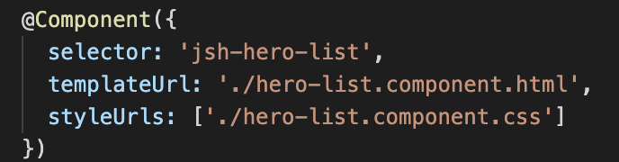
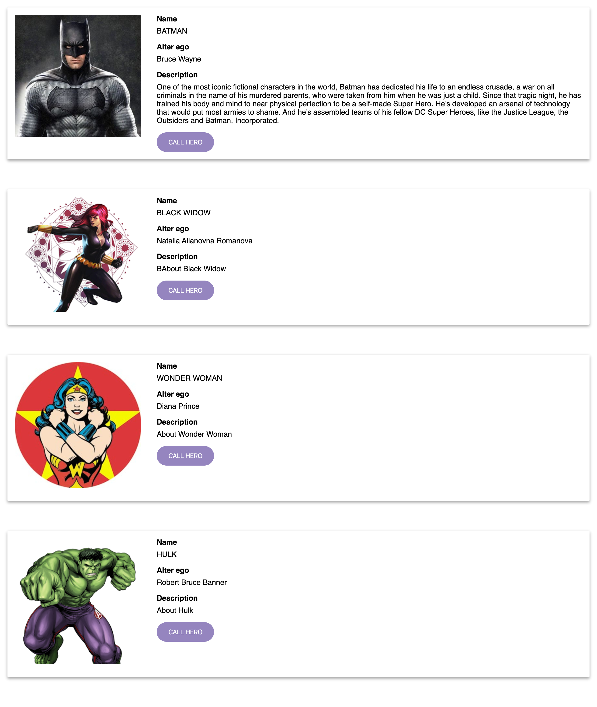

# Lecția 12

## Starter

Deschideți în Gitpod proiectul la care lucrați și în terminal rulați comanda: `npm install -g @angular/cli`

## Activitate 1 - Crearea lista de eroi

Durată: 15' \| Metodă: prelegere \| Materiale: -

Următorul obiectiv este să mai adăugăm în aplicație eroi astfel încât să creăm o echipa invincibilă! Echipa noastră va fi formată în final din 4 super eroi:

* Batman
* Wonder Woman
* Hulk
* Black Widow

În momentul de față avem o componentă `Hero` care afișează un erou pe baza datelor din componentă. Și cum datele sunt dinamice, putem presupune că o primă variantă pentru îndeplinirea obiectivului nostru este să luăm această componentă și să o folosim pentru fiecare erou.

Dacă ne uităm în template-ul componentei principale `AppComponent` \(fișierul `src/app/app.component.html`\), avem următorul mark-up:

```markup
<jsh-hero></jsh-hero>
```

Avem 4 super eroi deci ne-ar trebui 4 componente. Să multiplicam astfel componenta de 4 ori. În același fișier, înlocuiti codul cu următorul:

```markup
<jsh-hero></jsh-hero>
<jsh-hero></jsh-hero>
<jsh-hero></jsh-hero>
<jsh-hero></jsh-hero>
```

Dacă ne uităm la rezultat în browser, vom vedea că într-adevar avem 4 componente `Heros` însă toate conțin aceleași date. Și mai mult, dacă încercați să modificați datele eroului în `HeroComponent`\(`hero.component.ts`\) veți vedea că acea modificare va apărea în toate cele 4 componente. Asta se datorează faptului că datele folosite pentru afișarea eroului sunt create intern în componenta și nu le putem modifica din afara componentei pentru a afișa eroi diferiți.

De asemenea putem observa că cele 4 componente `Hero` sunt plasate direct în componenta principală. Deși nu este nimic greșit din punct de vedere programatic, acest design poate duce ușor la template-uri foarte voluminoase și greu de întreținut. O metodă mai indicată este să încercăm să construim ierarhii de componente.

Înainte de a adresa problema afișării eroilor diferiți, să ne ocupăm un pic de arhitectura aplicației. Pentru a îmbunătăți structura template-urilor și a face codul mai ușor de înțeles vom crea o componentă care să se ocupe de listarea eroilor. Această componentă va conține ulterior și toată logica necesară afișării. Pentru început, să creăm o nouă componentă numită `HeroListComponent`. Introduceți în lina de comandă \(terminal\) următoarea instrucțiune:

```text
ng generate component HeroList
```

Rezultatul rulării acestei comenzi va fi crearea unui folder in `src/app/hero-list` care conține fișierele corespunzătoare noii componente. În plus, componenta a fost adăugată automat și în modulul aplicației \(fisierul `src/app/app.module.ts`\).

În continuare trebuie să mutăm lista de eroi din `AppComponent` în `HeroList` component. Copiați conținutul template-ului din fișierul `src/app/app.component.html` în template-ul componentei `HeroList` \(fișierul `src/app/hero-list/hero-list.component.html`\), înlocuind conținutul existent. Astfel template-ul componentei de listare trebuie să arate astfel:

```markup
<jsh-hero></jsh-hero>
<jsh-hero></jsh-hero>
<jsh-hero></jsh-hero>
<jsh-hero></jsh-hero>
```

Astfel am realizat o relație părinte-copil între `HeroList` și cele 4 componente `Hero`:


Iar ca un pas final, trebuie să folosim componenta `HeroList` în `AppComponent` prin folosirea tag-ului corespunzător componentei. Acesta este definit în câmpul selector al decoratorului de componentă din fișierul `hero-list.component.ts`.



Folosiți acest selector prin definirea unui tag în template-ul `AppComponent`, înlocuind conținutul existent \(lista de eroi\):

```markup
<jsh-hero-list></jsh-hero-list>
```

Dacă reîncărcați browser-ul nu ar trebui să vedeți nicio modificare. Însă aplicația noastră are în acest moment o arhitectură mult mai bună prin crearea de relații copil-părinte între componente.


## Activitate 2 - Popularea listei de eroi

Durată: 20' \| Metodă: prelegere \| Materiale: -

Ce ne propunem în continuare este să găsim o modalitate prin care obiectul `Hero` din `HeroComponent` să nu mai fie creat în interiorul componentei, ci mai degrabă să fie transmis din exterior. Asta ne va permite să avem în aplicatie aceeași componentă, dar cu date de afișare diferite.

Principalul avantaj al definirii arhitecturii ca o ierarhie de componente este că avem un mecanism de comunicare între componente prin care părinții pot transmite date componentelor copil. Pentru a nu complica foarte tare fluxul de date și a-l face mai previzibil, comunicarea datelor este unidirecțională, doar de la părinte spre copil.

Modalitatea prin care putem realiza această comunicare este decorarea proprietăților clasei componentei cu `@Input()`.

Primul pas este să mutăm definirea obiectului erou din componenta `Hero` în componenta `HeroList`. Mai întai vom crea 4 obiecte de tip `Hero` în `HeroListComponent` \(`hero-list.component.ts`\):

```javascript
public hero1: Hero = {
  name: 'Batman',
  alterEgo: 'Bruce Wayne',
  description: "One of the most iconic fictional characters in the world, Batman has dedicated his life to an endless crusade, a war on all criminals in the name of his murdered parents, who were taken from him when he was just a child. Since that tragic night, he has trained his body and mind to near physical perfection to be a self-made Super Hero. He's developed an arsenal of technology that would put most armies to shame. And he's assembled teams of his fellow DC Super Heroes, like the Justice League, the Outsiders and Batman, Incorporated.",
  photo: 'assets/batman.jpg'
};

public hero2: Hero = {
  name: 'Black Widdow',
  alterEgo: 'Natalia Alianovna Romanova',
  description: 'About Black Widow',
  photo: 'assets/black-widow.png'
};

public hero3: Hero = {
  name: 'Wonder Woman',
  alterEgo: 'Diana Prince',
  description: 'About Wonder Woman',
  photo: 'assets/wonder-woman.jpg'
};

public hero4: Hero = {
  name: 'Hulk',
  alterEgo: 'Robert Bruce Banner',
  description: 'About despre Hulk',
  photo: 'assets/hulk.png'
};
```

De asemenea, trebuie să importăm clasa `Hero`. Adăugați următoarea linie de cod la începutul fișierului:

```javascript
import { Hero } from '../hero';
```

În componenta `HeroComponent` trebuie să eliminăm definirea eroului din funcția `ngOnInit()` și să adăugăm decoratorul `@Input()` proprietății `hero`. În plus, trebuie să adăugam `Input` la lista de importuri din `@angular/core`. Codul componentei `HeroComponent` ar trebui sa arate astfel:

```javascript
import { Component, OnInit, Input } from '@angular/core';
import { Hero } from '../hero';

@Component({
  selector: 'jsh-hero',
  templateUrl: './hero.component.html',
  styleUrls: ['./hero.component.css']
})
export class HeroComponent implements OnInit {
  @Input() hero:Hero;
  constructor() { }

  ngOnInit() {
  }
}
```

În acest moment, putem aplica property binding pe componente de tipul `Hero` în urmatorul fel:

```javascript
<jsh-hero [hero]="hero1"></jsh-hero>
```

unde:

* **`[hero]`** - reprezintă proprietatea din componenta căreia i s-a aplicat decoratorul `@Input`.
* **`="hero"`** - în partea dreaptă a egalului avem un obiect definit în componenta care folosește `<jsh-hero>` \(în acest caz `HeroLitComponent`\) care va fi transmis către componenta copil și folosit în interiorul acesteia

Relația dintre `HeroList` și `Hero` arată astfel:


Tot ce mai rămâne este să adăugăm binding-uri de la cele 4 obiecte hero create în `HeroList`către componentele `Hero`. Astfel, în template-ul `HeroList` vom avea urmatorul continut:

```javascript
<jsh-hero [hero]="hero1"></jsh-hero>
<jsh-hero [hero]="hero2"></jsh-hero>
<jsh-hero [hero]="hero3"></jsh-hero>
<jsh-hero [hero]="hero4"></jsh-hero>
```

Și la un refresh de pagină vom vedea, în sfârșit, lista de eroi, cu 4 eroi diferiți provenind din obiecte diferite din componenta de listare.



## Activitate 3 - ngFor

Durată: 15' \| Metodă: prelegere \| Materiale: -

În momentul de față putem identifica 2 probleme cu varianta curentă a aplicației în cazul în care dorim să adăugăm un nou erou.

1. Trebuie să adăugăm o nouă proprietate în clasa `HeroListComponent` \(de ex. `hero5`, `hero6`etc.\)
2. Trebuie să adăugăm un nou tag în template care să facă bind la acea proprietate

Să adresăm problemele pe rând.

Pentru problema nr. 1, va trebui să mutăm toate definițiile de eroi într-o structură de date mai flexibilă, care să permită adăugarea și ștergerea de elemente în mod facil. Candidata ideală în acest caz este structura de date de tip `Array`

În componenta `HeroList` creăm o proprietate numită `heros` de tip `Array` de obiecte `Hero`:

```javascript
...
export class HeroListComponent implements OnInit {
  public heros: Hero[];
  ...
}
```

Mutați fiecare obiect din proprietățile `hero1`, `hero2`, `hero3`, `hero4` ca elemente ale array-ului `heros`

```javascript
public heros: Hero[] = [
  {
    name: 'Batman',
    alterEgo: 'Bruce Wayne',
    description: "One of the most iconic fictional characters in the world, Batman has dedicated his life to an endless crusade, a war on all criminals in the name of his murdered parents, who were taken from him when he was just a child. Since that tragic night, he has trained his body and mind to near physical perfection to be a self-made Super Hero. He's developed an arsenal of technology that would put most armies to shame. And he's assembled teams of his fellow DC Super Heroes, like the Justice League, the Outsiders and Batman, Incorporated.",
    photo: 'assets/batman.jpg'
  },
  {
    name: 'Black Widdow',
    alterEgo: 'Natalia Alianovna Romanova',
    description: 'About Black Widow',
    photo: 'assets/black-widow.png'
  },
  {
    name: 'Wonder Woman',
    alterEgo: 'Diana Prince',
    description: 'About Wonder Woman',
    photo: 'assets/wonder-woman.jpg'
  },
  {
    name: 'Hulk',
    alterEgo: 'Robert Bruce Banner',
    description: 'About Hulk',
    photo: 'assets/hulk.png'
  }
];
```

Mai rămâne să modificăm binding-urile din template, astfel încât fiecare componentă să folosească câte un element din array, la care se referă folosind indexul acestuia.

```javascript
<jsh-hero [hero]="heros[0]"></jsh-hero>
<jsh-hero [hero]="heros[1]"></jsh-hero>
<jsh-hero [hero]="heros[2]"></jsh-hero>
<jsh-hero [hero]="heros[3]"></jsh-hero>
```

Dacă dați refresh, lucururile ar trebui să funcționeze ca înainte.

Pentru rezolvarea și celei de-a doua probleme, ar trebui să găsim o modalitate prin care să putem să folosim array-ul din componenta și să afișăm exact numărul de componente pe care îl are acesta, fără a mai modifica template-ul. Din fericire, Angular vine în ajutorul nostru cu o directivă care adresează exact această problema, numită `ngFor`. Sintaxa generala pentru aceasta este:

```javascript
<jsh-hero *ngFor="let h of heros"></jsh-hero>
```

unde:

* **`<jsh-hero>`** - vrem să repetam componenta `Hero` de un numar de ori egal cu lungimea array-ului `heros` din componenta `HeroListComponent`
* **`*ngFor`** - este numele directivei, precedat de un `*` care semnalizează ca este o directivă structurală , adică modifică structura template-ului \(în cazul de față adaugă elemente `<jsh-hero>`\)
* **`"let h of heros"`** - este o micro-sintaxă a directivei care ne permite să avem acces la fiecare element al array-ului pentru fiecare iterație; `h` este variabila care definește un erou \(un element al array-ului\), iar `heroes` este numele array-ului

În cazul nostru, directiva îndeplinește exact rolul de care aveam nevoie: iterează și adaugă componente `Hero` în funcție de lungimea array-ului `heros` și la fiecare adăugare pasează pentru binding fiecare element al aray-ului componentei.

În template-ul componentei `HeroList`, înlocuiți codul existent cu următorul cod: \(în hero-list.component.html\)

```javascript
<jsh-hero
  *ngFor="let h of heros"
  [hero]="h"
></jsh-hero>
```

Dacă dăm refresh browser-ului vom vedea că lucrurile sunt la fel ca la pasul precedent, doar că am simplificat mult modalitatea prin care putem adăuga eroi noi la lista. Tot ce trebuie să facem este sa adaugam un element nou la array-ul `heros` din `HeroListComponent`, și totul se va actualiza ca prin magie :\).

## Final

Nu uitați ca la finalul lecției să dați git add, git commit și git push pentru a updata proiectul cu noile modificări.


