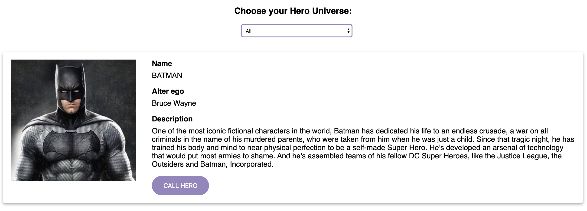

# Lecția 13

## Starter

Deschideți în Gitpod proiectul la care lucrați și în terminal rulați comanda: `npm install -g @angular/cli`

## Activitate 1 - Filtrare

Durată: 20' \| Metodă: prelegere \| Materiale: -

Știm că fiecare erou aparține unui univers. De exemplu Batman și Wonder Woman aparțin universului DC, iar Hulk și Black Widow aparțin universului Marvel. Pentru pasul următor am vrea să filtrăm lista noastră dupa acest criteriu.

În template-ul componentei `ListComponent` \(fișierul `hero-list.component.html`\) adăugăm un element `<select>` cu 3 opțiuni:

* **`All`** - afișarea tuturor eroilor indiferent de univers
* **`DC`** - doar eroii care aparțin universului `DC`
* **`Marvel`** - doar eroii care aparțin universului `Marvel`

Adaugati următorul cod la începutul fișierului:

```markup
<div class="select-destiny">
  <h3>Choose your Hero Universe:</h3>
  <select>
    <option value="all">All</option>
    <option value="DC">DC</option>
    <option value="Marvel">Marvel</option>
  </select>
</div>
```

și următoarele stiluri în fișierul css \(`hero-list.component.css`\):

```css
select {
  height: 29px;
  overflow: hidden;
  width: 240px;
  border-radius: 20px;
  background-color: #fff;
  border: 2px solid #9585bf;
  margin-left: 16px;
}

h3 {
 font-family: 'Oswald', sans-serif;
}

.select-destiny {
 margin-bottom: 32px;
 text-align: center;
}
```

Acum ar trebui să vedeți noul select la începutul listei de eroi:



Obiectivul nostru va fi ca în momentul în care din dropdown se selectează o valoare, lista să fie filtrată și actualizată în funcție de selecție. Însă până să realizăm asta, mai avem nevoie de câțiva pași. În primul rând, trebuie să specificăm pentru fiecare erou cărui univers aparține.

În momentul de față clasa `Hero` conține 4 proprietăți: `name`, `alterEgo`, `description` și `photo`. Mai trebuie să adaugam o proprietate de tip string, numita `universe`.

În fișierul `src/app/hero.ts` adăugați încă un parametru `public universe: string` la constructorul clasei.

În momentul în care actualizăm modelul de date, trebuie să adaptam codul și în toate locurile în care acesta este folosit.

Astfel, în codul componentei `HeroList` \(fișierul`hero-list.component.ts`\) trebuie să adăugăm o proprietate `univers` la toate obiectele din array-ul `heros`:

```javascript
public heros: Hero[] = [
    {
      name: 'Batman',
      ...
      universe: 'DC'
    },
    {
      name: 'Black Widdow',
      ...
      universe: 'Marvel'
    },
    {
      name: 'Wonder Woman',
      ...
      universe: 'DC'
    },
    {
      name: 'Hulk',
      ...
      universe: 'Marvel'
    }
  ];
```

Acum că am modificat modelul de date și știm pentru fiecare erou cărui univers aparține, în continuare trebuie să adaptăm lista în funcție de selecția utilizatorului. Vom crea o proprietate ce va reține valorea selectată din elementul `<select>` și o funcție numită `changeUniverse()` care să se apeleze când o nouă selecție a fost efectuată.

În același fișier, adăugați proprietatea `selectedUniverse` pe care în funcția `ngOnInit()` o inițializați cu valoarea `all`.

```javascript
export class HeroListComponent implements OnInit {
  selectedUniverse: string;

  ...

  ngOnInit() {
    this.selectedUniverse = 'all';
  }
}
```

După aceasta adăugați o funcție numită `changeUniverse` care primește un parametru numit `newUniverse` și care atribuie valoarea parametrului primit proprietății `selected universe`:

```javascript
changeUniverse(newUniverse) {
  this.selectedUniverse = newUniverse;
}
```

În template \(fișierul `hero-list.component.html`\) în cadrul elementului `<select>` adăugați un binding pe evenimentul `change` care să lege acest eveniment de funcția `changeUniverse`:

```markup
<select (change)="changeUniverse()">
```

Tot ce mai rămâne este să trimitem și valoarea selectată ca parametru al funcției. Pentru aceasta ne folosim de faptul că în momentul când facem binding pe eveniment putem să transmitem un obiect numit `$event` pe care avem toate informațiile atașate evenimentului \(în cazul de față, schimbarea valorii din dropdown\). Mai mult, pe acest obiect, avem o proprietate numită `target` care, în cazul de față, este corespunzătoare elementului `select` pe care putem să verificăm proprietatea `value`pentru a obține valoarea selectată.

Astfel putem actualiza codul de mai sus în acest fel:

```javascript
<select (change)="changeUniverse($event.target.value)">
```

Pentru a putea testa funcționarea corecta, putem afișa în template valoarea `selectedUniverse`pentru a vedea în timp real cum se modifică la schimbarea valorii din select.

```javascript
{{selectedUniverse}}
```

Dupa ce ne-am convins că totul merge ok, putem șterge afișarea universului.

A mai rămas un singur pas de făcut, să filtrăm lista în funcție de selecție. Ceea ce am încerca să facem este ca în momentul în care iterăm prin lista, să afișăm doar eroii corespunzători selecției de univers. Pentru aceasta, Angular ne pune la dispoziție o directivă numită `*ngIf` care primește o valoare booleană și afișează sau ascunde un element în funcție de valoarea de adevăr a expresiei. Cum ar putea arăta în cazul de față expresia?

* daca s-a selectat `all` atunci afișăm eroul indiferent de univers
* daca s-a selectat un univers, verificăm dacă această valoare este aceeași cu cea a eroului.

Astfel directiva noastră va putea fi aplicată direct pe `<jsh-hero>` și ar arăta în felul urmator:

```javascript
*ngIf="selectedUniverse === 'all' || selectedUniverse===hero.universe"
```

Intrucat nu vom putea aplica 2 directive sructurale pe același element, mai adăugăm un element `<div>` care să conțină componenta erou și care să se ocupe de iterație prin colecție. De remarcat ca toți copiii unui element pe care se aplică directiva `*ngFor` vor avea acces la valoarea iterației curente \(în cazul de față `hero`\).

Actualizați codul din template în felul următor:

```javascript
<div *ngFor="let h of heros">
  <jsh-hero 
    *ngIf="selectedUniverse === 'all' || selectedUniverse===h.universe" 
    [hero]="h"
  ></jsh-hero>
</div>
```

Rulați serverul și testați noua funcționalitate.

## Activitate 2 - Servicii

Durată: 20' \| Metodă: prelegere \| Materiale: -

Urmatorul pas pentru aplicația noastră este să scoatem lista de eroi din componenta de listare, astfel încât array-ul de eroi să poate fi accesat atât de componenta de listare \(ce listează eroii\) cât și de alte componente din aplicație. Astfel componenta nu va mai fi responsabilă pentru a ține array-ul de eroi și se va ocupa exclusiv de starea sa internă. Pentru asta avem nevoie de un **serviciu**.

**Serviciile** în Angular sunt obiecte ale căror date pot fi împărțite între componentele aplicației sau pot fi folosite și de alte servicii. Acest obiect este creat doar o singură dată la inițializarea apicației, iar fiecare componentă sau serviciu care îl folosește are acces la aceeași instanță.

Pentru a crea un serviciu, rulați în terminal următoarea comandă:

```text
ng generate service Hero
```

Rezultatul rulării comenzii va fi crearea unui fișier numit `hero.service.ts` în folderul aplicației \(`src/app`\).

Ce ne propunem în continuare este să mutăm în noua clasă array-ul cu eroi care in momentul actual se afla în `HeroListComponent`. **Astfel, lista va putea fi accesată și de alte componente din aplicație.**

Mutați array-ul din componenta `HeroListComponent` \(fișierul `src/app/hero-list/hero-list.component.ts`\) într-o proprietate `heros` de tipul `Hero[]` din serviciu:

```javascript
import { Injectable } from '@angular/core';
import { Hero } from './hero'; // adaugati importul clasei Hero

@Injectable({
  providedIn: 'root'
})

export class HeroService {
  public heros: Hero[] = [
    // aici adăogați cele 4 obiecte de tip Hero
  ];
  constructor() { }
}
```

În Componenta `HeroList`, păstrați proprietatea `heros`, doar că aceasta nu va mai fi inițializată direct cu valoarea array-ului, cele 4 obiecte de tip `Hero` fiind mutate în serviciu:

```text
export class HeroListComponent implements OnInit {
  ...
  heros: Hero[];
}
```

În continuare, vom folosi serviciul pentru a readuce lista de eroi în componenta de listare.

Pentru a putea folosi un serviciu într-o componentă, sunt necesari 3 pasi:

1. Importarea serviciului
2. Adăugarea în parametrii constructorului \(injectare\)
3. Folosirea în codul clasei componentei

În componenta cu lista de eroi \(`hero-list.component.ts`\), adăugați următoarea declarație de import la începutul fișierului:

```javascript
import { HeroService } from '../hero.service';
```

Adăugați `heroService` de tipul `HeroService` ca parametru al constructorului:

```javascript
export class HeroListComponent implements OnInit {
  ...
  heros: Hero[];
  constructor(private heroService: HeroService) { }
  ...
}
```

Precedand cu `private` serviciul în constructor, acesta va fi disponibil ca parametru al clasei și îl putem invoca pe `this` în interiorul clasei. De acest lucru se va ocupa Angular, care se va uita special la parametrii constructorului și tipul acestora și **va "injecta" instanțele de serviciu corespunzătoare pentru a avea acces la ele**.

Odată ce am injectat serviciul, îl putem folosi în clasa ca să obținem din nou lista de eroi pentru a o afișa. După cum am implementat mai devreme, clasa serviciului are o proprietate numită  `heros`care stochează array-ul de eroi.

În clasa componentei 'HeroListComponent', folosind instanța serviciului asignați valoarea proprietății `heros` de pe `heroService` în proprietatea `heros` din componentă:

```javascript
ngOnInit() {
  this.selectedUniverse = 'all';
  this.heros = this.heroService.heros;
}
```

Observați că inițializarea proprietăților funcției este făcută în funcția `ngOnInit` de care Angular se asigură ca va rula de fiecare datâ când componenta va fi inițializată.

În acest moment arhitectura aplicației ne permite să folosim lista de eroi din mai multe componente.

## Activitate 3 - Exercițiu

Durată: 10' \| Metodă: prelegere \| Materiale: -

În activitatea 3 din lecția 11 am introdus conceptul de `Pipe` folosind pipe-ul `uppercase` pentru a transforma un **string** direct în template. Pentru a găsi toate pipe-urile preexistente în Angular, verificați [acest link](https://angular.io/api?type=pipe). Pentru acest exercițiu vom crea un nou pipe care sa transforme în mod aleator fiecare literă dintr-un string în uppercase sau lowercase, asemenea cunoscutului Spongebob meme.

Pentru a începe este necesar să scriem în terminal următoarea comandă:

```bash
ng g pipe spongebob
```

Angular CLI vă va crea un pipe default și îl va adăuga la array-ul **declarations** din `app.module.ts` așa că voi puteți să scrieți funcționalitatea în `spongebob.pipe.ts`. Veți găsi în acest fișier următoarele:

```typescript
@Pipe({
  name: 'spongebob'
})
export class SpongebobPipe implements PipeTransform {

  transform(value: any, ...args: any[]): any {
    return null;
  }
}
```

Metoda transform primește ca prim parametru valoarea trimisă pipe-ului vostru și un array de parametrii. Noi ne vom folosi doar de `value`, căruia îi vom modifica tipul de la `any` la `string`. Pentru a testa cât construiți pipe-ul, vă recomandăm să declarați o variabilă `myString` într-o componentă, să îi asignați un string \(cu cât mai lung cu atât va fi mai ușor de observat\) și să adăugați următorul cod în template-ul componentei.

```markup
<p>
  {{ myString }}
</p>

<p>
  {{ myString | spongebob }}
</p>
```

Taskul vostru devine să primiți un string **value** în metoda `transform` și să întoarceți un alt string conform cerinței.


Hint: puteți transforma un string într-un Array folosind metoda **Array.from\(\)**. Un string poate fi transformat în uppercase folosind metoda **.toUpperCase\(\)**


## Final

Nu uitați ca la finalul lecției să dați git add, git commit și git push pentru a updata proiectul cu noile modificări.


