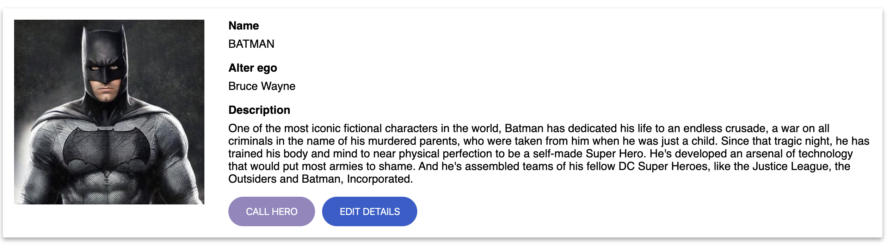
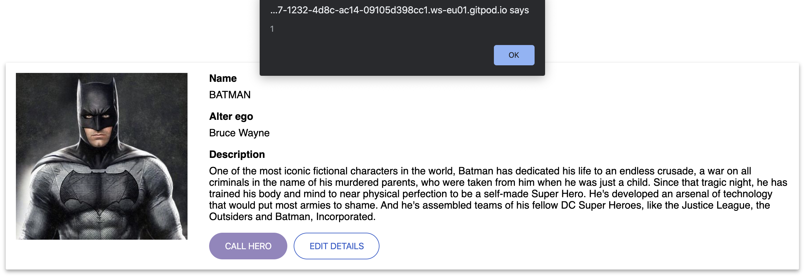
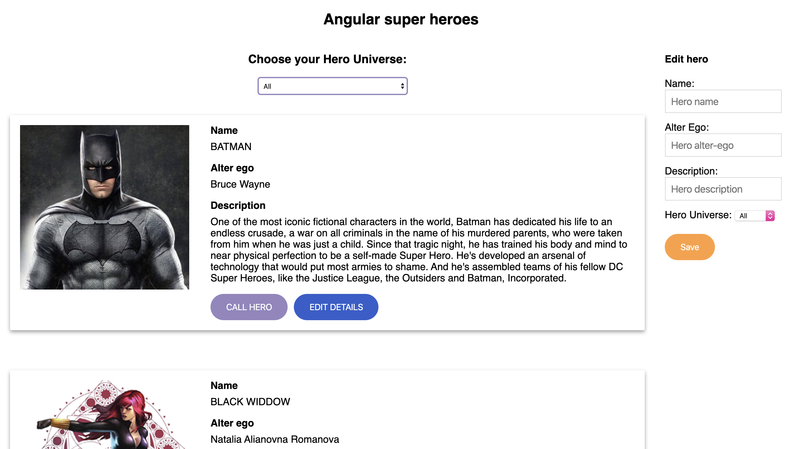

# Lecția 14

## Starter

Deschideți în Gitpod proiectul la care lucrați și în terminal rulați comanda: `npm install -g @angular/cli`

## Activitate 1 - Identificarea unica a eroilor

Durată: 10' \| Metodă: prelegere \| Materiale: -

Ultimul lucru care mai rămâne de implementat este posibilitatea de a edita detaliile unui erou din listă. Pentru aceasta vom mai adauga un buton de `Edit` în componenta erou și o nouă componentă ce se va ocupa cu editarea detaliilor eroului.

Primul pas ce trebuie făcut pentru a avea o listă editabila este să identificăm unic eroii din lista. Deși am putea crede că `Numele` sau `Descrierea` eroilor ar putea să determine eroul selectat, acestea pot ajunge, la un moment dat, să fie identice \(adăugăm din greșeală 2 Batman în listă\). O bună practică în programare este să asignăm fiecărei entități un identificator numeric care să fie unic generat pentru fiecare și care ne permite să știm exact la care erou ne referim.

În fiserul clasei `Hero` \(`src/app/hero.ts`\), în constructorul clasei vom adăuga proprietatea `id`de tip `number`:

```javascript
export class Hero {
  constructor(
    public id: number, // adaugati prorietatea id
    public name: string,
    public alterEgo: string,
    public description: string,
    public photo: string,
    public universe: string
  ) {}
}
```

După ce am modificat modelul de date pentru `Hero`, trebuie să actualizăm și în locurile unde am folosit obiecte de tip `Hero`. Astfel, în `HeroListComponent` \(`hero-list-component.ts`\) adăugați câte o proprietate `id` fiecărui erou din lista.

```javascript
public heros: Hero[] = [
    {
      id: 1, // id adaugat
      name: 'Batman',
      ...
    },
    {
      id: 2, // id adaugat
      name: 'Black Widdow',
      ...
    },
    {
      id: 3, // id adaugat
      name: 'Wonder Woman',
      ...
    },
    {
      id: 4, // id adaugat
      name: 'Hulk',
      ...
    }
  ];
```

Dacă reîncărcați aplicația, totul ar trebui să meargă ca înainte. Acum suntem pregătiți sa introducem funcționalitatea de editare.

## Activitate 2 - Adăugarea butonului de Edit

Durată: 10' \| Metodă: prelegere \| Materiale: -

Pentru a începe procedura de editare este nevoie să avem pe fiecare componentă de tip `HeroComponent` un buton numit `Edit Hero`.

Trebuie să adăugăm în template-ul `HeroComponent` \(fișierul `hero.component.html`\) un nou buton, sub butonul `CALL HERO` :

```markup
...
<button (click)="callHero()" class="btn btn-xl btn-purple">CALL HERO</button>
<button class="btn btn-xl btn-blue">EDIT DETAILS</button> <!--Butonul nou adaugat -->
...
```

Dacă veți da refresh, veți vedea noul buton pe fiecare componenta `Hero`:



Următorul pas este să adăugăm și un comportament la click pe buton:

În clasa componentei `HeroComponent` \(`hero.component.ts`\) implementați o funcție numită `editHero`:

```javascript
...
export class HeroComponent implements OnInit {
  ...
  editHero() {
    // aici vom alerta id-ul eroului editat
  }
}
```

În interiorul funcției, alertati id-ul `hero`-ului de pe componenta pe care s-a facut click:

```javascript
editHero() {
  alert('Edit hero with id: ' + this.hero.id);
}
```

Pentru a chema funcția `editHero` din interfață, revenim în template-ul componentei și creăm un binding între evenimentul `click` al butonului `EDIT HERO` și funcție:

```markup
<button class="btn btn-xl btn-blue" (click)="editHero()">EDIT DETAILS</button>
```

Acum dacă apăsați butonul de edit veți vedea o alertă cu id-ul eroului respectiv. Deocamdată, codul este doar pentru a testa funcționalitatea. În continuare vom afla cum poate o componentă copil să notifice componenta părinte că a aparut un eveniment.

## Activitate 3 - Emiterea de evenimente către componenta părinte prin `@Output`

Durată: 15' \| Metodă: prelegere \| Materiale: -

Pentru moment, funcționalitatea butonului de edit nu este suficientă pentru scopul nostru. Am dori ca în momentul în care se apasă edit pe un erou, o altă componentă să preia evenimentul și să îl trateze. În acest caz, am vrea să semnalizăm componentei părinte \(adică `HeroListComponent`\) ca s-a apăsat butonul de Edit.

Angular ne pune la dispoziție un decorator numit `@Output` ce aplicat unei proprietăți face posibil binding-ul de tip eveniment la proprietatea respectivă din componenta care o folosește \(similar cu binding-ul la `(click)`\).

Astfel, în clasa componentei `HeroComponent` \(`hero.component.ts`\) adăugăm o proprietate numită `edit` pe care o decorăm cu `@Output`:

```javascript
export class HeroComponent implements OnInit {
  ...
  @Output() edit; 
  ...
}
```

De asemenea, proprietatea creată trebuie inițializată:

```javascript
export class HeroComponent implements OnInit {
  ...
  @Output() edit = new EventEmitter();
  ...
}
```

Pentru a le putea folosi în fisier, atât `Output` cât și `EventEmitter` trebuie importate din pachetul `@angular/core`.

Actualizați definițiile de import la începutul fișierului:

```javascript
import { Component, OnInit, Input, Output, EventEmitter } from '@angular/core';
```

Odată ce am creat proprietatea output, o putem folosi pentru a emite valori către componentele abonate să asculte la modificări. Pentru aceasta folosim metoda `emit` de pe obiectul `EventEmitter`. Această metodă poate primi și un parametru în cazul în care vrem să atașăm și date pe eveniment. În cazul nostru, vrem să trimitem id-ul eroului selectat.

Înlocuiti codul existent din metoda `editHero` și emiteți valoarea id-ului eroului selectat pentru editare:

```javascript
editHero() {
  this.edit.emit(this.hero.id);
}
```

În acest moment, componenta `HeroComponent` emite un eveniment când se apasă butonul de editare. Acum trecem la componenta părinte, care trebuie să asculte și să reacționeze la evenimentele emise de componentele copil.

În clasa componentei `HeroListComponent` \(`hero-list.component.ts`\) adăugați o metodă `editHandler` care primește un parametru `id` și îl alertează.

```javascript
editHandler(id) {
  alert(id);
}
```

Vom folosi acestă funcție pentru a face binding cu evenimentul `edit` al componentei `Hero`.

În fișierul template al componentei `HeroListComponent` \(`hero-list.component.html`\), în elementul `<jsh-hero></jsh-hero>` adăugați un binding între evenimentul `(edit)` și funcția nou creată `editHandler`, transmițând parametrul `$event` care este echivalent cu `id`-ul emis din componenta copil.

```markup
<jsh-hero
  ...
  (edit)="editHandler($event)"
></jsh-hero>
```

Aplicația ar trebui să funcționeze ca înainte, doar că acum ați pus la punct un mecanism de comunicare între `HeroComponent` și `HeroListComponent`. Ultima parte rămasă de implementat este funcționalitatea propriu-zisă de editare.



## Activitate 4 - Componenta de editare eroi

Durată: 15' \| Metodă: prelegere \| Materiale: -

Componenta `HeroComponent` pe care am creat-o la început are doar funcția de a afișa informațiile legate de erou. Pentru a putea edita aceste informații, avem nevoie de o componentă separată care să aibe exact această funcție.

Pentru a crea componenta `EditHero`, în linia de comandă, introduceți:

```text
ng generate component EditHero
```

Rezultatul rulării acestei comenzi este adăugarea componentei la codul nostru sursă \(s-a creat fișierul `src/app/edit-hero` cu cele 3 fisere, `.ts`, `.html` si `.css`\). De asemenea, componenta a fost adăugată în modulul aplicației, pentru a putea fi folosită în cod:


Pentru început, să începem să edităm partea vizuală a formularului. Ar trebui să avem în vedere proprietățile ce trebuie editate și ce elemente de interfață am avea nevoie.

* **`name`** - un element `<input>`
* **`alterEgo`** - un element `<input>`
* **`description`** - un element `<textarea>`
* **`universe`** - un element `<select>` cu 2 elemente `<options>` pentru cele 2 universuri

În fișierul template al componentei `EditHero` \(`edit-hero.component.html`\) adăugați următorul markup:

```markup
<div class="edit-hero">
  <h4>Edit hero</h4>
  <form>
    <label>Name:
      <input  placeholder="Hero name" name="name">
    </label>
    <br>
    <label>Alter Ego:
      <input placeholder="Hero alter-ego" name="alterEgo">
    </label>
    <br>
    <label>Description:
      <input placeholder="Hero description" name="description">
    </label>
    <br>
    <label>
      Hero Universe:
      <select name="universe">
        <option value="all">All</option>
        <option value="DC">DC</option>
        <option value="Marvel">Marvel</option>
      </select>
    </label>
    <br>
    <button type="submit" class="btn btn-xl btn-orange m-y-2">Save</button>
  </form>
</div>
```

Pentru a face formularul drăguț, adăugați în fișierul `css` următoarele definiții de stil:

```css
input {
  padding: 8px;
  font-size: 16px;
  margin-bottom: 14px;
}

.edit-hero {
  margin: 0 32px 0 16px;
}
```

În template-ul componentei `AppComponent` \(`app.component.html)` adăugați un element de tipul `<jsh-edit-hero>`:

```markup
<h2>Angular super heroes</h2>
<div class="heros-app">
  <jsh-hero-list></jsh-hero-list>
  <jsh-edit-hero></jsh-edit-hero> <!-- componenta adaugata -->
</div>
```

Am adăugat și un titlu în conținutul aplicației și clasa `heros-app`. Dacă rulați acum aplicația, veți vedea formularul de editare, în partea dreaptă a listei.



## Final

Nu uitați ca la finalul lecției să dați git add, git commit și git push pentru a updata proiectul cu noile modificări.


