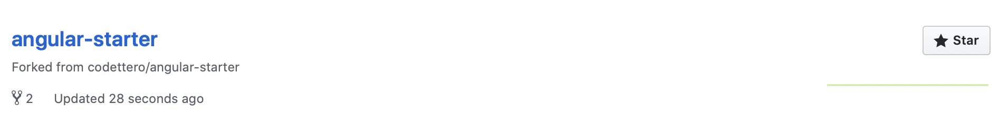

# Lecția 9

## Pasul 0 - Set-up

[GitHub](https://github.com) este o platformă online de versionare a proiectelor. În următoarele lecții, aveți nevoie de un cont de GitHub. Nu vom lucra foarte mult cu git, dar pentru cei curioși, puteți citi mai multe [aici](https://guides.github.com/activities/hello-world/).

Vom folosi și [Gitpod](https://www.gitpod.io) pentru a utiliza un editor online care funcționează în cloud și permite instalarea ușoară a dependințelor necesare.

1.Creați cont pe GitHub, dacă nu aveți deja, accesați pagina [Gitpod](https://www.gitpod.io), dați click pe _**Try now -&gt; Start workspace**_ și în continuare vă va autentifica cu contul de GitHub.

2. Dupa aceasta, puteți închide tab-ul Gitpod și accesați următorul [link](https://gitpod.io#https://github.com/codettero/angular-starter). Va deschide un proiect deja creat în Gitpod.


[https://gitpod.io\#https://github.com/codettero/angular-starter](https://gitpod.io#https://github.com/codettero/angular-starter)


3. Se va deschide un editor online cu proiectul `angular-starter`, ca în imaginea următoare.


4. Observați notificarea din colțul din dreapta jos. Selectați **Setup Project** de acolo.

5. Va apărea un meniu în partea dreaptă, unde ne interesează al 4-lea buton **Test Drive Configuration**, de unde selectați **Push to branch & Start Workspace**.


6. În partea de sus a ecranului, va apărea un alt meniu cu 2 opțiuni. Selectați-o pe prima **Fork to my account**.



În caz că nu există această opțiune în meniu, ca în imaginea de mai sus, dați click pe iconul vostru din colțul din dreapta sus, unde va apărea un drop-down cu niște opțiuni. Selectați **Open Access Control**, ca în imaginea de mai jos, și apoi se va deschide un nou tab unde bifați **read/write private repos**.



#### Rezultat

Ca semn că totul a mers bine, veți observa în partea din stânga jos a paginii, în meniul albastru \(status bar\) faptul că acum apare numele vostru de pe GitHub/angular-starter.


În plus, dacă deschideți GitHub, mergeți pe profilul vostru și dați click pe **Repositories**, veți vedea proiectul `angular-starter` adăugat.



7. Tot în status bar \(zona albastră\), dați click pe a doua opțiune \(nume/gitpod-setup\).


Va apărea în partea de sus meniul din poza următoare. Selectați **origin/master**.


8. Vom activa setarea de salvare automată prin a folosi shortcutul **Ctrl + Shift + P,** vom scrie în meniul apărut "**autosave**" și vom selecta singura opțiune, la fel ca în poza de mai jos.


## Pasul 1 - Instalarea dependințelor

Vom lucra cu terminalul, care este un loc unde putem adăuga comenzi care vor executa programe fără interfață grafică. O să ne ajute în a scrie cod mai rapid. În poza de mai jos se observă terminalul, în partea de jos a ecranului. Terminalul e identificat de un **prompt**, unde scrie **gitpod** și locația unde vă aflați în filesystem \(**/workspace/angular-starter**\) și se termină cu semnul **$**.



Dacă nu aveți deschis terminalul, mergeți în menul din partea de sus, dați click pe **Terminal &gt; New Terminal**.



În terminal adăugați următoarea comandă și dați enter. Această comandă va instala un program din partea Angular care ajută crearea aplicației, pe care îl veți utiliza in terminal folosind cuvântul cheie `ng`.

```text
npm install -g @angular/cli
```


La un moment dat, se va opri pentru a întreba dacă doriți să împărtășiți date de utilizare. Puteți răspunde cu nu prin a tasta **n** în terminal și a da enter.


Rezultatul este ca în poza de mai jos \(nu neapărat identic, atâta timp cât nu sunt erori, e în regulă\).


Scrieți în terminal următoarea comandă și dați enter. Această comandă instalează dependințele aplicației web la care vom lucra. În urma comenzii, va apărea folderul **node\_modules** în directorul în care lucrați.

```text
npm install --dev
```


Prima comandă va trebui dată de fiecare dată când deschideți proiectul. Gitpod lucrează cu containere în spate și nu rămâne Angular CLI instalat. Dacă întâmpinați eroarea că ng nu este găsit \(`bash: ng: command not found`\), atunci înseamnă că trebuie să rulați prima comandă \(`npm install -g @angular/cli`\)


## Pasul 2 - Salvarea modificărilor

Pentru a sincroniza modificările pe care le faceți în Gitpod cu proiectul de pe GitHub, avem de dat un **save** mai complicat. Deschideți README.md și adăugați o line cu numele vostru. Veți vedea că în editor linia modificată va fi marcată cu o culoare, la fel ca în poză.


În continuare vom scrie trei comenzi în terminal pe care le veți folosi frecvent pentru a updata proiectul pe GitHub.


Comenzile sunt:

```bash
git add .
git commit -m "MESAJUL DESCRIPTIV AL MODIFICARILOR"
git push
```

**git add .** adaugă toate modificările din folderul curent în care vă aflați când dați comanda

**git commit** salvează modificările făcute \(crează un checkpoint\). Parametrii `-m` se referă la "message" \(mesajul commit-ului\).

**git push** updatează proiectul de pe GitHub cu modificările adăugate în commit


Vom folosi aceste comenzi la finalul fiecărei lecții pentru a salva modificările aduse și pentru a fi vizibile și ulterior. Nu uitați să faceți acest lucru după ce terminați de lucru la fiecare lecție.


## Pasul 3 - Vizualizarea proiectului

Pentru a vedea cum arată pagina web, în timp real, vom rula comanda de mai jos în terminal.

```bash
ng serve
```

Puteți lăsa comanda să ruleze în mod continuu, însă, când vom avea nevoie să scriem o nouă comandă în terminal, va trebui să oprim comanda de mai sus folosind shortcutul `Ctrl + C`. La rulare, va apărea o notificare, la fel ca în poză. Recomandăm să deschideți pagina într-o nouă fereastră, selectând "**Open in Browser**".


Site-ul arată acum astfel. De unde vine acest text? Deschideți `src/app/app.component.html` și veți vedea.


Felicitări! Acum putem începe dezvoltarea aplicației folosind Angular.


