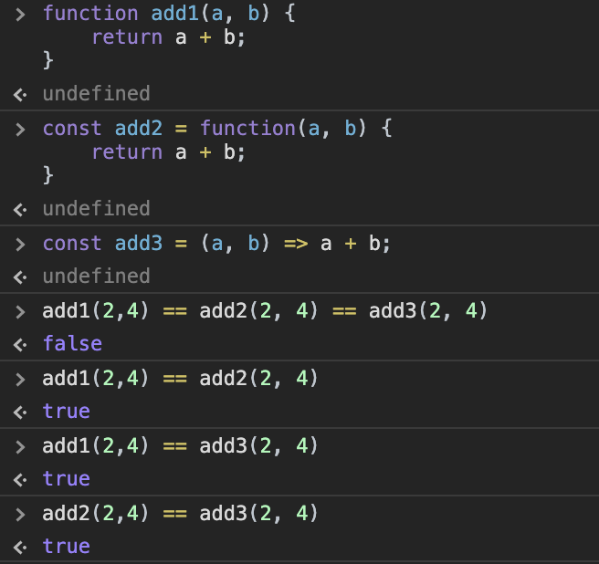
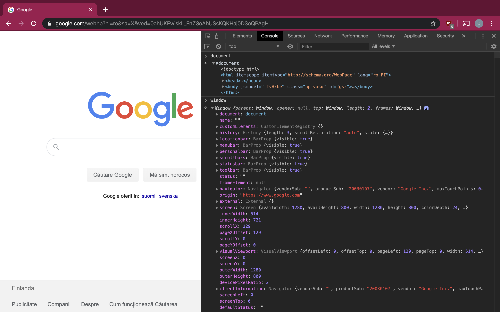
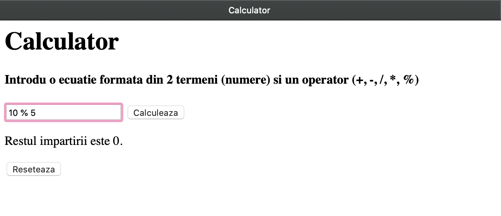
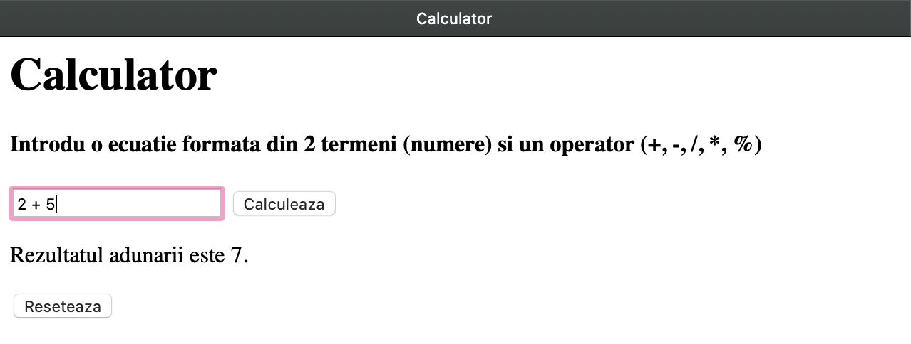
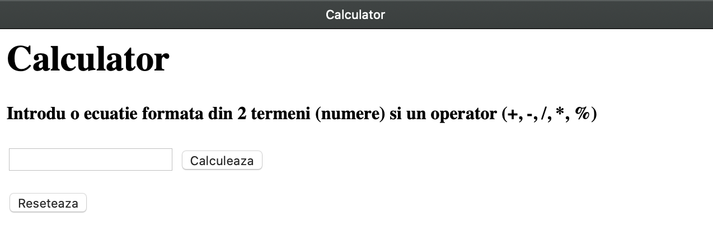

# Lecția 3

### Activitatea 1 -  == vs ===

Durată: 15' \| Metodă: explicație \| Materiale: -

Testarea egalității în limbajul C/C++ se face cu operatorul == \(deoarece un singur = e folosit pentru atribuire\). În JavaScript însă, se pot folosi următorii doi operatori: `==` \(dublu egal\) și `===` \(triplu egal\). 

#### ==

Dublu egal este folosit pentru a compara conținutul a două valori, indiferent de tipul variabilelor. Cu alte cuvinte, putem compara valori de tipuri diferite \(de exemplu, un string cu un număr\).

În cazul a două variabile de același tip, se compară valoarea lor. Dacă variabilele au tipuri diferite, atunci limbajul caută un tip comun acestora \(se numește **castare** sau **coercing** de la un tip la altul\). În acest caz, castarea este valabilă în timpul comparației și nu influențează valorile variabilelor după comparație.

Exemple:

```javascript
5 == 5 // true
10 == 5 // false
5 == 5.0 // true
'5' == 5 // true, string-ul "5" va fi castat la numarul 5
'55' == 5 // false, are loc castarea, dar valorile sunt diferite
'0x5' == 5 // true, string-ul '0x5' este castat la numar, fiind interpretat ca valoarea 5 scrisa in baza 16
"0b101" == 5 // true, similar ca mai sus, doar ca acum este vorba de baza 2
true == true // true
true == 1 // true
false == false // true
false == 0 // true, ambele sunt valori "falsy" (vezi mai jos)
"Hello" == "Helo" // false
```


Există 6 valori cu valoarea de adevăr falsă \(numite **falsy values**\), și anume: 0, false, "" \(string gol\), null, undefined, NaN \(not a number\). Primele 3, comparate între ele cu dublu egal, operația va da true. Despre ultimele 3, există mici excepții. Pentru detalii, consultați acest [link](https://codeburst.io/javascript-double-equals-vs-triple-equals-61d4ce5a121a).



Dublu egal castează variabilele la un tip comun \(dacă tipul lor e diferit\) și apoi compară valoarea acestora.


#### ===

Operatorul triplu egal verifică, pe lângă conținutul celor două variabile, și tipul lor de date. Dacă au tip diferit, rezultatul e automat fals. Dacă au același tip, dar valori diferite, rezultatul este tot fals. Numai dacă cele două variabile au același tip și aceleași valori, atunci rezultatul va fi adevărat.

```javascript
false === 0 // false
true === 1 // false
"" === 0 // false
"" === false // false
"Hello" == "Hello" // true
5 === 5 // true
"5" === 5 // false
```


Puteți deschide consola din browser și să testați exemplele de mai sus sau alte comparații unde nu sunteți sigur de rezultat.


## Activitatea 2 - Funcții

Durată: 10' \| Metodă: demonstrație, conversație, exercițiu \| Materiale: videoproiector

Funcțiile în JavaScript sunt similare cu cele învățate în C/C++. Spre deosebire de C/C++, nu se specifică valoarea de return a funcției în cadrul semnăturii, și nici tipurile parametrilor.

Sintaxa standard a unei funcții este:

`function name(...params) { body }`

```javascript
// Declaratie 1 - "Named function"
function add1(a, b) {
    return a + b;
}

// Declaratie 2 - "Anonymous function"
const add2 = function(a, b) {
    return a + b;
}

// Declaratie 3 - "Arrow function" ("=>" is the arrow)
const add3 = (a, b) => a + b;

// Cele 3 declaratii de mai sus sunt echivalente
// pentru apelul de mai jos
add(2, 4); // 6
```



### Sortarea folosind comparator

În lecția trecută am învățat că putem sorta un array folosind funcția `sort()`, iar comportamentul de bază sortează alfanumeric. Acum că am învățat funcții, putem sorta folosind alte criterii. Vom da câteva exemple.

```javascript
let a = [9, 11, 99, 1];
const comparatorCrescator = function(a, b) {
    return a - b;
}

a.sort(comparatorCrescator); // [1, 9, 11, 99]
a.sort((a, b) => b - a); // [99, 11, 9, 1]
```


Pe linia 7, comparatorul este un **arrow function** folosit pentru a sorta descrescător.


## Activitatea 3 - DOM

Durată: 10' \| Metodă: demonstrație, conversație, exercițiu \| Materiale: videoproiector

Codul vostru scris în JavaScript poate interacționa cu pagina HTML din care face parte printr-un concept intermediar numit **DOM** \(**Document Object Model**\) care este o abstractizare a documentului HTML. Acest lucru înseamnă că, în orice **browser**, pe lângă capacitățile limbajului JavaScript, aveți acces și la proprietăți ale DOM-ului. De exemplu, dacă deschideți consola pe pagina motorului vostru de căutare și scrieți `document` sau `window`, veți vedea valorile acestor două proprietăți ale DOM, după cum puteți observa și mai jos.



În continuare vom prezenta 3 funcții care vă vor ajuta să vă familiarizați cu DOM și să îl folosiți conform nevoilor codului vostru:

* getElementById: caută elementul HTML asociat unui id dat; id-ul ar trebui să fie unic, dar în cazul în care folosiți același id pe elemente diferite, atunci primul va fi găsit
* addEventListener: asociază execuția unei funcții cu un eveniment specific asupra unui element HTML. Exemple de eveniment: click, hover
* innerHTML: accesează conținutul unei etichete \(de exemplu, conținutul unui paragraf, header, input etc

```markup
<!-- body din HTML -->
<input type="text" id="getName"/>
<h1>Numele tău: <span id="insertName"></span></h1>

<button id="setName">Set your name</button>
```

```javascript
// in fisierul JS linkat catre pagina HTML

// Gasim referinte la elemente folosind id-urile din HTML
let getNameElement = document.getElementById("getName");
let insertNameElement = document.getElementById("insertName");
let setNameElement = document.getElementById("setName");

// Cand se da click pe buton, apelam functia arrow
setNameElement.addEventListener("click", () => {
    // Selectam valoarea inputului
    let name = getNameElement.value;
    
    // Inseram in elementul span valoarea variabilei name ca string.
    // Putem insera un intreg element HTML, dar, pentru ca
    // variabila name contine un string, elementul inserat
    // va fi de tip text (TextNode).
    insertNameElement.innerHTML = name;
});
```

În exemplul de mai sus, folosim 4 modalități de manipulare a DOM-ului pentru a lua valoarea unui input și a o introduce într-un heading când se dă click pe un buton.

Testați codul de mai sus în browser.

## Activitatea 4 - Exerciții

Durată: 15' \| Metodă: exercițiu \| Materiale: -

Creați un calculator care efectuează calcule cu exact doi termeni. Pagina conține titlu, instructiuni, un input field în care să fie introdusă operația, un buton pentru a calcula și un paragraf la final în care să fie afișat rezultatul. Rezultatul ar trebui sa fie însotit de explicații, ca în exemplele de mai jos \(textul se modifică în funcție de operația executată. Butonul "Resetează" este folosit pentru a șterge rezultatul anterior și a goli input-ul.

Folosiți HTML pentru a crea elementele de mai sus și JS pentru funcționalitate. Input-ul va fi un string, din care va trebui să separați operatorul și termenii.








