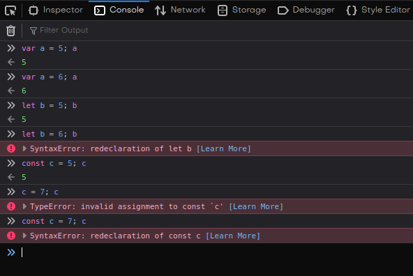
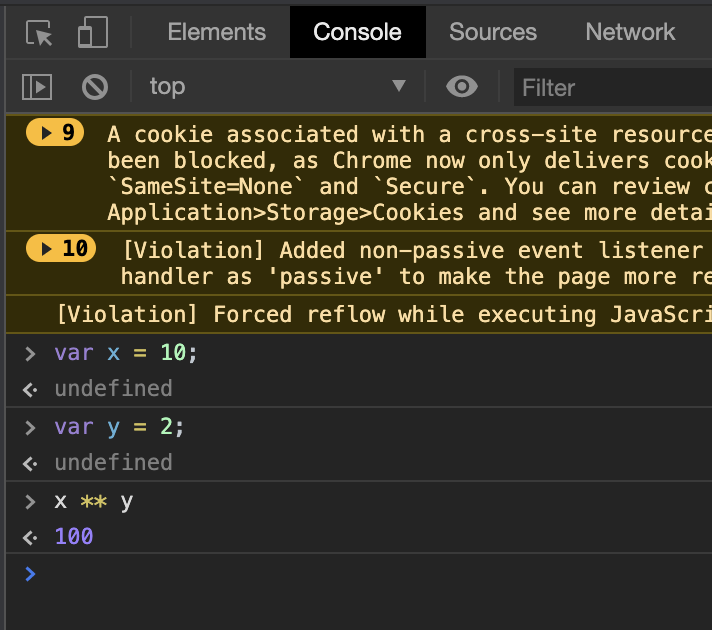

# Lecția 1

## Activitate 1 - Intro to JS

Durată: 10' \| Metodă: prelegere \| Materiale: -

Am studiat anterior limbajul HTML, cu ajutorul căruia putem scrie conținut într-o pagină web, dar și CSS, care ajută la stilizarea paginii web. În continuare, vorbim despre JavaScript, un limbaj de programare care ne permite să stabilim cum se comportă pagina web.

Pe scurt:

* HTML: adaugă conținut, elementele vizibile din pagina web, cum ar fi paragrafe, imagini, liste, tabele etc
* CSS: stilizează conținutul paginii web, putem poziționa elementele în pagină unde dorim, adăugam spațiere, culori, font-uri, umbre etc
* JS: stabilește cum se comporta pagina web, oferă dinamism site-ului; putem adăuga animații, diverse evenimente și acțiuni care au un anumit trigger etc

Față de HTML și CSS, JavaScript este un limbaj de programare. Pentru început, vă puteți gândi la JavaScript ca la C/C++, doar că sintaxa este puțin diferită. Vom discuta, întocmai ca la primele ore de informatică, despre variabile, atribuiri, structuri decizionale și repetitive.


Poate ați auzit de limbajul de programare Java, care nu este același lucru cu JavaScript. 



În JS, nu este necesar să puneți punct și virgulă la finalul fiecărui rând. Nu va da eroare dacă lipseste, însă este bine să fiți consecvenți. Pe durata acestor linii, vom folosi totuși **`;`** la final de rând.


## Activitate 2 - variabile și tipuri de date

Durată: 25' \| Metodă: prelegere \| Materiale: -

### Variabile și tipuri de date

Spre deosebire de C/C++, în JavaScript, variabilele nu au nevoie de un tip de date, ci este dedus în funcție de valoarea asignată. Asta înseamnă că o variabilă poate reține la un moment dat un număr, iar după poate reține un șir de caractere, fără să dea eroare de tip.


JavaScript are tipare dinamică \(dynamic typing\), adică o variabilă poate reține, la momente de timp diferite, tipuri de date diferite. Acest lucru se întâmplă deoarece valoarea variabilelor e verificată abia când se execută linia respectivă. 


În JavaScript, variabilele se declară prin cuvântul cheie **var.** Alte două cuvinte cheie pentru declararea variabilelor, `let` și `const` vor fi introduse într-o secțiune ulterioară. În exemplul de mai jos se observă declararea și atribuirea unei variabile numită x. 

```javascript
// JavaScript
var x;           // undefined
x = 5;           // Number
x = "John";      // String

// C++
int x;          // undefined
x = 5;          // Number
x = "Hello";    // eroare
```

Tipurile de date cele mai des întâlnite sunt:

* Number \(5, 3.14, -100, 27.999\)
* String \("Hello", 'Hello', "a", 'a'\)
* Boolean \(poate lua doar valorile true sau false\)
* Objects \(o grupare de mai multe elemente sub forma cheie-valoare; valorile pot fi, la rândul lor, Number, String sau alt Object\)
* Array \(o grupare de variabile sau constante\) - array este, de asemenea, un Object
* null, undefined, NaN \(absența unei valori\)

```javascript
// Exemplu de obiect
var x = {
    firstName: "John",
    lastName: "Doe"
}

// cheile sunt firstName si lastName
// valorile cheilor sunt String-urile "John" si "Doe"

// putem accesa valorile prin x.firstName si x.lastName
```


În JavaScript, String-urile folosesc atât ghilimele \("Hello", "a"\), cât și apostrofuri \('Hello', 'a'\) interschimbabil. Nu este valabilă regula din C/C++ conform căreia ghilimelele sunt pentru șiruri de caractere, iar apostrofurile pentru un singur caracter.



În JavaScript, toate numerele sunt de tipul **Number,** fie ca sunt numere întregi, pozitive sau negative, sau cu virgulă. Nu există mai multe tipuri, cum ar fi float sau unsigned int ca în C/C++.


### Null vs undefined

Am discutat mai devreme despre valorile pe care le poate lua o variabilă, cum ar fi un număr sau un șir de caractere. Dar ce se întâmplă dacă o variabilă nu are o valoare, dacă nu reține sau nu corespunde unui obiect din memoria calculatorului?

În acest caz, spunem ca valoarea ei este `undefined`. La prima vedere, `null` si `undefined` sunt foarte asemănătoare. Atât `null`, cât și `undefined` pot atribuite de către programator. Diferența este dată de faptul că, atunci când o variabilă este doar declarată, fără să primească o valoare propriu-zisă, aceasta este `undefined`.

Cauza pentru care există două valori atât de asemănătoare este că, deși ambele exprimă absența unei valori valide, null exprimă absența datelor, iar undefined lipsa asignării sau o stare de eroare.

```javascript
var x = null; // valoarea este null, asignată de programator
var y; // variabila y este undefined, nu i-a fost asignată nicio valoare
var z = undefined; // variabila z este undefined
```


Atât **null**, cât și **undefined**, reprezintă lipsa unei valori propriu-zise \(empty state\), dar provin din mijloace diferite.



Când accesăm un câmp inexistent, valoarea obținută este undefined, în semn de eroare.


```javascript
var x = {firstName:"John", lastName:"Doe"}
console.log(x.age); // undefined, deoarece nu există câmpul age

// console.log() este funcția care printează valori pe ecran
```

### Var, let, const

Declararea standard a variabilelor, în JavaScript, folosind cuvântul cheie `var` se supune unui proces numit `hoisting`. Acest lucru înseamnă că, de fiecare dată când declari o variabilă folosind `var`, aceasta va fi "**urcată**" spațial la începutul funcției în care ne aflăm, iar în cazul în care scriem în afara oricărei funcții, într-un fișier, aceasta va fi pusă la începutul fișierului. Pentru cei care sunt obișnuiti cu practicile din `C/C++`, unde este recomandat să declarați variabilele la începutul funcției, `hoisting` e ca și cum browserul face acest lucru pentru voi de fiecare dată când folosiți `var`. Spre exemplu:

```javascript
function f() {
    var b = 5; // b este declarat și asignat la 5
    c = 7; // c este asignat la 7
    console.log(a, b, c);
    var a = 6; // a este declarat și asignat la 6
    var c; // c este declarat
}

// Funcția f este echivalentă cu funcția g
function g() {
    var a, b, c;
    b = 5;
    c = 7;
    console.log(a, b, c);
    a = 6;
    console.log(d); // ReferenceError: d is not defined
}

f(); // output: undefined 5 7
```


Atenție: o linie cu codul **`var a = 6`** conține două operații: o declarație a variabilei **a** și o asignare a ei la numărul 6. Doar declarația este **hoisted**.


De asemenea, declarațiile folosind var sunt `function scoped`, adică există numai in cadrul primei funcții părinte în care au fost declarate. Spre exemplu:

```javascript
console.log(i); // ReferenceError: i is not defined

function f() {
    console.log(i); // undefined
    
    for (var i = 0; i < 5; i++) {
    	console.log(i); // 0 1 2 3 4
    }
    
    console.log(i); // 5
}

f();
```

Deși variabila `i` a fost declarată în cadrul for-ului, cu care sunteți familiari din alte limbaje de programare, această instrucțiune nu este o funcție, așa că **i** este **hoisted la începutul funcției f**, dar **există și după terminarea** for-ului. În schimb, variabila i **nu există în afara funcției f**.

Acest comportament a provocat multe erori de-a lungul timpului \(pentru cei care nu au fost atenți la explicația de mai sus\), așa că, în 2015 au fost introduse în JavaScript două noi cuvinte cheie, `let` și `const`, suportate de toate versiunile curente ale browserelor moderne. Aceste cuvinte cheie pot fi folosite pentru a declara variabile care nu sunt `hoisted` și fac parte din `block scope`, nu _function scope_, ca mai sus. Spre exemplu:

```javascript
console.log(i); // ReferenceError: i is not defined

function f() {
    console.log(i); // ReferenceError: i is not defined
    
    for (let i = 0; i < 5; i++) {
    	console.log(i); // 0 1 2 3 4
    }
    
    console.log(i); // ReferenceError: i is not defined
}
```


Deoarece variabila i este declarată folosind **`let`** în interioriul blocului definit de for, aceasta există doar în cadrul acesui **bloc** \(între paranteze și acolade\). **Nu este hoisted** la începutul funcției și **nu există după for**.



Recomandam să folosiți **`let`** de fiecare dată când declarați o variabilă.


În legatură cu cuvântul cheie `const`, acesta are toate proprietățile lui **let**, și, în plus, variabilele declarate folosindu-l sunt **constante**, adică nu își pot schimba valoarea de-a lungul programului. Asta înseamnă că, de fiecare dată când declarați o variabilă folosind `const` **trebuie să o și initializați** la singura valoare pe care o va avea, altfel va produce o eroare.

```javascript
const C; // SyntaxError: missing = in const declaration
const d = 10;
d = 12; // TypeError: invalid assignment to const `c'
```

Un ultim exemplu folosind toate cele trei cuvinte cheie:



## Activitate 3 - Operații aritmetice

Durată: 15' \| Metodă: prelegere \| Materiale: videoproiector

Operatorii în JavaScript sunt similari cu cei din C/C++.

```javascript
// asignare de valori unor variabile
var x = 2;
var y = 3;

// adunare
var z = x + y;
console.log(z); // 5

// scădere
z = x - y;
console.log(z); // -1

// înmulțire
z = x * y;
console.log(z); // 6

// împărțire
z = y / x;
console.log(z); // 

// restul împărțirii
z = x % y;
console.log(z); // 2

// incrementare
x++; // echivalent cu x = x + 1 sau x += 1
console.log(x); // 3

// decrementare
y--; // echivalent cu y = y - 1 sau y -= 1
console.log(y); // 2

// ridicare la putere
z = y ** x;    // 2^3
console.log(z); // 8
```


Ca în orice limbaj, operatorii respectă o anumită precedență, de exemplu înmulțirea și impărțirea se execută înaintea adunării și a scăderii. Dacă operațiile au același nivel de prioritate, atunci se execută de la stânga la dreapta.

Folosirea parantezelor arată ce operație are prioritate.


```javascript
var x = (100 + 20) * 3;
console.log(x); // 360

var x = 100 + 20 * 3;
console.log(x); // 160
```


În cazul String-urilor, operatorul de adunare `+` are un alt rol, diferit de adunarea cu operanzi numerici. În acest caz, `+` reprezintă operatorul de concatenare, adică de unire a două șiruri de caractere \(ca `strcat` în C/C++\).


```javascript
var first_name = "Ana";
var last_name = "Pincu";

console.log(first_name + last_name); // "AnaPincu"
console.log(first_name + " " + last_name); // "Ana Pincu"
```

### Cum testăm?

Pentru a executa rapid câteva operații, vom folosi **consola** browserelor. În lecția următoare vom vedea cum rulăm cod JavaScript dintr-o pagină web în care este incorporat.

Deschideți consola și testați câteva operații: creați mai multe variabile, de diverse tipuri, și testați rezultatele diferitelor operații.

Pentru a deschide consola, porniți Chrome, click dreapta și selectati **Inspect**. Apoi in fereastra deschisă, selectați **console** și acolo puteți scrie codul, ca in exemplul de mai jos.



