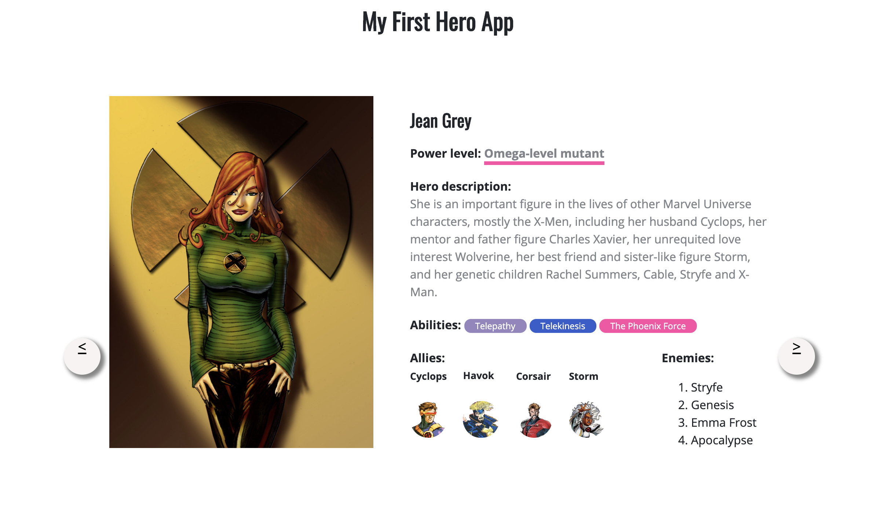
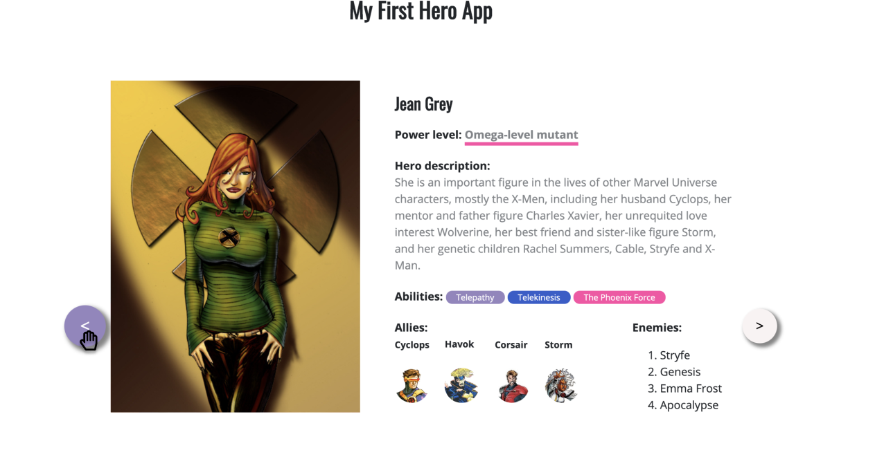

# Lecția 5

Semestrul trecut am creat o pagină web care conține informații despre 3 supereroi. Fiecare erou urmează un șablon, definit de noi. Momentan, toți cei 3 eroi sunt vizibili pe pagină, însă dorim să îi adăugăm într-o listă și să se poată naviga de la un erou la altul prin intermediul unor butoane.

Lucrăm tot în folderul myProject, cum am lucrat și semestrul trecut, și continuăm proiectul. Acesta conține folderul img cu imagini, fisierul index.html și stylesheet.css. Vom adăuga un nou fișier în folder, numit script.js. Structura folderului este următoarea:

```text
myProject/
    img/
    index.html
    stylesheet.css
    script.js
```

## Pasul 0 - adăugarea butoanelor

Avem nevoie de un buton cu săgeata stânga și celălalt cu săgeată dreapta. Vrem să le poziționăm în stânga și în dreapta ecranului, centrat. Adăugați în HTML, pentru fiecare supererou, două `a href`, astfel:

Primul `a href`:

* are clasa **hero--btn previous**
* va apela o funcție **previousHero\(\)**, care va fi scrisă mai tarziu în JS
* are un id gol \(\#\) ca valoare pentru href, deoarece funcționalitatea butonului e definită de funcția previousHero\(\); deși nu avem nevoie de href aici, dacă eliminăm acest atribut, pe buton nu va ma apărea mânuța de click
* are ca și conținut săgeata stânga, cu semnul **&\#60;**
* este adăugat în div-ul **hero**, în afara div-ului cu clasa **hero--left**

Primul buton este introdus astfel în HTML:

```markup
<a class="hero--btn previous" href="#" onclick="previousHero()">&#60;</a>
```

Al doilea `a href`:

* are clasa **hero--btn next**
* va apela o funcție **nextHero\(\)**, care va fi scrisă mai tarziu în JS
* are un id gol \(\#\) ca valoare pentru href
* are ca și conținut săgeata stânga, cu semnul **&\#62;**
* este adăugat în div-ul **hero,** ca ultim element \(poate fi pus chiar dupa div-ul cu clasa **clearfix** de la final

Adăugați aceste două link-uri fiecărui supererou. Când deschideți pagina web, veți observa că acestea au aparut și sunt marcate de semnele &lt; și &gt;, subliniate. În continuare, ne vom ocupa de stilizarea acestora. 


Am folosit eticheta a href \(pentru link-uri\) în loc de button \(pentru butoane\). Se obține aceeași funcționalitate cu oricare dintre ele.


## Pasul 2 - stilizarea butoanelor

Adăugați următorul cod în CSS, referitor la elementele din clasa **hero--btn**. Codul nu este complet, adăugați următoarele proprietăți și valori:

* înălțimea de 50px
* lațimea de 50px
* rotunjirea de 50% \(butonul va deveni un cerc\)
* textul centrat, cu dimensiunea de 20px
* culoarea textului neargă
* culoarea de fundal a butonului \#f9f3f3 \(gri\)

```css
.hero--btn {
  display: block;
  position: absolute;
  top: 50%; /* pentru a fi centrat pe verticală în div */
  -webkit-box-shadow: 4px 4px 5px 2px rgba(133,133,133,1);
  -moz-box-shadow: 4px 4px 5px 2px rgba(133,133,133,1);
  box-shadow: 4px 4px 5px 2px rgba(133,133,133,1);
}

/* poziționarea butonului din stânga */
.previous {
  margin-left: -62px;
}

/* poziționarea butonului din dreapta */
.next {
  right: 0;
  margin-right: -62px;
}
```


Ultimele 3 linii fac același lucru: adaugă umbră butonului, de o anumită dimensiunea în cele 4 părti \(sus, jos, stânga, drepta\) și de o anumita culoare. Deși fac același lucru, le-am scris pe toate 3 pentru eventualitatea în care un browser nu înțelege proprietatea.



Eliminați codul de pe linia 17 \(`right: 0;`\) și testați ce se întâmplă. Care este scopul acelei linii? Similar și pentru liniile 12 și 18, care este rolul lor?


Dacă ați includ codul de mai sus în CSS, și ați adăugat proprietățile menționate, un div pentru un supererou arată astfel:



Observăm că textul din butoane este subliniat și nu este centrat. Pentru a rezolva asta, adăugați următoarele linii în CSS pentru clasa **hero--btn** și testați.

```css
text-decoration: none; /* elimina sublinierea */
line-height: 2.5; /* centreaza conținutul */
```

## Pasul 3 - hover

În continuare, dorim ca butonul să se modifice atunci când mergem cu mouse-ul pe el \(hover\) și să își schimbe culoarea. Copiați codul de mai jos în CSS. 

```css
.hero--btn:hover {
  background: #9585bf;
  color: #fff;
  -webkit-transform: scale(1.2); /* Ch <36, Saf 5.1+, iOS < 9.2, An =<4.4.4 */
      -ms-transform: scale(1.2); /* IE 9 */
          transform: scale(1.2); /* IE 10, Fx 16+, Op 12.1+ */
}
```


`:hover` specifică faptul că aceste proprietăți intră în vigoare când are loc acțiunea de **hover**, adică atunci când cursorul mouse-ului este poziționat pe elementul din clasa **hero--btn**, fără a fi dat click.


Puteți specifica alte culori pentru text și fundal atunci când mouse-ul este pe buton; în exemplul de mai sus am folosit alb și mov.

Ultimele 3 linii din CSS fac același lucru, însă iar sunt scrise duplicat pentru mai mult versiuni de browsere. Rolul lor este de a scala \(mări\) butonul atunci când mouse-ul este pe el. Testați mai multe scalări \(de exemplu, 0.5 și 3\) și vedeți ce se întâmplă.

În final, pagina web cu cele două butoane stilizate arată astfel:



\*\*\*\*


